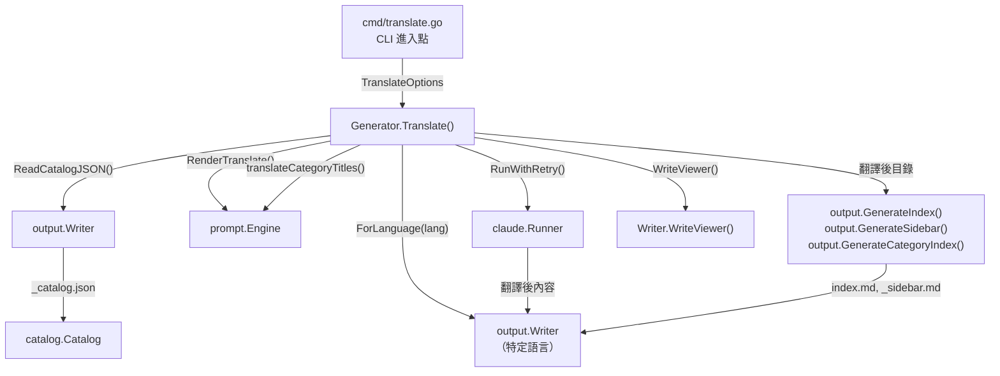
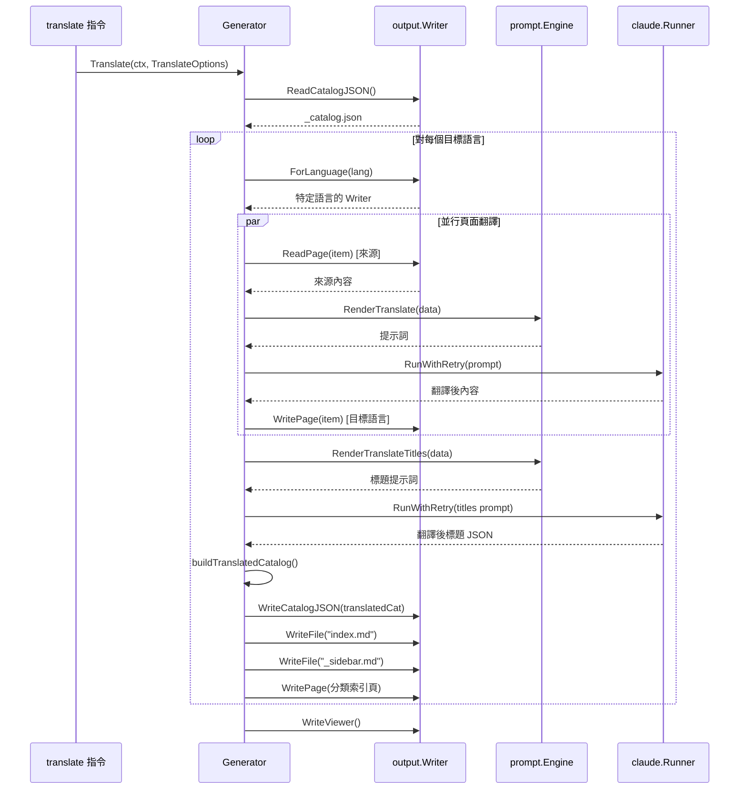

# translate 指令

`translate` 指令使用 Claude AI 將已產生的文件從主要語言翻譯成一種或多種次要語言。

## 概覽

`translate` 指令是 selfmd 中的獨立 CLI 指令，它將現有文件（由 `generate` 指令產生）翻譯成 `selfmd.yaml` 中定義的次要語言。它作為產生後的步驟運作，從 `.doc-build/` 讀取主要語言的輸出，並在特定語言的子目錄中產生翻譯副本（例如 `.doc-build/en-US/`）。

主要特性：

- **需要先執行產生** — `translate` 指令從現有的目錄（`_catalog.json`）和頁面檔案讀取；必須先執行 `selfmd generate`。
- **並行翻譯** — 頁面使用 Go 的 `errgroup` 搭配可設定的並行數進行並行翻譯。
- **預設增量處理** — 已翻譯的頁面會被跳過，除非使用 `--force` 旗標。
- **完整輸出重建** — 翻譯頁面後，該指令還會翻譯目錄標題、產生翻譯後的導覽（索引、側邊欄、分類頁面），並重新產生文件檢視器套件。

## 架構



## 指令語法

```
selfmd translate [flags]
```

> Source: cmd/translate.go#L24-L30

### 旗標

| 旗標 | 類型 | 預設值 | 說明 |
|------|------|--------|------|
| `--lang` | `[]string` | 所有次要語言 | 僅翻譯指定的語言 |
| `--force` | `bool` | `false` | 強制重新翻譯已存在的檔案 |
| `--concurrency` | `int` | 設定值 | 覆寫設定中的並行數設定 |

```go
func init() {
	translateCmd.Flags().StringSliceVar(&translateLangs, "lang", nil, "only translate specified languages (default: all secondary languages)")
	translateCmd.Flags().BoolVar(&translateForce, "force", false, "force re-translate existing files")
	translateCmd.Flags().IntVar(&translateConc, "concurrency", 0, "concurrency (override config)")
	rootCmd.AddCommand(translateCmd)
}
```

> Source: cmd/translate.go#L32-L37

### 全域旗標（繼承）

| 旗標 | 簡寫 | 預設值 | 說明 |
|------|------|--------|------|
| `--config` | `-c` | `selfmd.yaml` | 設定檔路徑 |
| `--verbose` | `-v` | `false` | 啟用詳細輸出 |
| `--quiet` | `-q` | `false` | 僅顯示錯誤 |

> Source: cmd/root.go#L37-L39

## 設定前提條件

`translate` 指令要求在 `selfmd.yaml` 中定義 `secondary_languages`。如果未設定次要語言，指令會以錯誤結束。

```go
if len(cfg.Output.SecondaryLanguages) == 0 {
    return fmt.Errorf("%s", "secondary_languages not defined in config, cannot translate")
}
```

> Source: cmd/translate.go#L49-L51

`selfmd.yaml` 中的範例設定：

```yaml
output:
  language: zh-TW                    # 主要語言
  secondary_languages:               # 目標翻譯語言
    - en-US
    - ja-JP
```

`--lang` 旗標的值會與 `secondary_languages` 清單進行驗證。指定不在設定中的語言會產生錯誤：

```go
for _, l := range translateLangs {
    if !validLangs[l] {
        return fmt.Errorf("language %s is not in secondary_languages list (available: %s)", l, strings.Join(cfg.Output.SecondaryLanguages, ", "))
    }
}
```

> Source: cmd/translate.go#L61-L64

## 核心流程

翻譯管線由每個目標語言的五個依序階段組成，最後是檢視器重新產生步驟。



### 階段 1：讀取主目錄

指令從輸出目錄讀取現有的 `_catalog.json`。此目錄由 `generate` 指令產生，包含完整的文件結構。

```go
catJSON, err := g.Writer.ReadCatalogJSON()
if err != nil {
    return fmt.Errorf("failed to read catalog (please run selfmd generate first): %w", err)
}
```

> Source: internal/generator/translate_phase.go#L33-L36

### 階段 2：翻譯頁面（並行）

葉節點頁面（非分類項目）使用 `errgroup` 搭配信號量進行並行控制來並行翻譯。每個頁面經過以下管線：

1. **跳過檢查** — 如果翻譯後的頁面已存在且未設定 `--force`，則跳過該頁面。標題會從現有翻譯中提取以供目錄使用。
2. **讀取來源** — 從輸出目錄讀取主要語言的頁面內容。
3. **渲染提示詞** — 使用來源/目標語言的元資料和來源內容渲染 `translate.tmpl` 模板。
4. **呼叫 Claude** — 透過 `RunWithRetry()` 將提示詞發送給 Claude。
5. **提取內容** — 從回應中的 `<document>` 標籤提取翻譯後的 Markdown。
6. **寫入輸出** — 將翻譯後的頁面寫入特定語言的子目錄。

```go
data := prompt.TranslatePromptData{
    SourceLanguage:     sourceLang,
    SourceLanguageName: sourceLangName,
    TargetLanguage:     targetLang,
    TargetLanguageName: targetLangName,
    SourceContent:      sourceContent,
}

rendered, err := g.Engine.RenderTranslate(data)
```

> Source: internal/generator/translate_phase.go#L197-L206

### 階段 3：翻譯分類標題

分類項目（含有子項目的項目）不是完整頁面，它們只有標題。這些標題透過 `translate_titles.tmpl` 模板在單次 Claude 呼叫中批次翻譯。回應預期為翻譯後字串的 JSON 陣列。

```go
rendered, err := g.Engine.RenderTranslateTitles(prompt.TranslateTitlesPromptData{
    SourceLanguage:     sourceLang,
    SourceLanguageName: sourceLangName,
    TargetLanguage:     targetLang,
    TargetLanguageName: targetLangName,
    Titles:             titles,
})
```

> Source: internal/generator/translate_phase.go#L329-L335

### 階段 4：建立翻譯後目錄與導覽

透過將標題替換為翻譯後的版本來建構目錄的翻譯副本。此目錄接著用於產生：

- `_catalog.json` — JSON 格式的翻譯後目錄
- `index.md` — 含翻譯後標題的主要著陸頁面
- `_sidebar.md` — 含翻譯後連結的側邊欄導覽
- 分類索引頁 — 每個分類區段的索引頁面

```go
translatedCat := buildTranslatedCatalog(cat, translatedTitles)
if err := langWriter.WriteCatalogJSON(translatedCat); err != nil {
    g.Logger.Warn("failed to save translated catalog", "lang", targetLang, "error", err)
}
```

> Source: internal/generator/translate_phase.go#L73-L76

### 階段 5：重新產生檢視器

在所有語言翻譯完成後，文件檢視器會使用更新的語言元資料重新產生，讓使用者可以在瀏覽器中切換語言。

```go
docMeta := g.buildDocMeta()
fmt.Println("Regenerating documentation viewer...")
if err := g.Writer.WriteViewer(g.Config.Project.Name, docMeta); err != nil {
    g.Logger.Warn("failed to generate viewer", "error", err)
}
```

> Source: internal/generator/translate_phase.go#L118-L124

## 翻譯提示詞模板

翻譯系統使用兩個共用的提示詞模板（與語言無關，儲存在 `templates/` 根層級而非特定語言的子資料夾）。

### 頁面翻譯模板（`translate.tmpl`）

此模板指示 Claude 翻譯完整的文件頁面，同時保留：

- Markdown 格式（標題、連結、表格、程式碼區塊）
- 程式碼識別符和檔案路徑
- Mermaid 圖表語法（標籤會被翻譯）
- 相對連結路徑（僅翻譯顯示文字）
- 來源標註（`> Source: path/to/file#L10-L25`）

翻譯後的內容必須包含在 `<document>` 標籤內回傳。

> Source: internal/prompt/templates/translate.tmpl#L1-L34

### 分類標題翻譯模板（`translate_titles.tmpl`）

此模板批次翻譯分類標題，預期回應為 JSON 陣列。技術術語和專有名詞（例如 "Git"、"CLI"、"API"）維持原樣不翻譯。

> Source: internal/prompt/templates/translate_titles.tmpl#L1-L16

## 輸出結構

翻譯後的文件放置在輸出目錄下的特定語言子目錄中：

```
.doc-build/
├── _catalog.json          # 主要語言目錄
├── index.md               # 主要語言索引
├── overview/
│   └── index.md           # 主要語言頁面
├── en-US/                  # 翻譯語言目錄
│   ├── _catalog.json      # 翻譯後目錄
│   ├── _sidebar.md        # 翻譯後側邊欄
│   ├── index.md           # 翻譯後索引
│   └── overview/
│       └── index.md       # 翻譯後頁面
└── ja-JP/                  # 另一個翻譯語言
    ├── _catalog.json
    └── ...
```

`Writer.ForLanguage()` 方法建立一個範圍限定在語言子目錄的新 writer：

```go
func (w *Writer) ForLanguage(lang string) *Writer {
	return &Writer{
		BaseDir: filepath.Join(w.BaseDir, lang),
	}
}
```

> Source: internal/output/writer.go#L145-L149

## 使用範例

**翻譯為所有已設定的次要語言：**

```bash
selfmd translate
```

**僅翻譯為特定語言：**

```bash
selfmd translate --lang en-US
```

**翻譯多個指定語言：**

```bash
selfmd translate --lang en-US --lang ja-JP
```

**強制重新翻譯所有頁面：**

```bash
selfmd translate --force
```

**覆寫並行數並啟用詳細日誌：**

```bash
selfmd translate --concurrency 5 --verbose
```

## 錯誤處理

translate 指令優雅地處理錯誤，不會中止整個流程：

- **單一頁面失敗**會被記錄但不會阻止其他頁面的翻譯。失敗次數會被計數並在摘要中報告。
- **分類標題翻譯失敗**會產生警告，但不會阻止管線的其餘部分完成。
- **缺少目錄**會產生明確的錯誤訊息，引導使用者先執行 `selfmd generate`。

完成時，指令會列印包含成功/失敗/跳過計數和總費用的摘要：

```go
fmt.Println("Translation complete!")
fmt.Printf("  Total time: %s\n", elapsed.Round(time.Second))
fmt.Printf("  Total cost: $%.4f USD\n", g.TotalCost)
```

> Source: internal/generator/translate_phase.go#L129-L131

## 相關連結

- [CLI 指令](../index.md)
- [generate 指令](../cmd-generate/index.md)
- [輸出語言](../../configuration/output-language/index.md)
- [翻譯工作流程](../../i18n/translation-workflow/index.md)
- [支援語言](../../i18n/supported-languages/index.md)
- [翻譯階段](../../core-modules/generator/translate-phase/index.md)
- [Claude Runner](../../core-modules/claude-runner/index.md)
- [提示詞引擎](../../core-modules/prompt-engine/index.md)
- [設定概覽](../../configuration/config-overview/index.md)

## 參考檔案

| 檔案路徑 | 說明 |
|-----------|------|
| `cmd/translate.go` | translate 指令的 CLI 定義與旗標處理 |
| `cmd/root.go` | 根指令與全域旗標定義 |
| `internal/generator/translate_phase.go` | 翻譯管線實作（頁面翻譯、標題翻譯、目錄建構） |
| `internal/generator/pipeline.go` | Generator 結構定義與 NewGenerator 建構函式 |
| `internal/config/config.go` | Config 結構，包含 OutputConfig.SecondaryLanguages 與 KnownLanguages |
| `internal/prompt/engine.go` | 提示詞引擎，包含 TranslatePromptData 與 RenderTranslate 方法 |
| `internal/prompt/templates/translate.tmpl` | 頁面翻譯提示詞模板 |
| `internal/prompt/templates/translate_titles.tmpl` | 分類標題批次翻譯提示詞模板 |
| `internal/output/writer.go` | 輸出寫入器，包含 ForLanguage()、PageExists() 與 ReadPage() 方法 |
| `internal/output/navigation.go` | 導覽產生（GenerateIndex、GenerateSidebar、GenerateCategoryIndex） |
| `internal/claude/runner.go` | Claude CLI 執行器，包含 RunWithRetry 邏輯 |
| `internal/claude/parser.go` | 回應解析與 ExtractDocumentTag 函式 |
| `internal/catalog/catalog.go` | 目錄資料模型與 Flatten() 方法 |