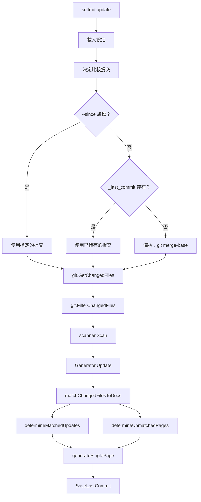
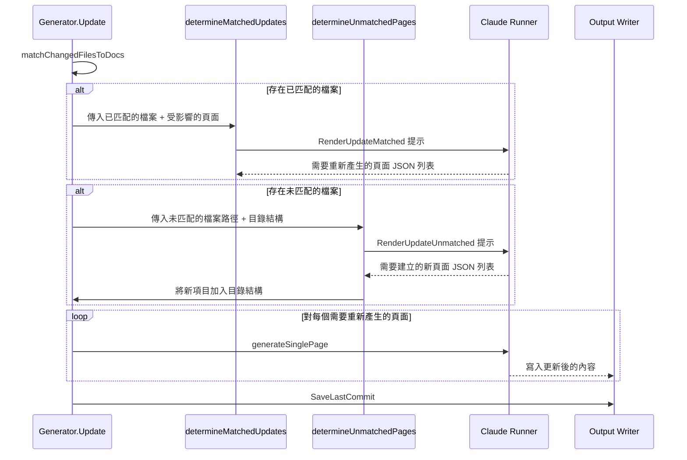

# update 指令

`selfmd update` 指令透過分析 git 變更，僅重新產生受影響的文件頁面，執行增量式文件更新。

## 概述

`update` 指令專為初次完整產生文件後的維護作業而設計。它不會從頭重新產生所有頁面，而是：

- 偵測兩個 git 提交之間的原始碼變更
- 將變更的檔案對應到現有的文件頁面
- 使用 Claude 判斷哪些頁面確實需要更新
- 識別是否應為未匹配的檔案建立新的文件頁面
- 僅重新產生受影響的頁面，保留未變更的內容

此指令需要先透過 `selfmd generate` 產生過文件。它依賴現有的目錄結構（`_catalog.json`）和已儲存的提交參考（`_last_commit`）來判斷自上次產生或更新以來發生了哪些變更。

### 前置條件

- 當前目錄必須是 git 儲存庫
- 系統上必須有可用的 Claude CLI
- 必須存在有效的 `selfmd.yaml` 設定檔
- 必須先透過 `selfmd generate` 產生過文件

## 架構



## 指令語法

```
selfmd update [flags]
```

### 旗標

| 旗標 | 類型 | 預設值 | 說明 |
|------|------|--------|------|
| `--since` | `string` | `""` | 與指定的提交雜湊進行比較。若省略，預設使用上次產生/更新時的提交 |
| `-c, --config` | `string` | `selfmd.yaml` | 設定檔路徑（繼承自根指令） |
| `-v, --verbose` | `bool` | `false` | 啟用詳細除錯輸出（繼承自根指令） |

### 範例

```bash
# 基本增量更新（使用上次儲存的提交）
selfmd update

# 從指定提交開始更新
selfmd update --since abc1234

# 以詳細日誌模式更新
selfmd update -v

# 使用自訂設定檔更新
selfmd update -c my-config.yaml
```

## 核心流程

update 指令遵循多步驟的流水線，逐步縮小需要重新產生的頁面範圍。

### 步驟 1：提交解析

指令首先決定要比較哪兩個提交。解析遵循三層備援機制：

```go
// Determine comparison commit
previousCommit := sinceCommit
if previousCommit == "" {
    // Try reading saved commit from last generate/update
    saved, readErr := gen.Writer.ReadLastCommit()
    if readErr == nil && saved != "" {
        previousCommit = saved
    } else {
        // Fallback to merge-base
        base, err := git.GetMergeBase(rootDir, cfg.Git.BaseBranch)
        if err != nil {
            return fmt.Errorf("cannot get base commit: %w\nhint: run selfmd generate first or use --since to specify a commit", err)
        }
        previousCommit = base
    }
}
```

> Source: cmd/update.go#L68-L82

### 步驟 2：變更偵測與過濾

透過 `git diff --name-status` 取得兩個提交之間的變更檔案，並依設定的 include/exclude glob 規則進行過濾：

```go
changedFiles, err := git.GetChangedFiles(rootDir, previousCommit, currentCommit)
if err != nil {
    return err
}

changedFiles = git.FilterChangedFiles(changedFiles, cfg.Targets.Include, cfg.Targets.Exclude)
```

> Source: cmd/update.go#L89-L94

### 步驟 3：檔案對頁面匹配

`matchChangedFilesToDocs` 方法在現有文件頁面中搜尋對變更檔案路徑的參考。它會預先讀取所有頁面內容，然後檢查每個變更檔案是否出現在各頁面中以尋找文字匹配：

```go
func (g *Generator) matchChangedFilesToDocs(files []git.ChangedFile, cat *catalog.Catalog) (matched []matchResult, unmatched []string) {
    items := cat.Flatten()

    // Pre-read all page contents
    pageContents := make(map[string]string)
    for _, item := range items {
        content, err := g.Writer.ReadPage(item)
        if err != nil {
            continue
        }
        pageContents[item.Path] = content
    }

    // For each changed file, find which pages reference it
    for _, f := range files {
        var matchedPages []catalog.FlatItem
        for _, item := range items {
            content, ok := pageContents[item.Path]
            if !ok {
                continue
            }
            if strings.Contains(content, f.Path) {
                matchedPages = append(matchedPages, item)
            }
        }

        if len(matchedPages) > 0 {
            matched = append(matched, matchResult{
                changedFile: f.Path,
                pages:       matchedPages,
            })
        } else {
            unmatched = append(unmatched, f.Path)
        }
    }

    return matched, unmatched
}
```

> Source: internal/generator/updater.go#L177-L214

### 步驟 4：Claude 輔助更新分析

更新流程最多進行兩次 Claude API 呼叫，以智慧判斷需要更新的內容：



**已匹配檔案分析**（`determineMatchedUpdates`）：將變更的檔案路徑連同可能受影響的文件頁面摘要一起傳送給 Claude，由 Claude 回傳確實需要重新產生的頁面 JSON 陣列。提示指示 Claude 採取保守策略——僅在變更確實影響行為、架構或 API 時才標記頁面需要重新產生。

**未匹配檔案分析**（`determineUnmatchedPages`）：對於未被任何現有文件頁面參考的原始碼檔案，Claude 會判斷是否應建立新頁面。它會檢查該檔案是否在邏輯上屬於現有頁面的範圍，以避免重複。

### 步驟 5：頁面重新產生

被識別為需要更新的頁面會使用與 `generate` 指令相同的 `generateSinglePage` 方法進行重新產生。現有頁面內容會作為上下文傳入，以協助 Claude 產生相關的更新：

```go
for i, item := range allPages {
    fmt.Printf("      [%d/%d] %s（%s）...", i+1, len(allPages), item.Title, item.Path)
    // Read existing content to pass as context for regeneration
    existing, _ := g.Writer.ReadPage(item)
    err := g.generateSinglePage(ctx, scan, item, catalogTable, linkFixer, existing)
    if err != nil {
        fmt.Printf(" Failed: %v\n", err)
        g.Logger.Warn("page regeneration failed", "title", item.Title, "path", item.Path, "error", err)
        g.writePlaceholder(item, err)
    }
}
```

> Source: internal/generator/updater.go#L137-L148

### 步驟 6：目錄結構與導覽更新

當新增頁面時，目錄結構會動態更新。系統處理一個特殊情況：當在現有的葉節點下新增子頁面時，該葉節點會被提升為父節點，其原始內容會被移至一個「概述」子頁面：

```go
promoted := addItemToCatalog(cat, np.CatalogPath, np.Title)
if promoted != nil {
    // A leaf node was promoted to a parent.
    // Move the original content to the new "overview" child.
    origItem := catalog.FlatItem{
        Path:    promoted.OriginalPath,
        DirPath: catalogPathToDir(promoted.OriginalPath),
    }
    overviewItem := catalog.FlatItem{
        Title:   promoted.OriginalTitle,
        Path:    promoted.OverviewPath,
        DirPath: catalogPathToDir(promoted.OverviewPath),
    }
    if content, err := g.Writer.ReadPage(origItem); err == nil && content != "" {
        if err := g.Writer.WritePage(overviewItem, content); err != nil {
            g.Logger.Warn("failed to move page to overview", "from", promoted.OriginalPath, "error", err)
        }
    }
}
```

> Source: internal/generator/updater.go#L96-L116

所有頁面重新產生完畢後，若有新增頁面，則會更新導覽和索引檔案。最後，當前的提交雜湊會儲存至 `_last_commit`，供下次增量更新使用。

## 資料類型

更新流程使用兩個由 Claude 分析回傳的關鍵結果類型：

```go
// UpdateMatchedResult represents a page that Claude determined needs regeneration.
type UpdateMatchedResult struct {
    CatalogPath string `json:"catalogPath"`
    Title       string `json:"title"`
    Reason      string `json:"reason"`
}

// UpdateUnmatchedResult represents a new page that Claude determined should be created.
type UpdateUnmatchedResult struct {
    CatalogPath string `json:"catalogPath"`
    Title       string `json:"title"`
    Reason      string `json:"reason"`
}
```

> Source: internal/generator/updater.go#L18-L29

## 設定

`update` 指令依賴 `selfmd.yaml` 中的多個設定區段：

| 設定路徑 | 用途 |
|----------|------|
| `targets.include` | 用於納入變更檔案的 glob 規則 |
| `targets.exclude` | 用於排除變更檔案的 glob 規則 |
| `git.base_branch` | 無已儲存提交時，`git merge-base` 的備援分支 |
| `output.dir` | 文件輸出目錄（預設：`.doc-build`） |
| `output.language` | 文件輸出語言 |
| `claude.model` | 用於分析和產生的 Claude 模型 |

## 與 generate 的比較

| 面向 | `generate` | `update` |
|------|-----------|----------|
| 範圍 | 從頭產生完整文件 | 僅處理變更/新增的頁面 |
| 需要 Git | 否（僅在儲存提交時可選用） | 是（必要） |
| 目錄結構 | 透過 Claude 產生 | 讀取現有的 `_catalog.json` |
| 並行處理 | 可設定的並行頁面產生 | 循序頁面重新產生 |
| 靜態檢視器 | 完成後產生 | 不重新產生 |
| 成本 | 較高（所有頁面） | 較低（僅受影響的頁面） |

## 相關連結

- [CLI 指令](../index.md)
- [generate 指令](../cmd-generate/index.md)
- [translate 指令](../cmd-translate/index.md)
- [增量更新引擎](../../core-modules/incremental-update/index.md)
- [產生流水線](../../architecture/pipeline/index.md)
- [變更偵測](../../git-integration/change-detection/index.md)
- [受影響頁面匹配](../../git-integration/affected-pages/index.md)
- [設定概述](../../configuration/config-overview/index.md)
- [Git 整合設定](../../configuration/git-config/index.md)

## 參考檔案

| 檔案路徑 | 說明 |
|----------|------|
| `cmd/update.go` | update 指令定義、旗標註冊與執行流程 |
| `cmd/root.go` | 根指令與全域旗標（`--config`、`--verbose`） |
| `cmd/generate.go` | generate 指令，用於與 update 流程比較 |
| `internal/generator/updater.go` | 核心更新邏輯：檔案匹配、Claude 分析、頁面重新產生 |
| `internal/generator/pipeline.go` | Generator 結構體定義與 `NewGenerator` 建構函式 |
| `internal/generator/content_phase.go` | 用於頁面重新產生的 `generateSinglePage` 實作 |
| `internal/git/git.go` | Git 操作：變更偵測、提交解析、檔案過濾 |
| `internal/config/config.go` | 設定結構體與 `GitConfig` 定義 |
| `internal/catalog/catalog.go` | 目錄結構資料結構與展平/解析操作 |
| `internal/output/writer.go` | 輸出寫入器：頁面讀寫、提交儲存/載入、目錄結構 JSON 輸出入 |
| `internal/prompt/engine.go` | 提示模板引擎與更新相關資料類型 |
| `internal/prompt/templates/en-US/update_matched.tmpl` | 已匹配檔案分析的提示模板 |
| `internal/prompt/templates/en-US/update_unmatched.tmpl` | 未匹配檔案分析的提示模板 |