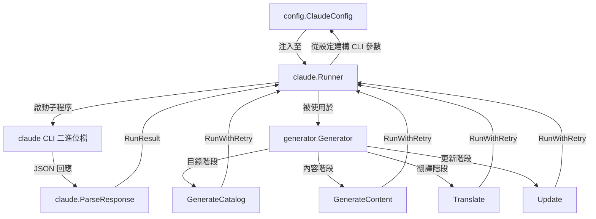
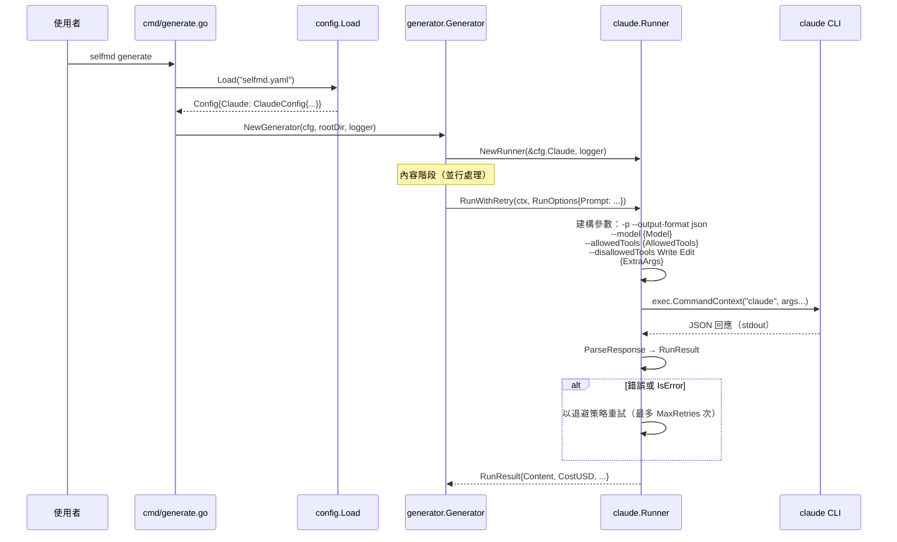

# Claude 設定

控制 selfmd 如何與 Claude CLI 互動以產生文件的設定選項。

## 概覽

`selfmd.yaml` 中的 `claude` 區段控制 selfmd 如何以子程序方式呼叫 Claude Code CLI 的所有面向。這些設定決定了使用哪個 AI 模型、可同時產生多少頁面、逾時與重試行為、Claude 在產生過程中允許使用哪些工具，以及傳遞給 `claude` 命令的額外 CLI 參數。

selfmd 不會直接呼叫 Claude API，而是以列印模式（`-p`）搭配 JSON 輸出來執行 `claude` CLI 二進位檔（Claude Code），因此這些設定是 selfmd 與 AI 驅動文件產生管線之間的關鍵介面。

## 架構



## 設定欄位

`ClaudeConfig` 結構定義了所有可用設定：

```go
type ClaudeConfig struct {
	Model          string   `yaml:"model"`
	MaxConcurrent  int      `yaml:"max_concurrent"`
	TimeoutSeconds int      `yaml:"timeout_seconds"`
	MaxRetries     int      `yaml:"max_retries"`
	AllowedTools   []string `yaml:"allowed_tools"`
	ExtraArgs      []string `yaml:"extra_args"`
}
```

> Source: internal/config/config.go#L82-L89

### 欄位參考

| 欄位 | 型別 | 預設值 | 說明 |
|-------|------|---------|-------------|
| `model` | `string` | `"sonnet"` | 透過 `--model` 旗標傳遞的 Claude 模型識別碼 |
| `max_concurrent` | `int` | `3` | 內容產生期間同時執行的 Claude 呼叫數上限 |
| `timeout_seconds` | `int` | `1800` | 每次呼叫的逾時秒數（預設 30 分鐘） |
| `max_retries` | `int` | `2` | 失敗的 Claude 呼叫重試次數 |
| `allowed_tools` | `[]string` | `["Read", "Glob", "Grep"]` | Claude 在產生過程中允許使用的工具 |
| `extra_args` | `[]string` | `[]` | 附加至每次 `claude` 呼叫的額外 CLI 參數 |

### 預設設定

```go
Claude: ClaudeConfig{
    Model:          "sonnet",
    MaxConcurrent:  3,
    TimeoutSeconds: 1800,
    MaxRetries:     2,
    AllowedTools:   []string{"Read", "Glob", "Grep"},
    ExtraArgs:      []string{},
},
```

> Source: internal/config/config.go#L116-L123

### YAML 範例

```yaml
claude:
    model: opus
    max_concurrent: 3
    timeout_seconds: 30000
    max_retries: 2
    allowed_tools:
        - Read
        - Glob
        - Grep
    extra_args: []
```

> Source: selfmd.yaml#L30-L39

## 設定如何套用

### 模型選擇

`model` 欄位會作為 `--model` 旗標傳遞給 Claude CLI。也支援透過 `RunOptions.Model` 進行單次呼叫的覆寫，但所有標準管線階段都使用設定中的預設值。

```go
model := opts.Model
if model == "" {
    model = r.config.Model
}
if model != "" {
    args = append(args, "--model", model)
}
```

> Source: internal/claude/runner.go#L37-L43

### 工具限制

`allowed_tools` 清單決定了在產生過程中允許使用哪些 Claude Code 工具。每個工具名稱透過 `--allowedTools` 傳遞。此外，`Write` 和 `Edit` 始終會透過 `--disallowedTools` 明確禁止，以防止 Claude 嘗試直接寫入檔案——所有輸出都從 stdout 擷取，並由 selfmd 自己的 `output.Writer` 寫入。

```go
tools := opts.AllowedTools
if len(tools) == 0 {
    tools = r.config.AllowedTools
}
if len(tools) > 0 {
    for _, t := range tools {
        args = append(args, "--allowedTools", t)
    }
}

// Explicitly block Write/Edit to prevent content from being lost in denied tool calls
args = append(args, "--disallowedTools", "Write", "--disallowedTools", "Edit")
```

> Source: internal/claude/runner.go#L45-L56

### 並行控制

`max_concurrent` 欄位控制在內容階段中同時產生多少文件頁面。它使用 `golang.org/x/sync/errgroup` 的信號量模式來實現：

```go
concurrency := g.Config.Claude.MaxConcurrent
if opts.Concurrency > 0 {
    concurrency = opts.Concurrency
}
fmt.Printf("[3/4] Generating content pages (concurrency: %d)...\n", concurrency)
```

> Source: internal/generator/pipeline.go#L130-L134

`generate` 命令的 `--concurrency` CLI 旗標可在執行時覆寫此值。

### 逾時處理

每次 Claude 呼叫都使用 `TimeoutSeconds` 包裝在 `context.WithTimeout` 中。如果超過期限，會回傳特定的逾時錯誤：

```go
timeout := opts.Timeout
if timeout == 0 {
    timeout = time.Duration(r.config.TimeoutSeconds) * time.Second
}

ctx, cancel := context.WithTimeout(ctx, timeout)
defer cancel()
```

> Source: internal/claude/runner.go#L61-L67

### 重試邏輯

失敗的 Claude 呼叫會自動重試，最多重試 `MaxRetries` 次，採用線性退避（每次嘗試間隔 5 秒）。CLI 錯誤和 Claude 回報的錯誤都會觸發重試：

```go
func (r *Runner) RunWithRetry(ctx context.Context, opts RunOptions) (*RunResult, error) {
	maxRetries := r.config.MaxRetries
	var lastErr error

	for attempt := 0; attempt <= maxRetries; attempt++ {
		if attempt > 0 {
			backoff := time.Duration(attempt) * 5 * time.Second
			r.logger.Info("retrying", "attempt", attempt+1, "backoff", backoff)
			select {
			case <-ctx.Done():
				return nil, ctx.Err()
			case <-time.After(backoff):
			}
		}

		result, err := r.Run(ctx, opts)
		if err == nil && !result.IsError {
			return result, nil
		}

		if err != nil {
			lastErr = err
		} else {
			lastErr = fmt.Errorf("Claude reported error: %s", result.Content)
		}

		r.logger.Warn("Claude call failed", "attempt", attempt+1, "error", lastErr)
	}

	return nil, fmt.Errorf("all %d attempts failed: %w", maxRetries+1, lastErr)
}
```

> Source: internal/claude/runner.go#L113-L143

### 額外參數

`extra_args` 欄位允許傳遞任意額外旗標給 `claude` CLI。這些參數會附加在所有標準參數之後：

```go
args = append(args, r.config.ExtraArgs...)
args = append(args, opts.ExtraArgs...)
```

> Source: internal/claude/runner.go#L58-L59

## 核心流程

以下序列圖展示了 Claude 設定在典型文件產生呼叫中的流動方式：



## 驗證規則

設定載入器會對 Claude 設定進行驗證與修正：

```go
if c.Claude.MaxConcurrent < 1 {
    c.Claude.MaxConcurrent = 1
}
if c.Claude.TimeoutSeconds < 30 {
    c.Claude.TimeoutSeconds = 30
}
if c.Claude.MaxRetries < 0 {
    c.Claude.MaxRetries = 0
}
```

> Source: internal/config/config.go#L164-L173

- `max_concurrent` 最小值限制為 `1`
- `timeout_seconds` 最小值限制為 `30`
- `max_retries` 最小值限制為 `0`（不重試）

## 前置需求

Claude CLI 必須已安裝且在系統 `PATH` 中可用。selfmd 會在任何產生或更新命令執行前進行驗證：

```go
func CheckAvailable() error {
	_, err := exec.LookPath("claude")
	if err != nil {
		return fmt.Errorf("claude CLI not found. Please install Claude Code: https://docs.anthropic.com/en/docs/claude-code")
	}
	return nil
}
```

> Source: internal/claude/runner.go#L146-L152

## 相關連結

- [設定總覽](../config-overview/index.md)
- [設定](../index.md)
- [Claude Runner](../../core-modules/claude-runner/index.md)
- [產生管線](../../architecture/pipeline/index.md)
- [文件產生器](../../core-modules/generator/index.md)
- [內容階段](../../core-modules/generator/content-phase/index.md)
- [提示引擎](../../core-modules/prompt-engine/index.md)

## 參考檔案

| 檔案路徑 | 說明 |
|-----------|-------------|
| `internal/config/config.go` | `ClaudeConfig` 結構定義、預設值與驗證 |
| `internal/claude/runner.go` | `Runner` 實作——CLI 參數建構、執行、重試邏輯 |
| `internal/claude/types.go` | `RunOptions`、`RunResult` 與 `CLIResponse` 型別定義 |
| `internal/claude/parser.go` | 回應解析與內容擷取工具 |
| `internal/generator/pipeline.go` | `Generator` 協調器——使用 `ClaudeConfig` 進行並行控制與 Runner 設定 |
| `internal/generator/content_phase.go` | 內容產生階段——使用信號量的並行頁面產生 |
| `internal/generator/catalog_phase.go` | 目錄產生階段——單次 Claude 呼叫 |
| `internal/generator/translate_phase.go` | 翻譯階段——使用 Claude 進行並行翻譯 |
| `internal/generator/updater.go` | 增量更新——多次 Claude 呼叫進行變更分析 |
| `internal/prompt/engine.go` | 提示模板引擎——渲染傳送給 Claude 的提示 |
| `cmd/generate.go` | Generate 命令——載入設定、傳遞並行覆寫值 |
| `cmd/init.go` | Init 命令——產生預設 `ClaudeConfig` 值 |
| `cmd/update.go` | Update 命令——使用 Claude 進行增量文件更新 |
| `selfmd.yaml` | 包含 Claude 設定範例的專案設定檔 |