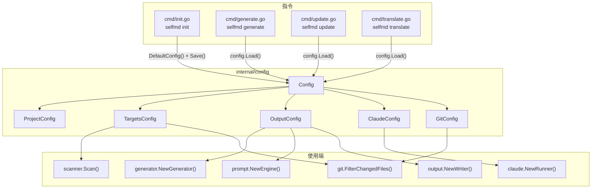
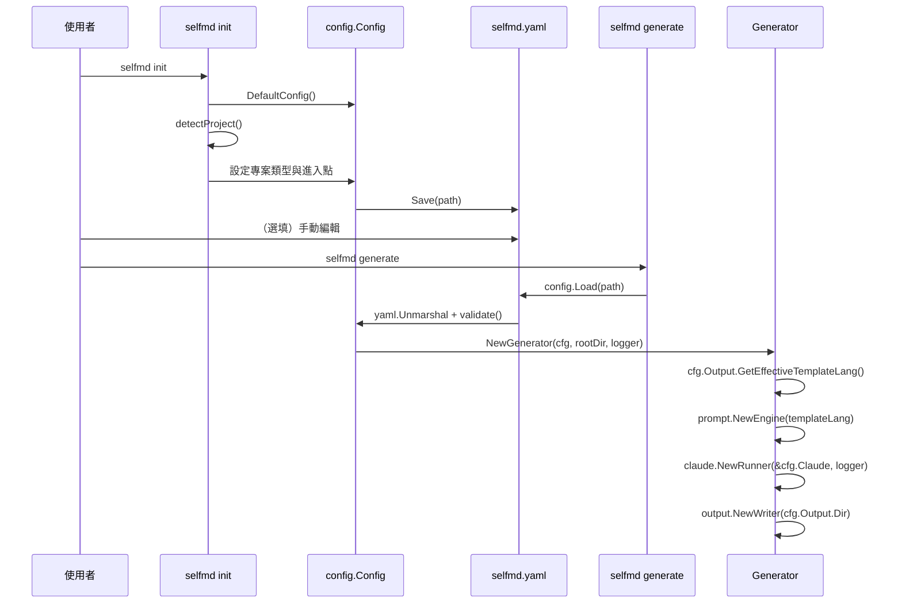

# 設定總覽

selfmd 使用單一 YAML 設定檔（`selfmd.yaml`）來控制文件生成的所有面向，從專案中繼資料到 Claude AI 設定與 git 整合。

## 概述

`selfmd.yaml` 檔案是 selfmd 工具的核心設定點。它在每個指令（`generate`、`update`、`translate`）啟動時載入，並控制以下項目：

- **專案識別** — 名稱、類型與描述
- **檔案目標** — 哪些原始碼檔案要納入或排除於文件生成
- **輸出設定** — 輸出目錄、主要與次要語言，以及清除行為
- **Claude AI 參數** — 模型選擇、並行數、逾時、重試與工具權限
- **Git 整合** — 是否啟用基於 git 的增量更新，以及比較的基準分支

設定檔由 `selfmd init` 建立，之後可手動編輯。所有欄位在 `DefaultConfig()` 函式中都有合理的預設值，因此只需指定與預設值不同的值。

## 架構



## 設定結構

`Config` 結構體定義於 `internal/config/config.go`，由五個頂層區段組成：

```go
type Config struct {
	Project ProjectConfig `yaml:"project"`
	Targets TargetsConfig `yaml:"targets"`
	Output  OutputConfig  `yaml:"output"`
	Claude  ClaudeConfig  `yaml:"claude"`
	Git     GitConfig     `yaml:"git"`
}
```

> Source: internal/config/config.go#L11-L17

### `project` — 專案中繼資料

描述被產生文件的專案。

```go
type ProjectConfig struct {
	Name        string `yaml:"name"`
	Type        string `yaml:"type"`
	Description string `yaml:"description"`
}
```

> Source: internal/config/config.go#L19-L23

| 欄位 | 類型 | 預設值 | 說明 |
|------|------|--------|------|
| `name` | string | 當前目錄名稱 | 用於文件標題的專案顯示名稱 |
| `type` | string | `"backend"` | 專案類型。由 `selfmd init` 根據專案檔案自動偵測（例如 `go.mod` → `backend`、`package.json` → `frontend`） |
| `description` | string | `""` | 選填的專案描述 |

`selfmd init` 指令會透過檢查標記檔案來自動偵測專案類型：

```go
checks := []struct {
	file    string
	pType   string
	entries []string
}{
	{"go.mod", "backend", []string{"main.go", "cmd/root.go"}},
	{"Cargo.toml", "backend", []string{"src/main.rs", "src/lib.rs"}},
	{"package.json", "frontend", []string{"src/index.ts", "src/index.js", "src/main.ts", "src/App.tsx"}},
	{"pom.xml", "backend", []string{"src/main/java"}},
	{"build.gradle", "backend", []string{"src/main/java"}},
	{"requirements.txt", "backend", []string{"main.py", "app.py", "src/main.py"}},
	{"pyproject.toml", "backend", []string{"src/main.py", "main.py"}},
	{"composer.json", "backend", []string{"public/index.php", "src/Kernel.php"}},
	{"Gemfile", "backend", []string{"config/application.rb", "app/"}},
}
```

> Source: cmd/init.go#L61-L75

### `targets` — 檔案目標

控制哪些原始碼檔案會被掃描並納入文件生成。

```go
type TargetsConfig struct {
	Include     []string `yaml:"include"`
	Exclude     []string `yaml:"exclude"`
	EntryPoints []string `yaml:"entry_points"`
}
```

> Source: internal/config/config.go#L25-L29

| 欄位 | 類型 | 預設值 | 說明 |
|------|------|--------|------|
| `include` | []string | `["src/**", "pkg/**", "cmd/**", "internal/**", "lib/**", "app/**"]` | 要納入的檔案 glob 模式 |
| `exclude` | []string | `["vendor/**", "node_modules/**", ".git/**", ".doc-build/**", "**/*.pb.go", "**/generated/**", "dist/**", "build/**"]` | 要排除的檔案 glob 模式 |
| `entry_points` | []string | `[]` | 會被讀取內容並作為上下文傳遞給 Claude 的關鍵檔案 |

掃描器會先評估排除模式（匹配時跳過整個目錄），再檢查納入模式。兩者都使用 `doublestar` glob 函式庫進行模式匹配：

```go
// check excludes
for _, pattern := range cfg.Targets.Exclude {
	matched, _ := doublestar.Match(pattern, rel)
	if matched {
		if d.IsDir() {
			return filepath.SkipDir
		}
		return nil
	}
}
```

> Source: internal/scanner/scanner.go#L33-L41

`entry_points` 欄位特別重要 — 這些檔案會被完整讀取並作為上下文提供給 Claude 生成文件，協助它理解專案的架構與進入點流程。

### `output` — 輸出設定

控制文件生成的位置與方式。

```go
type OutputConfig struct {
	Dir                 string   `yaml:"dir"`
	Language            string   `yaml:"language"`
	SecondaryLanguages  []string `yaml:"secondary_languages"`
	CleanBeforeGenerate bool     `yaml:"clean_before_generate"`
}
```

> Source: internal/config/config.go#L31-L36

| 欄位 | 類型 | 預設值 | 說明 |
|------|------|--------|------|
| `dir` | string | `".doc-build"` | 生成文件的輸出目錄 |
| `language` | string | `"zh-TW"` | 主要文件語言 |
| `secondary_languages` | []string | `[]` | 透過 `selfmd translate` 翻譯的額外語言 |
| `clean_before_generate` | bool | `false` | 是否在生成前清除輸出目錄 |

`OutputConfig` 也提供用於範本語言解析的輔助方法：

```go
func (o *OutputConfig) GetEffectiveTemplateLang() string {
	for _, lang := range SupportedTemplateLangs {
		if o.Language == lang {
			return o.Language
		}
	}
	return "en-US"
}
```

> Source: internal/config/config.go#L58-L65

目前，內建的提示範本支援 `zh-TW` 和 `en-US`。如果設定的語言沒有內建範本，selfmd 會退回使用 `en-US` 範本，並透過語言覆寫指示 Claude 以目標語言輸出。

### `claude` — Claude AI 設定

控制 selfmd 如何與 Claude Code CLI 互動。

```go
type ClaudeConfig struct {
	Model          string   `yaml:"model"`
	MaxConcurrent  int      `yaml:"max_concurrent"`
	TimeoutSeconds int      `yaml:"timeout_seconds"`
	MaxRetries     int      `yaml:"max_retries"`
	AllowedTools   []string `yaml:"allowed_tools"`
	ExtraArgs      []string `yaml:"extra_args"`
}
```

> Source: internal/config/config.go#L82-L89

| 欄位 | 類型 | 預設值 | 說明 |
|------|------|--------|------|
| `model` | string | `"sonnet"` | Claude 模型名稱（例如 `sonnet`、`opus`、`haiku`） |
| `max_concurrent` | int | `3` | 內容生成階段的最大並行 Claude 呼叫數 |
| `timeout_seconds` | int | `1800` | 每次 Claude 呼叫的逾時秒數 |
| `max_retries` | int | `2` | 失敗時的重試次數 |
| `allowed_tools` | []string | `["Read", "Glob", "Grep"]` | Claude 在文件生成期間允許使用的工具 |
| `extra_args` | []string | `[]` | 傳遞給 Claude Code 指令的額外 CLI 參數 |

`max_concurrent` 設定直接控制內容生成階段的並行度：

```go
concurrency := g.Config.Claude.MaxConcurrent
if opts.Concurrency > 0 {
	concurrency = opts.Concurrency
}
fmt.Printf("[3/4] Generating content pages (concurrency: %d)...\n", concurrency)
```

> Source: internal/generator/pipeline.go#L130-L134

### `git` — Git 整合設定

控制基於 git 的增量更新行為。

```go
type GitConfig struct {
	Enabled    bool   `yaml:"enabled"`
	BaseBranch string `yaml:"base_branch"`
}
```

> Source: internal/config/config.go#L91-L94

| 欄位 | 類型 | 預設值 | 說明 |
|------|------|--------|------|
| `enabled` | bool | `true` | 是否啟用 git 整合 |
| `base_branch` | string | `"main"` | 用於 `selfmd update` 變更偵測的基準分支 |

`base_branch` 在沒有已儲存的 commit 時，用於尋找合併基準點：

```go
base, err := git.GetMergeBase(rootDir, cfg.Git.BaseBranch)
```

> Source: cmd/update.go#L76

## 核心流程

### 設定生命週期



### 設定載入與驗證

`Load` 函式讀取 YAML 檔案，將其反序列化到預先填入的預設設定上（因此未指定的欄位會保留預設值），並執行驗證：

```go
func Load(path string) (*Config, error) {
	data, err := os.ReadFile(path)
	if err != nil {
		return nil, fmt.Errorf("failed to read config file %s: %w", path, err)
	}

	cfg := DefaultConfig()
	if err := yaml.Unmarshal(data, cfg); err != nil {
		return nil, fmt.Errorf("config file format error: %w", err)
	}

	if err := cfg.validate(); err != nil {
		return nil, err
	}

	return cfg, nil
}
```

> Source: internal/config/config.go#L131-L147

驗證規則強制執行以下約束：

```go
func (c *Config) validate() error {
	if c.Output.Dir == "" {
		return fmt.Errorf("%s", "output.dir must not be empty")
	}
	if c.Output.Language == "" {
		return fmt.Errorf("%s", "output.language must not be empty")
	}
	if c.Claude.MaxConcurrent < 1 {
		c.Claude.MaxConcurrent = 1
	}
	if c.Claude.TimeoutSeconds < 30 {
		c.Claude.TimeoutSeconds = 30
	}
	if c.Claude.MaxRetries < 0 {
		c.Claude.MaxRetries = 0
	}
	return nil
}
```

> Source: internal/config/config.go#L157-L174

主要驗證行為：

- `output.dir` 和 `output.language` 為**必填** — 若為空值會回傳錯誤
- `max_concurrent` 會靜默地限制最小值為 `1`
- `timeout_seconds` 會靜默地限制最小值為 `30`
- `max_retries` 會靜默地限制最小值為 `0`

## 使用範例

### 完整設定檔

以下是 selfmd 專案本身的實際 `selfmd.yaml`：

```yaml
project:
    name: selfmd
    type: cli
    description: ""
targets:
    include:
        - src/**
        - pkg/**
        - cmd/**
        - internal/**
        - lib/**
        - app/**
    exclude:
        - vendor/**
        - node_modules/**
        - .git/**
        - .doc-build/**
        - '**/*.pb.go'
        - '**/generated/**'
        - dist/**
        - build/**
    entry_points:
        - main.go
        - cmd/root.go
output:
    dir: docs
    language: en-US
    secondary_languages: ["zh-TW"]
    clean_before_generate: false
claude:
    model: opus
    max_concurrent: 3
    timeout_seconds: 30000
    max_retries: 2
    allowed_tools:
        - Read
        - Glob
        - Grep
    extra_args: []
git:
    enabled: true
    base_branch: develop
```

> Source: selfmd.yaml#L1-L43

### CLI 設定檔覆寫

設定檔路徑可透過任何指令的 `--config`（或 `-c`）旗標覆寫：

```go
rootCmd.PersistentFlags().StringVarP(&cfgFile, "config", "c", "selfmd.yaml", "config file path")
```

> Source: cmd/root.go#L37

這讓您可以為不同的文件目標或環境維護多個設定檔。

## 相關連結

- [設定](../index.md) — 所有設定主題的上層區段
- [專案目標](../project-targets/index.md) — 納入/排除模式與進入點的詳細文件
- [輸出語言](../output-language/index.md) — 支援的語言與範本解析
- [Claude 設定](../claude-config/index.md) — Claude 模型與並行度調校
- [Git 整合設定](../git-config/index.md) — 基於 Git 的增量更新設定
- [init 指令](../../cli/cmd-init/index.md) — `selfmd init` 如何生成設定檔
- [generate 指令](../../cli/cmd-generate/index.md) — generate 指令如何使用設定
- [生成管線](../../architecture/pipeline/index.md) — 使用此設定的生成管線架構

## 參考檔案

| 檔案路徑 | 說明 |
|----------|------|
| `internal/config/config.go` | 核心 Config 結構體定義、預設值、載入、驗證與語言輔助函式 |
| `cmd/root.go` | 包含 `--config` 旗標的根指令定義 |
| `cmd/init.go` | `selfmd init` — 含專案類型偵測的設定生成 |
| `cmd/generate.go` | `selfmd generate` — 設定載入與選項覆寫 |
| `cmd/update.go` | `selfmd update` — 設定載入與 git 整合使用 |
| `cmd/translate.go` | `selfmd translate` — 設定載入與語言驗證 |
| `internal/generator/pipeline.go` | Generator 結構體建立與使用設定值的管線 |
| `internal/scanner/scanner.go` | 套用 `targets.include` 和 `targets.exclude` 模式的掃描器 |
| `internal/git/git.go` | 使用 `git.base_branch` 設定的 Git 操作 |
| `internal/generator/updater.go` | 使用設定進行匹配與重新生成的增量更新邏輯 |
| `selfmd.yaml` | selfmd 專案的實際設定範例 |