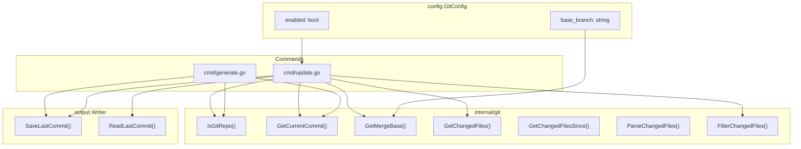
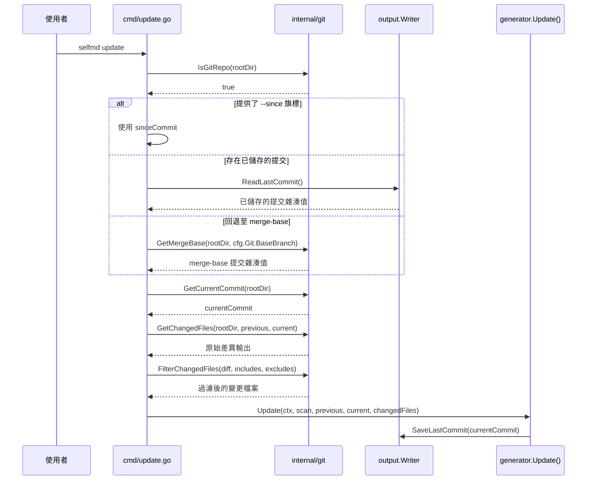

# Git 整合設定

`selfmd.yaml` 中的 `git` 區段控制 selfmd 如何與 Git 整合，以透過 `update` 指令進行增量文件更新。

## 概述

selfmd 利用 Git 偵測提交之間的原始碼變更，實現增量文件更新而非完整重新生成。Git 整合設定決定：

- Git 變更偵測是否啟用
- 哪個分支作為差異比較的基準
- 執行之間如何追蹤提交歷史

當 Git 整合啟用時，`generate` 指令會記錄當前 HEAD 提交雜湊值，而 `update` 指令會以此作為參考點來識別變更的檔案，並僅更新受影響的文件頁面。

## 架構



## 設定欄位

Git 設定定義在 `selfmd.yaml` 的 `git` 區段中：

```yaml
git:
    enabled: true
    base_branch: main
```

### `enabled`

| 屬性 | 值 |
|----------|-------|
| 型別 | `bool` |
| 預設值 | `true` |
| 必填 | 否 |

控制 Git 整合是否啟用。當設為 `true` 時，`generate` 指令會將當前提交雜湊值記錄到輸出目錄中的 `_last_commit` 檔案。這個儲存的提交值隨後會被 `update` 指令用來判斷哪些檔案已變更。

### `base_branch`

| 屬性 | 值 |
|----------|-------|
| 型別 | `string` |
| 預設值 | `"main"` |
| 必填 | 否 |

指定當沒有已儲存的提交記錄時，用於計算 merge-base 提交的基準分支。在 `update` 期間，selfmd 按以下優先順序解析比較提交：

1. `--since` 旗標值（如果在 CLI 上提供）
2. 來自 `_last_commit` 的已儲存提交（由先前的 `generate` 或 `update` 寫入）
3. `base_branch` 與當前 `HEAD` 之間的 merge-base

```go
// Determine comparison commit
previousCommit := sinceCommit
if previousCommit == "" {
    // Try reading saved commit from last generate/update
    saved, readErr := gen.Writer.ReadLastCommit()
    if readErr == nil && saved != "" {
        previousCommit = saved
    } else {
        // Fallback to merge-base
        base, err := git.GetMergeBase(rootDir, cfg.Git.BaseBranch)
        if err != nil {
            return fmt.Errorf("cannot get base commit: %w\nhint: run selfmd generate first or use --since to specify a commit", err)
        }
        previousCommit = base
    }
}
```

> Source: cmd/update.go#L68-L82

## 核心流程

### `generate` 中的提交追蹤

當 `generate` 完成時，它會檢查專案是否為 Git 儲存庫，並儲存當前 HEAD 提交雜湊值以供未來增量更新使用：

```go
// Save current commit for incremental updates
if git.IsGitRepo(g.RootDir) {
    if commit, err := git.GetCurrentCommit(g.RootDir); err == nil {
        if err := g.Writer.SaveLastCommit(commit); err != nil {
            g.Logger.Warn("failed to save commit record", "error", err)
        }
    }
}
```

> Source: internal/generator/pipeline.go#L163-L169

提交雜湊值會持久化到輸出目錄中的 `_last_commit` 檔案：

```go
// SaveLastCommit saves the current commit hash for incremental updates.
func (w *Writer) SaveLastCommit(commit string) error {
	return w.WriteFile("_last_commit", commit)
}
```

> Source: internal/output/writer.go#L130-L132

### `update` 中的變更偵測

以下序列圖說明由 Git 設定驅動的完整增量更新流程：



`update` 指令要求專案必須是 Git 儲存庫。如果不是，指令會以錯誤退出：

```go
if !git.IsGitRepo(rootDir) {
    return fmt.Errorf("%s", "current directory is not a git repository, cannot perform incremental update")
}
```

> Source: cmd/update.go#L49-L51

### 變更檔案偵測與過濾

`GetChangedFiles` 函式在兩個提交之間執行 `git diff --relative --name-status`，產生帶有檔案狀態指示符的輸出（`M` 表示修改、`A` 表示新增、`D` 表示刪除、`R` 表示重新命名）：

```go
// GetChangedFiles returns the list of changed files between two commits.
// Uses --relative so paths are relative to the working directory (dir), not the git repo root.
func GetChangedFiles(dir, fromCommit, toCommit string) (string, error) {
	return runGit(dir, "diff", "--relative", "--name-status", fromCommit+".."+toCommit)
}
```

> Source: internal/git/git.go#L31-L34

原始差異輸出接著會使用設定中的 `targets.include` 和 `targets.exclude` glob 模式進行過濾，確保只考慮相關的原始碼檔案：

```go
changedFiles = git.FilterChangedFiles(changedFiles, cfg.Targets.Include, cfg.Targets.Exclude)
```

> Source: cmd/update.go#L94

`FilterChangedFiles` 函式對每個檔案路徑套用 doublestar glob 匹配，排除符合任何排除模式的檔案，並僅包含符合至少一個包含模式的檔案：

```go
// FilterChangedFiles filters git diff --name-status output using include/exclude glob patterns.
func FilterChangedFiles(changedFiles string, includes, excludes []string) string {
	lines := strings.Split(changedFiles, "\n")
	var filtered []string

	for _, line := range lines {
		line = strings.TrimSpace(line)
		if line == "" {
			continue
		}

		parts := strings.SplitN(line, "\t", 3)
		if len(parts) < 2 {
			continue
		}

		// For renames, check the destination path (last element)
		filePath := parts[len(parts)-1]

		// Check excludes
		excluded := false
		for _, pattern := range excludes {
			if matched, _ := doublestar.Match(pattern, filePath); matched {
				excluded = true
				break
			}
		}
		if excluded {
			continue
		}

		// Check includes (if configured)
		if len(includes) > 0 {
			included := false
			for _, pattern := range includes {
				if matched, _ := doublestar.Match(pattern, filePath); matched {
					included = true
					break
				}
			}
			if !included {
				continue
			}
		}

		filtered = append(filtered, line)
	}

	return strings.Join(filtered, "\n")
}
```

> Source: internal/git/git.go#L73-L122

## 使用範例

### 預設設定

使用 `selfmd init` 初始化時，預設的 Git 設定為：

```go
Git: GitConfig{
    Enabled:    true,
    BaseBranch: "main",
},
```

> Source: internal/config/config.go#L124-L127

### 自訂基準分支

如果您的專案使用 `develop` 作為主要分支：

```yaml
git:
    enabled: true
    base_branch: develop
```

> Source: selfmd.yaml#L40-L42

### 執行增量更新

在使用 `selfmd generate` 生成初始文件後，執行增量更新：

```bash
selfmd update
```

或指定特定的提交進行差異比較：

```bash
selfmd update --since abc1234
```

> Source: cmd/update.go#L30

## 相關連結

- [設定概述](../config-overview/index.md)
- [update 指令](../../cli/cmd-update/index.md)
- [generate 指令](../../cli/cmd-generate/index.md)
- [變更偵測](../../git-integration/change-detection/index.md)
- [受影響頁面匹配](../../git-integration/affected-pages/index.md)
- [增量更新引擎](../../core-modules/incremental-update/index.md)
- [專案目標](../project-targets/index.md)

## 參考檔案

| 檔案路徑 | 說明 |
|-----------|-------------|
| `internal/config/config.go` | `GitConfig` 結構定義與預設值 |
| `internal/git/git.go` | Git 操作：差異比較、merge-base、變更偵測、過濾 |
| `cmd/update.go` | `update` 指令實作與提交解析邏輯 |
| `cmd/generate.go` | `generate` 指令實作 |
| `internal/generator/pipeline.go` | 生成管線，完成時儲存提交記錄 |
| `internal/generator/updater.go` | 使用解析後變更檔案的增量更新邏輯 |
| `internal/output/writer.go` | `SaveLastCommit` / `ReadLastCommit` 持久化機制 |
| `selfmd.yaml` | 包含 git 設定範例的專案設定檔 |