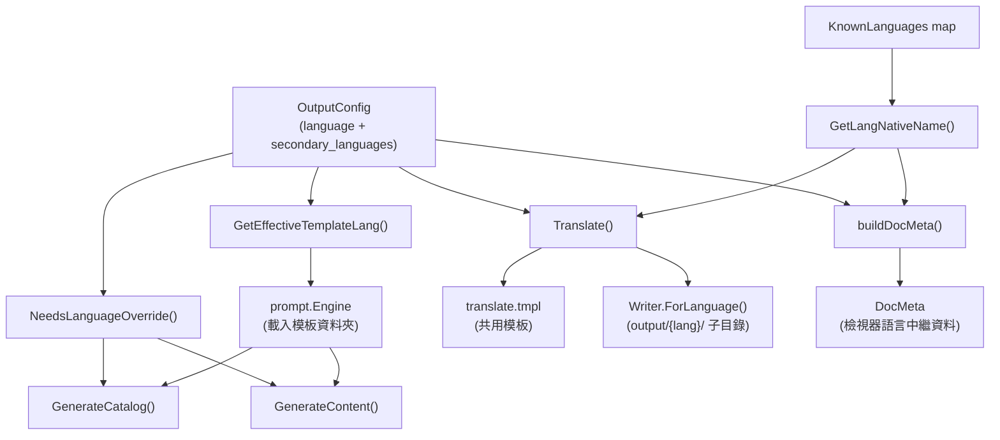
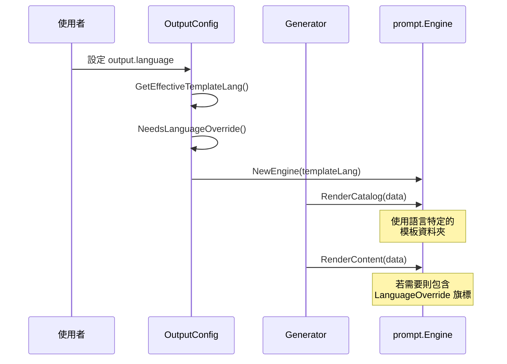
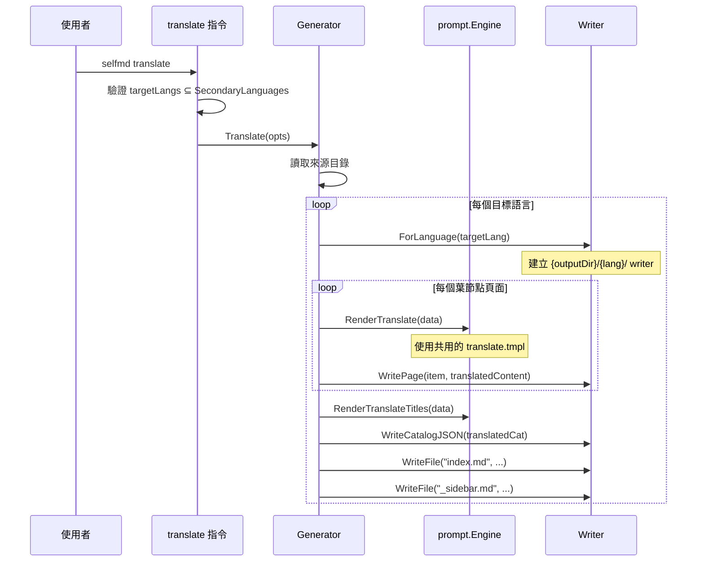

# 輸出語言

輸出語言設定控制 selfmd 產生文件時使用的語言，並定義用於翻譯的次要語言。

## 概述

selfmd 透過雙層語言系統支援多語言文件產生：

- **主要語言**（`output.language`）：初始文件產生時使用的語言。所有提示詞、目錄標題和內容頁面都以此語言產生。
- **次要語言**（`output.secondary_languages`）：可透過 `selfmd translate` 指令將現有文件翻譯成的額外語言。

系統維護一個已知語言代碼的註冊表、管理提示詞模板的選擇與回退邏輯，並提供語言覆寫機制，以支援沒有專屬提示詞模板的語言。

## 架構



## 設定欄位

語言相關設定位於 `selfmd.yaml` 的 `output` 區段中：

```yaml
output:
    dir: docs
    language: en-US
    secondary_languages: ["zh-TW"]
    clean_before_generate: false
```

> Source: selfmd.yaml#L25-L29

| 欄位 | 型別 | 預設值 | 說明 |
|------|------|--------|------|
| `language` | `string` | `"zh-TW"` | 主要文件語言（BCP 47 代碼） |
| `secondary_languages` | `[]string` | `[]` | 翻譯輸出的目標語言 |

這些欄位定義在 `OutputConfig` 結構體中：

```go
type OutputConfig struct {
	Dir                 string   `yaml:"dir"`
	Language            string   `yaml:"language"`
	SecondaryLanguages  []string `yaml:"secondary_languages"`
	CleanBeforeGenerate bool     `yaml:"clean_before_generate"`
}
```

> Source: internal/config/config.go#L31-L36

`language` 欄位為必填——驗證時會拒絕空值：

```go
func (c *Config) validate() error {
	if c.Output.Language == "" {
		return fmt.Errorf("%s", "output.language must not be empty")
	}
	// ...
}
```

> Source: internal/config/config.go#L157-L162

## 已知語言

selfmd 維護一個已識別語言代碼及其原生顯示名稱的對應表：

```go
var KnownLanguages = map[string]string{
	"zh-TW": "繁體中文",
	"zh-CN": "简体中文",
	"en-US": "English",
	"ja-JP": "日本語",
	"ko-KR": "한국어",
	"fr-FR": "Français",
	"de-DE": "Deutsch",
	"es-ES": "Español",
	"pt-BR": "Português",
	"th-TH": "ไทย",
	"vi-VN": "Tiếng Việt",
}
```

> Source: internal/config/config.go#L39-L51

`GetLangNativeName` 輔助函式將語言代碼解析為其顯示名稱，若為無法識別的值則回退為代碼本身：

```go
func GetLangNativeName(code string) string {
	if name, ok := KnownLanguages[code]; ok {
		return name
	}
	return code
}
```

> Source: internal/config/config.go#L75-L80

此函式在整個程式碼庫中被廣泛使用——包括目錄產生、內容產生、翻譯輸出和檢視器中繼資料建構。

## 提示詞模板選擇

並非所有已知語言都有專屬的提示詞模板資料夾。僅有兩種語言具有內建提示詞模板：

```go
var SupportedTemplateLangs = []string{"zh-TW", "en-US"}
```

> Source: internal/config/config.go#L54

模板目錄結構如下：

```
internal/prompt/templates/
├── en-US/
│   ├── catalog.tmpl
│   ├── content.tmpl
│   ├── update_matched.tmpl
│   ├── update_unmatched.tmpl
│   └── updater.tmpl
├── zh-TW/
│   ├── catalog.tmpl
│   ├── content.tmpl
│   ├── update_matched.tmpl
│   ├── update_unmatched.tmpl
│   └── updater.tmpl
├── translate.tmpl
└── translate_titles.tmpl
```

### 有效模板語言

當設定的 `output.language` 不符合任何內建模板資料夾時，系統會回退至 `en-US`：

```go
func (o *OutputConfig) GetEffectiveTemplateLang() string {
	for _, lang := range SupportedTemplateLangs {
		if o.Language == lang {
			return o.Language
		}
	}
	return "en-US"
}
```

> Source: internal/config/config.go#L58-L65

有效模板語言在建立 `prompt.Engine` 時使用：

```go
func NewGenerator(cfg *config.Config, rootDir string, logger *slog.Logger) (*Generator, error) {
	templateLang := cfg.Output.GetEffectiveTemplateLang()
	engine, err := prompt.NewEngine(templateLang)
	// ...
}
```

> Source: internal/generator/pipeline.go#L34-L36

### 語言覆寫機制

當模板語言與設定的輸出語言不同時（例如 `output.language: "ja-JP"` 使用 `en-US` 模板），會設定語言覆寫旗標。這會在提示詞中注入一條明確指示，告知 Claude 儘管模板使用英文，仍應以目標語言產生輸出：

```go
func (o *OutputConfig) NeedsLanguageOverride() bool {
	return o.GetEffectiveTemplateLang() != o.Language
}
```

> Source: internal/config/config.go#L69-L71

覆寫旗標在目錄和內容產生時都會傳入提示詞資料中：

```go
data := prompt.ContentPromptData{
	LanguageOverride:     g.Config.Output.NeedsLanguageOverride(),
	LanguageOverrideName: langName,
	// ...
}
```

> Source: internal/generator/content_phase.go#L91-L95

在提示詞模板中，覆寫會觸發額外的指示區塊：

```
{{- if .LanguageOverride}}
- **Document Language**: {{.LanguageOverrideName}} ({{.Language}})
- **IMPORTANT**: All documentation content MUST be written in **{{.LanguageOverrideName}}** ({{.Language}}).
{{- else}}
- **Document Language**: {{.LanguageName}} ({{.Language}})
{{- end}}
```

> Source: internal/prompt/templates/en-US/content.tmpl#L21-L26

## 核心流程

### 主要語言產生流程



### 翻譯流程

當設定了次要語言時，`selfmd translate` 指令會觸發獨立的處理管線：



translate 指令會驗證指定的 `--lang` 旗標是否為 `secondary_languages` 的子集：

```go
targetLangs := cfg.Output.SecondaryLanguages
if len(translateLangs) > 0 {
	validLangs := make(map[string]bool)
	for _, l := range cfg.Output.SecondaryLanguages {
		validLangs[l] = true
	}
	for _, l := range translateLangs {
		if !validLangs[l] {
			return fmt.Errorf("language %s is not in secondary_languages list (available: %s)", l, strings.Join(cfg.Output.SecondaryLanguages, ", "))
		}
	}
	targetLangs = translateLangs
}
```

> Source: cmd/translate.go#L54-L67

## 輸出目錄結構

翻譯後的文件儲存在輸出目錄下的語言特定子目錄中。`Writer.ForLanguage()` 方法建立一個限定範圍的 writer：

```go
func (w *Writer) ForLanguage(lang string) *Writer {
	return &Writer{
		BaseDir: filepath.Join(w.BaseDir, lang),
	}
}
```

> Source: internal/output/writer.go#L145-L149

這會產生如下的目錄結構：

```
docs/                          # output.dir
├── _catalog.json              # 主要語言目錄
├── index.md                   # 主要語言索引
├── configuration/
│   └── output-language/
│       └── index.md           # 主要語言頁面
├── zh-TW/                     # 次要語言
│   ├── _catalog.json          # 翻譯後的目錄
│   ├── index.md               # 翻譯後的索引
│   └── configuration/
│       └── output-language/
│           └── index.md       # 翻譯後的頁面
└── index.html                 # 靜態檢視器
```

## 檢視器語言中繼資料

產生或翻譯完成後，selfmd 會建構一個 `DocMeta` 結構，告知靜態檢視器有哪些可用語言：

```go
func (g *Generator) buildDocMeta() *output.DocMeta {
	meta := &output.DocMeta{
		DefaultLanguage: g.Config.Output.Language,
		AvailableLanguages: []output.LangInfo{
			{
				Code:       g.Config.Output.Language,
				NativeName: config.GetLangNativeName(g.Config.Output.Language),
				IsDefault:  true,
			},
		},
	}
	for _, lang := range g.Config.Output.SecondaryLanguages {
		meta.AvailableLanguages = append(meta.AvailableLanguages, output.LangInfo{
			Code:       lang,
			NativeName: config.GetLangNativeName(lang),
			IsDefault:  false,
		})
	}
	return meta
}
```

> Source: internal/generator/pipeline.go#L189-L208

`DocMeta` 結構體和 `LangInfo` 結構體定義了檢視器的語言資料：

```go
type DocMeta struct {
	DefaultLanguage    string     `json:"default_language"`
	AvailableLanguages []LangInfo `json:"available_languages"`
}

type LangInfo struct {
	Code       string `json:"code"`
	NativeName string `json:"native_name"`
	IsDefault  bool   `json:"is_default"`
}
```

> Source: internal/output/writer.go#L13-L23

## UI 字串

導覽頁面（索引、側邊欄、分類頁面）使用本地化的 UI 字串。目前有兩種語言具有完整的 UI 字串支援：

```go
var UIStrings = map[string]map[string]string{
	"zh-TW": {
		"techDocs":        "技術文件",
		"catalog":         "目錄",
		"home":            "首頁",
		"sectionContains": "本章節包含以下內容：",
		"autoGenerated":   "本文件由 [selfmd](https://github.com/monkenwu/selfmd) 自動產生",
	},
	"en-US": {
		"techDocs":        "Technical Documentation",
		"catalog":         "Table of Contents",
		"home":            "Home",
		"sectionContains": "This section contains the following:",
		"autoGenerated":   "This documentation was automatically generated by [selfmd](https://github.com/monkenwu/selfmd)",
	},
}
```

> Source: internal/output/navigation.go#L12-L27

沒有在 `UIStrings` 中定義的語言會回退使用英文字串：

```go
func getUIStrings(lang string) map[string]string {
	if s, ok := UIStrings[lang]; ok {
		return s
	}
	return UIStrings["en-US"]
}
```

> Source: internal/output/navigation.go#L30-L35

## 使用範例

### 設定主要語言

在 `selfmd.yaml` 中設定主要文件語言：

```yaml
output:
    language: en-US
```

> Source: selfmd.yaml#L26-L27

### 新增次要語言以進行翻譯

在設定中定義次要語言，然後執行 translate 指令：

```yaml
output:
    language: en-US
    secondary_languages: ["zh-TW"]
```

> Source: selfmd.yaml#L26-L28

```bash
# 翻譯為所有次要語言
selfmd translate

# 僅翻譯為特定語言
selfmd translate --lang zh-TW

# 強制重新翻譯已存在的頁面
selfmd translate --force
```

### 使用不支援的模板語言

對於沒有內建提示詞模板的語言（例如 `ja-JP`），selfmd 會自動使用 `en-US` 模板並加上語言覆寫指示：

```yaml
output:
    language: ja-JP
```

在此情況下：
- `GetEffectiveTemplateLang()` 回傳 `"en-US"`（回退）
- `NeedsLanguageOverride()` 回傳 `true`
- 提示詞中包含明確的指示，要求以日本語撰寫

## 相關連結

- [設定總覽](../config-overview/index.md)
- [translate 指令](../../cli/cmd-translate/index.md)
- [提示詞引擎](../../core-modules/prompt-engine/index.md)
- [翻譯階段](../../core-modules/generator/translate-phase/index.md)
- [支援語言](../../i18n/supported-languages/index.md)
- [翻譯工作流程](../../i18n/translation-workflow/index.md)
- [輸出寫入器](../../core-modules/output-writer/index.md)
- [靜態檢視器](../../core-modules/static-viewer/index.md)

## 參考檔案

| 檔案路徑 | 說明 |
|----------|------|
| `internal/config/config.go` | `OutputConfig` 結構體、`KnownLanguages`、`SupportedTemplateLangs`、模板回退邏輯 |
| `selfmd.yaml` | 專案設定檔，包含語言設定 |
| `cmd/translate.go` | `translate` 指令實作與語言驗證 |
| `cmd/init.go` | `init` 指令，展示預設設定建立 |
| `internal/generator/pipeline.go` | `NewGenerator`（模板語言選擇）、`buildDocMeta`（檢視器中繼資料） |
| `internal/generator/translate_phase.go` | 翻譯管線：頁面翻譯、標題翻譯、目錄建構 |
| `internal/generator/content_phase.go` | 內容產生與語言覆寫注入 |
| `internal/generator/catalog_phase.go` | 目錄產生與語言覆寫注入 |
| `internal/prompt/engine.go` | 提示詞模板引擎與提示詞資料結構 |
| `internal/prompt/templates/en-US/content.tmpl` | 內容提示詞模板，包含語言覆寫條件判斷 |
| `internal/prompt/templates/translate.tmpl` | 共用翻譯提示詞模板 |
| `internal/prompt/templates/translate_titles.tmpl` | 共用分類標題翻譯提示詞 |
| `internal/output/writer.go` | `Writer.ForLanguage()`、`DocMeta`、`LangInfo` 結構體 |
| `internal/output/navigation.go` | `UIStrings` 對應表與導覽頁面產生器 |