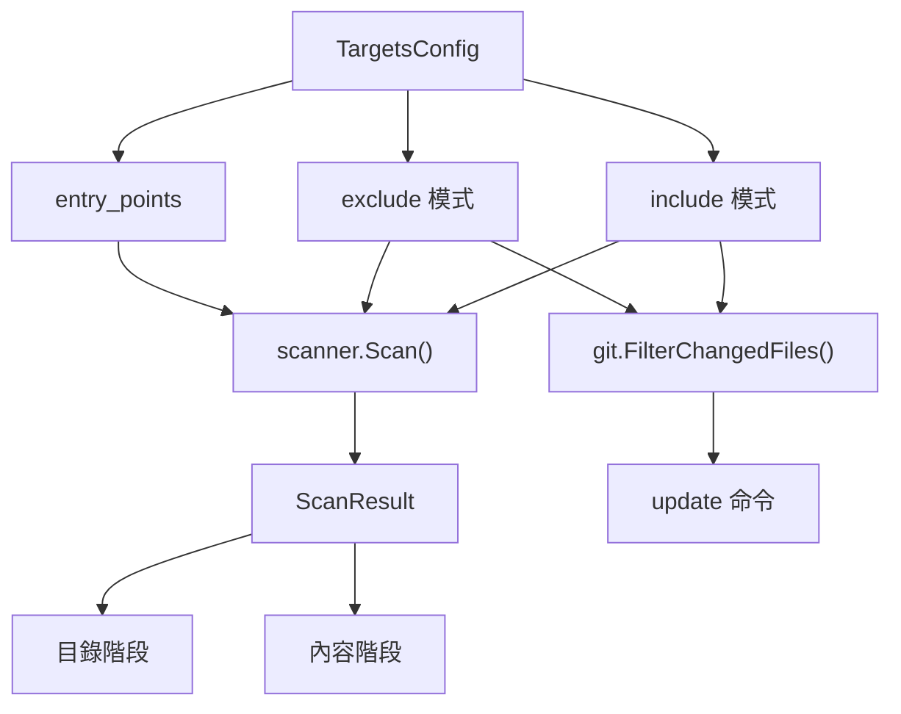
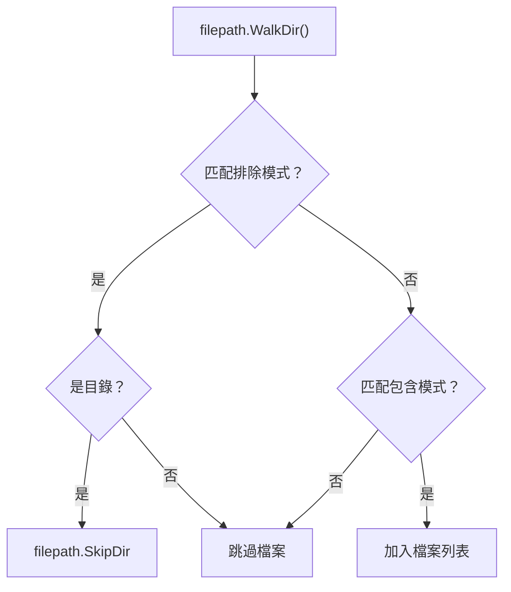

# 專案目標

`selfmd.yaml` 中的 `targets` 區段定義了掃描器在文件生成過程中應包含、排除哪些原始檔案，以及哪些檔案作為進入點。

## 概述

專案目標控制 selfmd 分析的檔案範圍。當 selfmd 掃描專案目錄時，會使用三個設定欄位 — `include`、`exclude` 和 `entry_points` — 來決定要處理哪些檔案。這些相同的模式在增量更新時也會被重複使用，以篩選 git 變更的檔案，確保完整生成與更新工作流程之間的一致性。

模式匹配由 [doublestar](https://github.com/bmatcuk/doublestar) 函式庫驅動，支援 glob 模式，包括用於遞迴目錄匹配的 `**` 萬用字元。

## 架構



## 設定欄位

`TargetsConfig` 結構體定義了三個控制檔案目標的欄位：

```go
type TargetsConfig struct {
	Include     []string `yaml:"include"`
	Exclude     []string `yaml:"exclude"`
	EntryPoints []string `yaml:"entry_points"`
}
```

> Source: internal/config/config.go#L25-L29

### `include`

一組 glob 模式，指定要納入掃描的檔案。只有匹配至少一個 include 模式的檔案才會被處理。如果列表為空，則所有檔案都會被納入（仍受排除規則限制）。

### `exclude`

一組 glob 模式，指定要跳過的檔案和目錄。排除規則優先評估 — 如果目錄匹配排除模式，掃描器會透過 `filepath.SkipDir` 跳過整個目錄樹。

### `entry_points`

一組相對檔案路徑，指向專案的主要進入點檔案。掃描器會讀取其內容並傳遞給目錄生成提示詞，為 Claude 提供關於專案結構和用途的額外上下文。

## 預設值

當 `selfmd init` 生成新設定時，會套用以下預設值：

```go
Targets: TargetsConfig{
	Include: []string{"src/**", "pkg/**", "cmd/**", "internal/**", "lib/**", "app/**"},
	Exclude: []string{
		"vendor/**", "node_modules/**", ".git/**", ".doc-build/**",
		"**/*.pb.go", "**/generated/**", "dist/**", "build/**",
	},
	EntryPoints: []string{},
},
```

> Source: internal/config/config.go#L102-L109

`init` 命令也會根據專案類型自動偵測進入點：

```go
checks := []struct {
	file    string
	pType   string
	entries []string
}{
	{"go.mod", "backend", []string{"main.go", "cmd/root.go"}},
	{"Cargo.toml", "backend", []string{"src/main.rs", "src/lib.rs"}},
	{"package.json", "frontend", []string{"src/index.ts", "src/index.js", "src/main.ts", "src/App.tsx"}},
	{"pom.xml", "backend", []string{"src/main/java"}},
	{"build.gradle", "backend", []string{"src/main/java"}},
	{"requirements.txt", "backend", []string{"main.py", "app.py", "src/main.py"}},
	{"pyproject.toml", "backend", []string{"src/main.py", "main.py"}},
	{"composer.json", "backend", []string{"public/index.php", "src/Kernel.php"}},
	{"Gemfile", "backend", []string{"config/application.rb", "app/"}},
}
```

> Source: cmd/init.go#L61-L75

只有實際存在於磁碟上的進入點路徑才會被納入最終設定。

## Glob 模式語法

模式使用 `doublestar` 函式庫進行匹配。主要規則：

| 模式 | 含義 |
|------|------|
| `*` | 匹配任意序列的非分隔符字元 |
| `**` | 遞迴匹配零個或多個目錄 |
| `?` | 匹配任意單個非分隔符字元 |
| `[abc]` | 匹配集合中的任意字元 |
| `{a,b}` | 匹配 `a` 或 `b` |

範例：

| 模式 | 匹配結果 |
|------|----------|
| `src/**` | `src/` 下任意深度的所有檔案 |
| `**/*.pb.go` | 所有 Protocol Buffer 生成的 Go 檔案 |
| `**/generated/**` | 任何 `generated/` 目錄中的所有檔案 |
| `vendor/**` | `vendor/` 下的所有檔案 |

## 核心流程

### 掃描器檔案篩選

掃描器遍歷專案目錄，先套用排除模式，再套用包含模式：



掃描器實作在目錄遍歷過程中套用此邏輯：

```go
// check excludes
for _, pattern := range cfg.Targets.Exclude {
	matched, _ := doublestar.Match(pattern, rel)
	if matched {
		if d.IsDir() {
			return filepath.SkipDir
		}
		return nil
	}
}

// ...

// check includes
if len(cfg.Targets.Include) > 0 {
	included := false
	for _, pattern := range cfg.Targets.Include {
		matched, _ := doublestar.Match(pattern, rel)
		if matched {
			included = true
			break
		}
	}
	if !included {
		return nil
	}
}
```

> Source: internal/scanner/scanner.go#L33-L61

### 進入點讀取

檔案列表建立完成後，掃描器會讀取每個進入點檔案的內容，並儲存在 `ScanResult.EntryPointContents` 中。超過 50,000 個字元的檔案會被截斷。

```go
entryPointContents := make(map[string]string)
for _, ep := range cfg.Targets.EntryPoints {
	content := readFileIfExists(rootDir, ep)
	if content != "" {
		entryPointContents[ep] = content
	}
}
```

> Source: internal/scanner/scanner.go#L84-L90

此內容隨後會透過 `EntryPointsFormatted()` 格式化並注入到目錄生成提示詞中：

```go
data := prompt.CatalogPromptData{
	// ...
	EntryPoints: scan.EntryPointsFormatted(),
	// ...
}
```

> Source: internal/generator/catalog_phase.go#L17-L28

### Git 變更篩選

在增量更新（`selfmd update`）期間，相同的 include/exclude 模式會篩選 git 變更的檔案，確保只有相關的變更才會觸發文件重新生成：

```go
changedFiles = git.FilterChangedFiles(changedFiles, cfg.Targets.Include, cfg.Targets.Exclude)
```

> Source: cmd/update.go#L94

`FilterChangedFiles` 函式解析 `git diff --name-status` 的輸出，並套用相同的 doublestar 匹配邏輯：

```go
func FilterChangedFiles(changedFiles string, includes, excludes []string) string {
	lines := strings.Split(changedFiles, "\n")
	var filtered []string

	for _, line := range lines {
		// ...
		filePath := parts[len(parts)-1]

		// Check excludes
		excluded := false
		for _, pattern := range excludes {
			if matched, _ := doublestar.Match(pattern, filePath); matched {
				excluded = true
				break
			}
		}
		if excluded {
			continue
		}

		// Check includes (if configured)
		if len(includes) > 0 {
			included := false
			for _, pattern := range includes {
				if matched, _ := doublestar.Match(pattern, filePath); matched {
					included = true
					break
				}
			}
			if !included {
				continue
			}
		}

		filtered = append(filtered, line)
	}

	return strings.Join(filtered, "\n")
}
```

> Source: internal/git/git.go#L73-L122

## 使用範例

`selfmd.yaml` 中典型的 `targets` 區段：

```yaml
targets:
    include:
        - src/**
        - pkg/**
        - cmd/**
        - internal/**
        - lib/**
        - app/**
    exclude:
        - vendor/**
        - node_modules/**
        - .git/**
        - .doc-build/**
        - '**/*.pb.go'
        - '**/generated/**'
        - dist/**
        - build/**
    entry_points:
        - main.go
        - cmd/root.go
```

> Source: selfmd.yaml#L5-L23

### 自訂技巧

**包含多個服務的 Monorepo：**將 include 模式縮小到相關的服務目錄：

```yaml
targets:
    include:
        - services/api/**
        - shared/lib/**
```

**前端專案：**聚焦於原始檔案，排除測試和建構產物：

```yaml
targets:
    include:
        - src/**
    exclude:
        - node_modules/**
        - dist/**
        - '**/*.test.ts'
        - '**/*.spec.ts'
        - coverage/**
```

**新增進入點：**指定 Claude 應讀取的主要檔案以獲取專案上下文：

```yaml
targets:
    entry_points:
        - src/index.ts
        - src/App.tsx
```

## 相關連結

- [設定概述](../config-overview/index.md)
- [Claude 設定](../claude-config/index.md)
- [Git 整合設定](../git-config/index.md)
- [專案掃描器](../../core-modules/scanner/index.md)
- [變更偵測](../../git-integration/change-detection/index.md)
- [受影響頁面匹配](../../git-integration/affected-pages/index.md)
- [目錄階段](../../core-modules/generator/catalog-phase/index.md)

## 參考檔案

| 檔案路徑 | 說明 |
|----------|------|
| `internal/config/config.go` | `TargetsConfig` 結構體定義與預設值 |
| `internal/scanner/scanner.go` | 使用 include/exclude 模式與進入點讀取的掃描器實作 |
| `internal/scanner/filetree.go` | `ScanResult` 結構體與檔案樹建構 |
| `internal/git/git.go` | `FilterChangedFiles` 將目標模式套用於 git diff |
| `internal/generator/pipeline.go` | 呼叫掃描器的生成器管線 |
| `internal/generator/catalog_phase.go` | 使用進入點內容的目錄階段 |
| `internal/prompt/engine.go` | 包含 `EntryPoints` 欄位的 `CatalogPromptData` 結構體 |
| `cmd/init.go` | 專案類型與進入點的自動偵測 |
| `cmd/generate.go` | 載入設定並呼叫管線的 generate 命令 |
| `cmd/update.go` | 使用目標模式篩選變更檔案的 update 命令 |
| `selfmd.yaml` | 範例專案設定檔 |