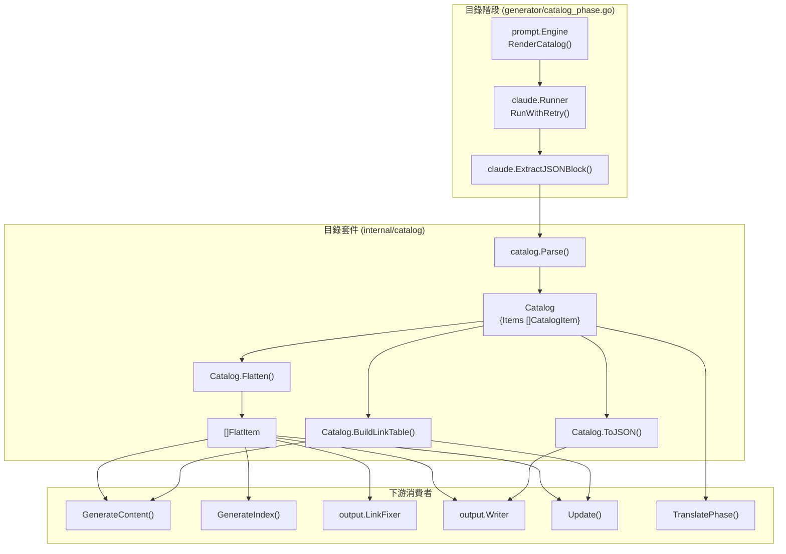
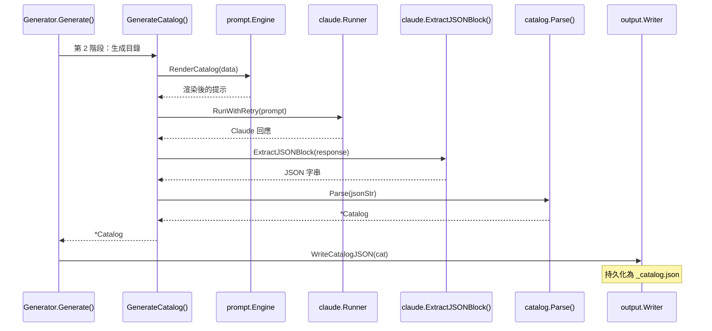

# 目錄管理器

目錄管理器（`internal/catalog`）定義並管理驅動整個生成管線的階層式文件結構。它提供了用於表示、解析、扁平化和序列化文件目錄的核心資料模型。

## 概覽

目錄管理器是 selfmd 中的基礎模組，負責表示用來組織所有文件頁面的樹狀目錄結構。生成管線的所有其他階段——內容生成、索引生成、導覽、連結修正、翻譯和增量更新——都依賴於目錄資料模型。

主要職責：

- **定義目錄資料模型** — `Catalog`、`CatalogItem`（樹節點）和 `FlatItem`（扁平化表示）
- **將 JSON 解析為目錄樹** — 將 Claude AI 生成的輸出反序列化為結構化的 `Catalog`
- **將樹扁平化以便迭代** — 將階層結構轉換為深度優先排序的扁平列表
- **序列化回 JSON** — 持久化目錄以便在多次生成間重複使用
- **建構連結表** — 生成用於提示範本的格式化路徑參照

目錄最初由 Claude AI 在生成管線的第 2 階段生成，然後作為 `_catalog.json` 持久化在輸出目錄中，供後續執行和增量更新時重複使用。

## 架構



## 資料模型

目錄套件定義了三個核心型別來表示文件結構。

### Catalog

持有文件樹頂層項目的根容器。

```go
type Catalog struct {
	Items []CatalogItem `json:"items"`
}
```

> Source: internal/catalog/catalog.go#L11-L13

### CatalogItem

表示單一文件章節的遞迴樹節點。每個項目可以擁有巢狀子項目，形成階層結構。

```go
type CatalogItem struct {
	Title    string        `json:"title"`
	Path     string        `json:"path"`
	Order    int           `json:"order"`
	Children []CatalogItem `json:"children"`
}
```

> Source: internal/catalog/catalog.go#L16-L21

- **Title** — 文件頁面的顯示標題（依語言而異）
- **Path** — 小寫、以連字號分隔的短代碼（例如 `"cmd-generate"`）
- **Order** — 同層項目的數值排序
- **Children** — 形成樹狀階層的巢狀子項目

### FlatItem

透過扁平化目錄樹產生的計算表示。這是下游模組主要使用的型別。

```go
type FlatItem struct {
	Title      string
	Path       string // dot-notation path, e.g., "core-modules.authentication"
	DirPath    string // filesystem path, e.g., "core-modules/authentication"
	Depth      int
	ParentPath string
	HasChildren bool
}
```

> Source: internal/catalog/catalog.go#L24-L31

雙路徑表示是此模組設計的核心：
- **Path** 使用點記法（`core-modules.scanner`）用於內部參照和提示資料
- **DirPath** 使用檔案系統斜線（`core-modules/scanner`）用於將檔案寫入磁碟

## 核心流程

### 目錄生成流程

目錄在生成管線的第 2 階段建立。此流程包括使用專案中繼資料渲染提示範本、呼叫 Claude AI、從回應中擷取 JSON，以及將其解析為 `Catalog` 結構。



### 目錄重複使用

當輸出目錄在多次執行間未被清除時，管線會嘗試載入現有的 `_catalog.json`，而非呼叫 Claude。這可以避免多餘的 AI 呼叫，並保持穩定的目錄結構。

```go
var cat *catalog.Catalog
if !clean {
	// Try to reuse existing catalog
	catJSON, readErr := g.Writer.ReadCatalogJSON()
	if readErr == nil {
		cat, err = catalog.Parse(catJSON)
	}
	if cat != nil {
		items := cat.Flatten()
		fmt.Printf("[2/4] Loaded existing catalog (%d sections, %d items)\n", len(cat.Items), len(items))
	}
}
```

> Source: internal/generator/pipeline.go#L102-L113

### 扁平化演算法

`Flatten()` 方法對目錄樹執行深度優先走訪，產生 `FlatItem` 值的扁平列表。主要的複雜度在於處理 Claude 可能產生的兩種路徑格式：

- **格式 A** — 相對路徑，子項目的 `Path` 需要加上父層前綴（例如，父層 `"overview"` 下的子路徑 `"introduction"` 會變成 `"overview.introduction"`）
- **格式 B** — 完整路徑，已經包含父目錄（例如 `"overview/introduction"`）

```go
func flattenItem(items *[]FlatItem, item CatalogItem, parentPath string, depth int) {
	path := item.Path
	dirPath := strings.ReplaceAll(path, ".", "/")

	if parentPath != "" {
		parentDir := strings.ReplaceAll(parentPath, ".", "/")
		if !strings.HasPrefix(dirPath, parentDir+"/") {
			path = parentPath + "." + item.Path
			dirPath = strings.ReplaceAll(path, ".", "/")
		} else {
			path = strings.ReplaceAll(dirPath, "/", ".")
		}
	}

	*items = append(*items, FlatItem{
		Title:       item.Title,
		Path:        path,
		DirPath:     dirPath,
		Depth:       depth,
		ParentPath:  parentPath,
		HasChildren: len(item.Children) > 0,
	})

	for _, child := range item.Children {
		flattenItem(items, child, path, depth+1)
	}
}
```

> Source: internal/catalog/catalog.go#L56-L88

## API 參考

### Parse

將 JSON 字串反序列化為 `Catalog`。如果 JSON 無效或目錄不包含任何項目，則回傳錯誤。

```go
func Parse(data string) (*Catalog, error) {
	var cat Catalog
	if err := json.Unmarshal([]byte(data), &cat); err != nil {
		return nil, fmt.Errorf("%s: %w", "failed to parse catalog JSON", err)
	}

	if len(cat.Items) == 0 {
		return nil, fmt.Errorf("%s", "catalog cannot be empty")
	}

	return &cat, nil
}
```

> Source: internal/catalog/catalog.go#L34-L45

### Flatten

以深度優先順序回傳所有目錄項目為 `[]FlatItem`，為每個項目計算完整的點記法路徑和檔案系統路徑。

```go
func (c *Catalog) Flatten() []FlatItem {
	var items []FlatItem
	for _, item := range c.Items {
		flattenItem(&items, item, "", 0)
	}
	return items
}
```

> Source: internal/catalog/catalog.go#L48-L54

### ToJSON

將目錄序列化回縮排格式的 JSON 以進行持久化。

```go
func (c *Catalog) ToJSON() (string, error) {
	data, err := json.MarshalIndent(c, "", "  ")
	if err != nil {
		return "", err
	}
	return string(data), nil
}
```

> Source: internal/catalog/catalog.go#L91-L97

### BuildLinkTable

產生一個格式化字串，顯示所有目錄項目及其目錄路徑，用於內容生成提示中，為 Claude 提供完整的文件結構。

```go
func (c *Catalog) BuildLinkTable() string {
	items := c.Flatten()
	var sb strings.Builder
	for _, item := range items {
		indent := strings.Repeat("  ", item.Depth)
		sb.WriteString(fmt.Sprintf("%s- 「%s」 → %s/index.md\n", indent, item.Title, item.DirPath))
	}
	return sb.String()
}
```

> Source: internal/catalog/catalog.go#L106-L114

輸出格式使用縮排來反映巢狀深度，例如：

```
- 「Overview」 → overview/index.md
  - 「Introduction」 → overview/introduction/index.md
  - 「Tech Stack」 → overview/tech-stack/index.md
- 「Core Modules」 → core-modules/index.md
  - 「Catalog Manager」 → core-modules/catalog/index.md
```

## 目錄持久化

目錄透過 `output.Writer` 儲存為輸出目錄中的 `_catalog.json`。此檔案有兩個用途：

1. **跨生成執行重複使用** — 當輸出目錄未被清除時，避免重新生成目錄
2. **增量更新** — `Update()` 方法讀取現有目錄，將變更的原始檔案對應到文件頁面

寫入和讀取由 `Writer` 處理：

```go
func (w *Writer) WriteCatalogJSON(cat *catalog.Catalog) error {
	data, err := cat.ToJSON()
	if err != nil {
		return err
	}
	return w.WriteFile("_catalog.json", data)
}

func (w *Writer) ReadCatalogJSON() (string, error) {
	path := filepath.Join(w.BaseDir, "_catalog.json")
	data, err := os.ReadFile(path)
	if err != nil {
		return "", fmt.Errorf("failed to read catalog JSON: %w", err)
	}
	return string(data), nil
}
```

> Source: internal/output/writer.go#L77-L93

## 目錄在增量更新中的角色

在增量更新期間，目錄扮演動態角色。`updater.go` 中的 `addItemToCatalog()` 函式可以在執行期間修改目錄，當 Claude 判斷變更的原始檔案需要新的文件頁面時。

當新頁面作為現有葉節點的子項目新增時，該葉節點會被提升為父節點，透過插入 `"overview"` 子項目來保留原始內容：

```go
func addItemToCatalog(cat *catalog.Catalog, catalogPath, title string) *promotedLeaf {
	parts := strings.Split(catalogPath, ".")
	var promoted *promotedLeaf
	addItemToChildren(&cat.Items, parts, title, "", &promoted)
	return promoted
}
```

> Source: internal/generator/updater.go#L372-L377

修改完成後，目錄表和連結修正器會被重建，並儲存更新後的目錄：

```go
if len(newPages) > 0 {
	catalogTable = cat.BuildLinkTable()
	linkFixer = output.NewLinkFixer(cat)
	if err := g.Writer.WriteCatalogJSON(cat); err != nil {
		g.Logger.Warn("failed to save updated catalog", "error", err)
	}
}
```

> Source: internal/generator/updater.go#L119-L127

## 相關連結

- [核心模組](../index.md)
- [文件生成器](../generator/index.md)
- [目錄階段](../generator/catalog-phase/index.md)
- [提示引擎](../prompt-engine/index.md)
- [Claude 執行器](../claude-runner/index.md)
- [輸出寫入器](../output-writer/index.md)
- [增量更新引擎](../incremental-update/index.md)
- [生成管線](../../architecture/pipeline/index.md)

## 參考檔案

| 檔案路徑 | 說明 |
|-----------|------|
| `internal/catalog/catalog.go` | 核心目錄資料模型：`Catalog`、`CatalogItem`、`FlatItem` 及所有目錄操作 |
| `internal/generator/catalog_phase.go` | 目錄生成階段——呼叫 Claude 產生目錄 |
| `internal/generator/pipeline.go` | 主要生成管線——協調目錄建立與重複使用 |
| `internal/generator/content_phase.go` | 內容生成——使用 `Flatten()` 和 `BuildLinkTable()` 進行頁面生成 |
| `internal/generator/index_phase.go` | 索引生成——使用 `Flatten()` 建構導覽和分類頁面 |
| `internal/generator/updater.go` | 增量更新——動態讀取、修改和儲存目錄 |
| `internal/output/writer.go` | 持久化和讀取 `_catalog.json`；使用 `FlatItem` 寫入頁面 |
| `internal/output/navigation.go` | 從目錄結構生成索引和側邊欄導覽 |
| `internal/output/linkfixer.go` | 從扁平化目錄建構連結索引以修正損壞的連結 |
| `internal/prompt/engine.go` | 提示範本引擎——定義 `CatalogPromptData` 並渲染目錄提示 |
| `internal/prompt/templates/en-US/catalog.tmpl` | 英文目錄生成提示範本 |
| `docs/_catalog.json` | 持久化目錄 JSON 輸出範例 |