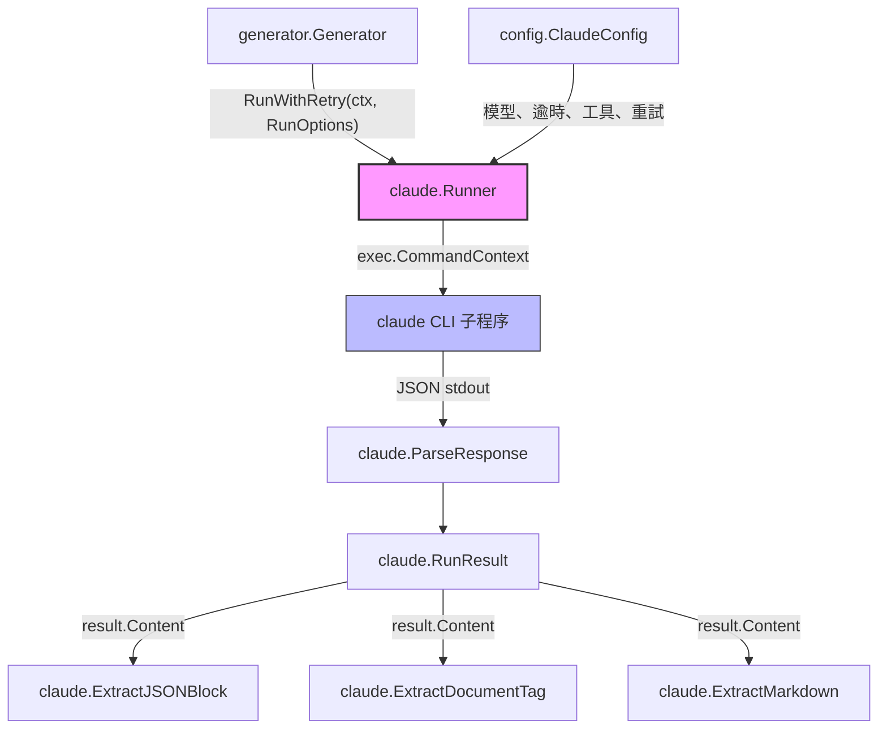
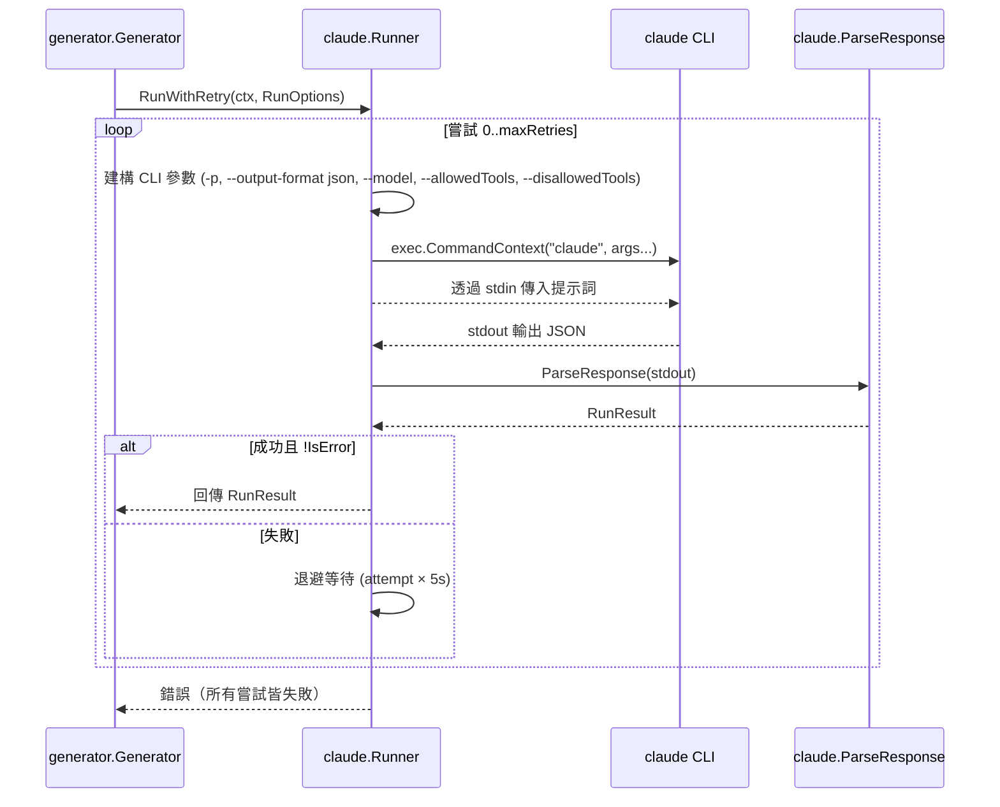

# Claude Runner

Claude Runner（`internal/claude`）是子程序管理層，負責處理與 Claude CLI 的所有互動。它封裝了命令建構、執行、逾時管理、重試邏輯和回應解析等功能。

## 概覽

Claude Runner 作為 selfmd 文件產生管線與外部 `claude` CLI 工具之間的橋樑。selfmd 不使用 HTTP API，而是將 Claude Code 作為本地子程序呼叫，透過 stdin 傳入提示詞，並在 stdout 接收結構化的 JSON 回應。

主要職責：

- **CLI 呼叫** — 建構並執行 `claude -p --output-format json` 命令，支援可設定的模型、工具限制和逾時設定
- **退避重試** — 自動以線性退避（5 秒 × 嘗試次數）重試失敗的呼叫
- **回應解析** — 將 Claude 的 JSON 輸出反序列化為具型別的 Go 結構體
- **內容擷取** — 提供工具函式從 Claude 的自由格式文字回應中擷取 JSON 區塊、Markdown 內容和 `<document>` 標籤內容
- **可用性檢查** — 在執行任何管線階段前，驗證 `claude` CLI 是否已安裝

## 架構



## 核心型別

### RunOptions

`RunOptions` 設定單次 Claude CLI 呼叫的參數。呼叫者指定提示詞、工作目錄，以及可選的模型、工具和逾時覆寫值。

```go
type RunOptions struct {
	Prompt       string
	WorkDir      string        // CWD for the claude process
	AllowedTools []string      // tool restrictions
	Model        string        // model override
	Timeout      time.Duration // per-invocation timeout
	ExtraArgs    []string      // additional CLI arguments
}
```

> Source: internal/claude/types.go#L6-L13

### RunResult

`RunResult` 保存 Claude CLI 呼叫的解析輸出，包括文字內容、錯誤狀態、執行時間、費用和工作階段 ID。

```go
type RunResult struct {
	Content    string  // the text result from Claude
	IsError    bool    // whether Claude reported an error
	DurationMs int64   // execution time in milliseconds
	CostUSD    float64 // cost of this invocation
	SessionID  string  // Claude session ID
}
```

> Source: internal/claude/types.go#L15-L22

### CLIResponse

`CLIResponse` 直接對應 `claude -p --output-format json` 回傳的 JSON 結構。

```go
type CLIResponse struct {
	Type       string  `json:"type"`
	Subtype    string  `json:"subtype"`
	IsError    bool    `json:"is_error"`
	Result     string  `json:"result"`
	DurationMs int64   `json:"duration_ms"`
	TotalCost  float64 `json:"total_cost_usd"`
	SessionID  string  `json:"session_id"`
}
```

> Source: internal/claude/types.go#L24-L33

### ClaudeConfig

`Runner` 以 `config.ClaudeConfig` 結構體初始化，提供模型、並行數、逾時、重試次數、允許的工具和額外參數的預設值。

```go
type ClaudeConfig struct {
	Model          string   `yaml:"model"`
	MaxConcurrent  int      `yaml:"max_concurrent"`
	TimeoutSeconds int      `yaml:"timeout_seconds"`
	MaxRetries     int      `yaml:"max_retries"`
	AllowedTools   []string `yaml:"allowed_tools"`
	ExtraArgs      []string `yaml:"extra_args"`
}
```

> Source: internal/config/config.go#L82-L89

預設值：

```go
Claude: ClaudeConfig{
	Model:          "sonnet",
	MaxConcurrent:  3,
	TimeoutSeconds: 1800,
	MaxRetries:     2,
	AllowedTools:   []string{"Read", "Glob", "Grep"},
	ExtraArgs:      []string{},
},
```

> Source: internal/config/config.go#L116-L123

## 核心流程

### 呼叫生命週期

以下序列圖展示單次 Claude 呼叫如何從產生器經由 runner 流向 CLI 再返回的過程：



### 命令建構

`Run` 方法按特定順序建構 CLI 參數：

1. 基本旗標：`-p`（管道模式）和 `--output-format json`
2. 模型：取自 `RunOptions.Model`，若未指定則回退至 `config.ClaudeConfig.Model`
3. 允許的工具：取自 `RunOptions.AllowedTools`，若未指定則回退至 `config.ClaudeConfig.AllowedTools`
4. 禁用的工具：`Write` 和 `Edit` 始終被封鎖，以防止 Claude 在被拒絕的工具呼叫中遺失內容
5. 額外參數：來自設定檔和單次呼叫選項

```go
args := []string{
	"-p",
	"--output-format", "json",
}
// ...
// Explicitly block Write/Edit to prevent content from being lost in denied tool calls
args = append(args, "--disallowedTools", "Write", "--disallowedTools", "Edit")
```

> Source: internal/claude/runner.go#L32-L56

### 重試邏輯

`RunWithRetry` 以可設定的重試行為包裝 `Run`。當 CLI 呼叫回傳錯誤或 `RunResult.IsError` 為 `true` 時會進行重試。退避策略為線性：`嘗試次數 × 5 秒`。

```go
func (r *Runner) RunWithRetry(ctx context.Context, opts RunOptions) (*RunResult, error) {
	maxRetries := r.config.MaxRetries
	var lastErr error

	for attempt := 0; attempt <= maxRetries; attempt++ {
		if attempt > 0 {
			backoff := time.Duration(attempt) * 5 * time.Second
			r.logger.Info("retrying", "attempt", attempt+1, "backoff", backoff)
			select {
			case <-ctx.Done():
				return nil, ctx.Err()
			case <-time.After(backoff):
			}
		}

		result, err := r.Run(ctx, opts)
		if err == nil && !result.IsError {
			return result, nil
		}
		// ...
	}

	return nil, fmt.Errorf("all %d attempts failed: %w", maxRetries+1, lastErr)
}
```

> Source: internal/claude/runner.go#L112-L143

### 逾時處理

每次呼叫都以 `context.WithTimeout` 包裝。若超過期限，runner 會回傳描述性的逾時錯誤，而非通用的 context 錯誤。

```go
timeout := opts.Timeout
if timeout == 0 {
	timeout = time.Duration(r.config.TimeoutSeconds) * time.Second
}

ctx, cancel := context.WithTimeout(ctx, timeout)
defer cancel()
```

> Source: internal/claude/runner.go#L61-L67

## 回應解析與內容擷取

### ParseResponse

將 Claude CLI 的原始 JSON 輸出反序列化為 `RunResult` 結構體。

```go
func ParseResponse(data []byte) (*RunResult, error) {
	var resp CLIResponse
	if err := json.Unmarshal(data, &resp); err != nil {
		return nil, fmt.Errorf("JSON parse failed: %w", err)
	}

	return &RunResult{
		Content:    resp.Result,
		IsError:    resp.IsError,
		DurationMs: resp.DurationMs,
		CostUSD:    resp.TotalCost,
		SessionID:  resp.SessionID,
	}, nil
}
```

> Source: internal/claude/parser.go#L12-L25

### ExtractJSONBlock

從 Claude 的回應文字中擷取 JSON。由目錄階段和更新引擎用於解析結構化 JSON 輸出。此函式依序嘗試三種策略：

1. 帶標記的程式碼區塊 ` ```json ... ``` `
2. 不帶語言標記的程式碼區塊 ` ``` ... ``` `
3. 透過大括號深度追蹤偵測原始 JSON 物件

```go
func ExtractJSONBlock(text string) (string, error) {
	// try fenced code block first
	re := regexp.MustCompile("(?s)```json\\s*\n(.*?)```")
	matches := re.FindStringSubmatch(text)
	if len(matches) > 1 {
		return strings.TrimSpace(matches[1]), nil
	}

	// try without language tag
	re = regexp.MustCompile("(?s)```\\s*\n(\\{.*?\\})\\s*```")
	matches = re.FindStringSubmatch(text)
	if len(matches) > 1 {
		return strings.TrimSpace(matches[1]), nil
	}

	// try to find raw JSON object
	start := strings.Index(text, "{")
	if start >= 0 {
		depth := 0
		for i := start; i < len(text); i++ {
			switch text[i] {
			case '{':
				depth++
			case '}':
				depth--
				if depth == 0 {
					return text[start : i+1], nil
				}
			}
		}
	}

	return "", fmt.Errorf("%s", "failed to extract JSON block from response")
}
```

> Source: internal/claude/parser.go#L27-L62

### ExtractDocumentTag

從 `<document>` 標籤中擷取內容。