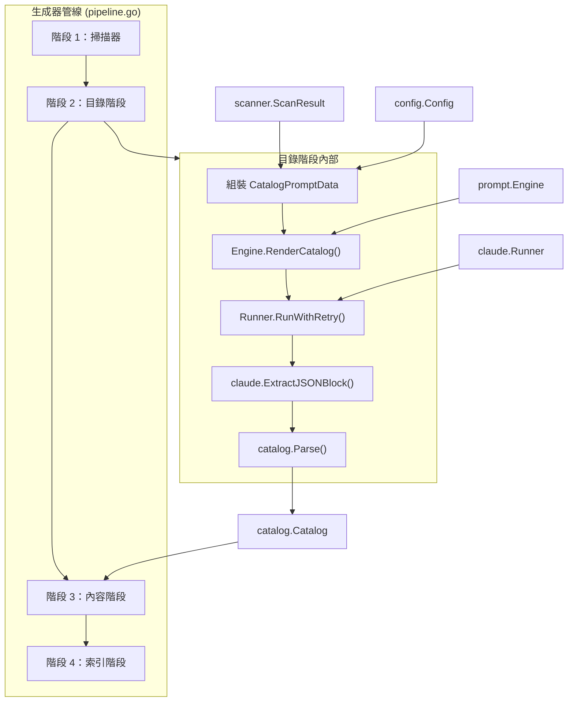
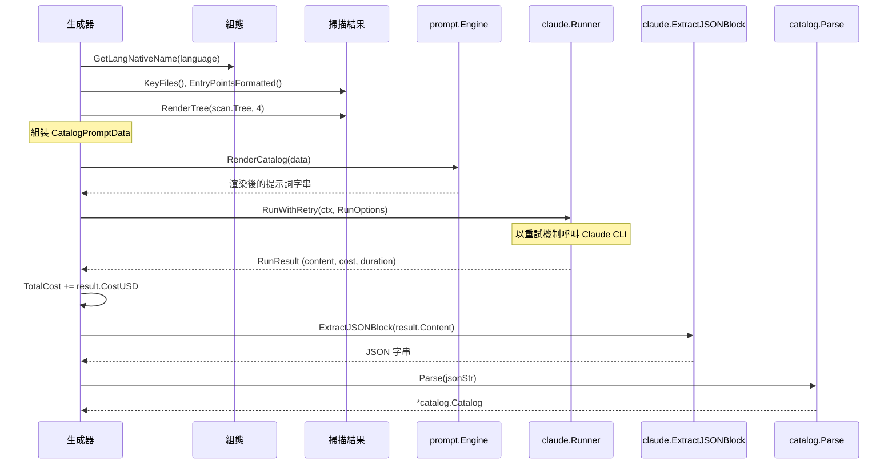

# 目錄階段

目錄階段是 selfmd 文件生成管線的第二個階段。它使用 Claude AI 分析專案的原始碼結構，並產生 JSON 格式的階層式文件目錄。

## 概覽

目錄階段作為整個文件生成流程的結構規劃步驟。在專案掃描器收集了檔案樹、關鍵檔案、README 內容和入口點之後，目錄階段會透過提示詞模板將這些資訊傳送給 Claude。Claude 分析程式碼庫後回傳一個 JSON 目錄，定義文件的目錄結構——包括章節標題、路徑、排序和巢狀層級。

此目錄接著驅動所有後續階段：內容階段利用它來決定要生成哪些頁面，索引階段則用它來建構導覽。

主要職責：
- 將專案中繼資料組裝成 `CatalogPromptData` 結構體
- 透過提示詞引擎渲染目錄提示詞模板
- 以重試邏輯呼叫 Claude CLI
- 從 Claude 的回應中擷取並解析 JSON 目錄
- 追蹤呼叫成本和持續時間

## 架構



## 資料流

### 輸入：CatalogPromptData

目錄階段從專案組態和掃描結果中組裝 `CatalogPromptData` 結構體。此結構體包含 Claude 設計適當文件結構所需的所有上下文。

```go
type CatalogPromptData struct {
	RepositoryName       string
	ProjectType          string
	Language             string
	LanguageName         string // native display name (e.g., "繁體中文")
	LanguageOverride     bool   // true when template lang != output lang
	LanguageOverrideName string // native name of the desired output language
	KeyFiles             string
	EntryPoints          string
	FileTree             string
	ReadmeContent        string
}
```

> Source: internal/prompt/engine.go#L40-L51

每個欄位從特定來源填充：

| 欄位 | 來源 | 說明 |
|------|------|------|
| `RepositoryName` | `config.Project.Name` | 來自 `selfmd.yaml` 的專案名稱 |
| `ProjectType` | `config.Project.Type` | 專案類型（例如 `"backend"`） |
| `Language` | `config.Output.Language` | 目標語言代碼（例如 `"zh-TW"`） |
| `LanguageName` | `config.GetLangNativeName()` | 語言的原生顯示名稱 |
| `LanguageOverride` | `config.Output.NeedsLanguageOverride()` | 模板語言是否與輸出語言不同 |
| `KeyFiles` | `scan.KeyFiles()` | 重要檔案如 `go.mod`、`main.go`、`README.md` |
| `EntryPoints` | `scan.EntryPointsFormatted()` | 已設定入口點檔案的內容 |
| `FileTree` | `scanner.RenderTree()` | 專案的 ASCII 樹狀結構表示 |
| `ReadmeContent` | `scan.ReadmeContent` | 完整的 README 內容 |

### 輸出：Catalog

輸出是一個 `catalog.Catalog` 結構體——由 `CatalogItem` 節點組成的樹狀結構，包含標題、路徑、排序和巢狀子項目。

```go
type Catalog struct {
	Items []CatalogItem `json:"items"`
}

type CatalogItem struct {
	Title    string        `json:"title"`
	Path     string        `json:"path"`
	Order    int           `json:"order"`
	Children []CatalogItem `json:"children"`
}
```

> Source: internal/catalog/catalog.go#L11-L21

## 核心流程



### 逐步執行

`Generator` 結構體上的 `GenerateCatalog` 方法執行以下步驟：

**1. 組裝提示詞資料**

將專案中繼資料和掃描結果收集到 `CatalogPromptData` 結構體中：

```go
langName := config.GetLangNativeName(g.Config.Output.Language)
data := prompt.CatalogPromptData{
	RepositoryName:       g.Config.Project.Name,
	ProjectType:          g.Config.Project.Type,
	Language:             g.Config.Output.Language,
	LanguageName:         langName,
	LanguageOverride:     g.Config.Output.NeedsLanguageOverride(),
	LanguageOverrideName: langName,
	KeyFiles:             scan.KeyFiles(),
	EntryPoints:          scan.EntryPointsFormatted(),
	FileTree:             scanner.RenderTree(scan.Tree, 4),
	ReadmeContent:        scan.ReadmeContent,
}
```

> Source: internal/generator/catalog_phase.go#L16-L28

**2. 渲染提示詞模板**

將組裝好的資料傳遞給提示詞引擎，該引擎使用 Go 的 `text/template` 渲染 `catalog.tmpl`：

```go
rendered, err := g.Engine.RenderCatalog(data)
```

> Source: internal/generator/catalog_phase.go#L30

**3. 以重試邏輯呼叫 Claude**

渲染後的提示詞透過 `RunWithRetry` 傳送至 Claude CLI，該方法提供指數退避的自動重試機制：

```go
result, err := g.Runner.RunWithRetry(ctx, claude.RunOptions{
	Prompt:  rendered,
	WorkDir: g.RootDir,
})
```

> Source: internal/generator/catalog_phase.go#L37-L40

重試邏輯使用 `config.Claude.MaxRetries`（預設值：2），退避時間為 `attempt * 5 秒`：

```go
for attempt := 0; attempt <= maxRetries; attempt++ {
	if attempt > 0 {
		backoff := time.Duration(attempt) * 5 * time.Second
		// ...
		select {
		case <-ctx.Done():
			return nil, ctx.Err()
		case <-time.After(backoff):
		}
	}
	result, err := r.Run(ctx, opts)
	if err == nil && !result.IsError {
		return result, nil
	}
	// ...
}
```

> Source: internal/claude/runner.go#L113-L143

**4. 從回應中擷取 JSON**

Claude 的回應可能包含 Markdown 圍欄式 JSON 或原始 JSON。`ExtractJSONBlock` 依序嘗試三種策略：圍欄式 ` ```json ` 區塊、無標記的圍欄區塊，以及最後透過大括號深度計數進行原始 JSON 物件擷取：

```go
jsonStr, err := claude.ExtractJSONBlock(result.Content)
```

> Source: internal/generator/catalog_phase.go#L50

**5. 解析為 Catalog 結構體**

擷取的 JSON 字串被反序列化為 `Catalog` 結構體。解析過程會驗證至少存在一個項目：

```go
cat, err := catalog.Parse(jsonStr)
```

> Source: internal/generator/catalog_phase.go#L55

### 目錄重用最佳化

在管線的 `Generate` 方法中，目錄階段包含一項最佳化：如果未指定 `--clean`，它會先嘗試從輸出目錄載入現有的 `_catalog.json`，完全跳過 Claude 呼叫：

```go
if !clean {
	catJSON, readErr := g.Writer.ReadCatalogJSON()
	if readErr == nil {
		cat, err = catalog.Parse(catJSON)
	}
	if cat != nil {
		items := cat.Flatten()
		fmt.Printf("[2/4] Loaded existing catalog (%d sections, %d items)\n", len(cat.Items), len(items))
	}
}
if cat == nil {
	fmt.Println("[2/4] Generating catalog...")
	cat, err = g.GenerateCatalog(ctx, scan)
	// ...
}
```

> Source: internal/generator/pipeline.go#L102-L127

成功生成後，目錄 JSON 會透過 `Writer.WriteCatalogJSON` 持久化儲存，以便後續執行時重用。

## 提示詞模板

目錄提示詞模板（`catalog.tmpl`）指示 Claude 扮演「資深程式碼庫分析師」的角色，並產生一個 JSON 目錄。提示詞的關鍵面向：

- 提供專案中繼資料（名稱、類型、語言）
- 包含專案的關鍵檔案、入口點、目錄樹和 README
- 執行嚴格規則：完整性、透過工具驗證、禁止捏造
- 定義以業務能力而非程式碼結構為中心的目錄設計原則
- 指定四步驟工作流程：分析入口點、探索模組、設計結構、驗證並輸出
- 要求以單一 ` ```json ` 程式碼區塊輸出，包含 `items` 陣列結構

提示詞明確告知 Claude 使用 `Read`、`Glob` 和 `Grep` 工具在設計目錄之前探索專案。

## 目錄結構

生成的目錄使用巢狀樹狀結構。每個項目包含：

- **`title`**：以設定的輸出語言呈現的人類可讀章節標題
- **`path`**：URL 安全的、小寫、以連字號分隔的路徑片段
- **`order`**：在同層級項目中的數值排序
- **`children`**：形成層級結構的巢狀子項目

`Catalog.Flatten()` 方法將此樹狀結構轉換為 `FlatItem` 項目的扁平列表以供迭代，計算完整的點分隔路徑和檔案系統目錄路徑：

```go
type FlatItem struct {
	Title      string
	Path       string // dot-notation path, e.g., "core-modules.authentication"
	DirPath    string // filesystem path, e.g., "core-modules/authentication"
	Depth      int
	ParentPath string
	HasChildren bool
}
```

> Source: internal/catalog/catalog.go#L24-L31

## 相關連結

- [文件生成器](../index.md) — 父模組概覽
- [內容階段](../content-phase/index.md) — 根據此目錄生成頁面的下一階段
- [索引階段](../index-phase/index.md) — 根據目錄建構導覽的最終階段
- [提示詞引擎](../../prompt-engine/index.md) — 渲染目錄提示詞的模板引擎
- [Claude 執行器](../../claude-runner/index.md) — 執行 Claude 呼叫的 CLI 執行器
- [目錄管理器](../../catalog/index.md) — 目錄資料結構與解析
- [專案掃描器](../../scanner/index.md) — 產生輸入 ScanResult 的掃描器
- [生成管線](../../../architecture/pipeline/index.md) — 整體管線架構

## 參考檔案

| 檔案路徑 | 說明 |
|----------|------|
| `internal/generator/catalog_phase.go` | 核心 `GenerateCatalog` 方法實作 |
| `internal/generator/pipeline.go` | 包含目錄重用邏輯的管線協調 |
| `internal/catalog/catalog.go` | `Catalog`、`CatalogItem` 和 `FlatItem` 結構體定義與解析 |
| `internal/prompt/engine.go` | `CatalogPromptData` 結構體和 `RenderCatalog` 方法 |
| `internal/claude/runner.go` | `Runner.RunWithRetry` 重試邏輯和 CLI 呼叫 |
| `internal/claude/parser.go` | `ExtractJSONBlock` 從 Claude 回應中擷取 JSON |
| `internal/claude/types.go` | `RunOptions`、`RunResult` 和 `CLIResponse` 型別定義 |
| `internal/scanner/scanner.go` | `ScanResult`、`KeyFiles()` 和 `EntryPointsFormatted()` 方法 |
| `internal/scanner/filetree.go` | `FileNode` 樹狀結構和用於提示詞渲染的 `RenderTree` |
| `internal/config/config.go` | `Config` 結構體、語言設定和 `NeedsLanguageOverride` |
| `internal/output/writer.go` | 用於目錄持久化的 `WriteCatalogJSON` 和 `ReadCatalogJSON` |
| `internal/prompt/templates/en-US/catalog.tmpl` | 英文目錄提示詞模板 |
| `cmd/generate.go` | 呼叫生成管線的 CLI 入口點 |