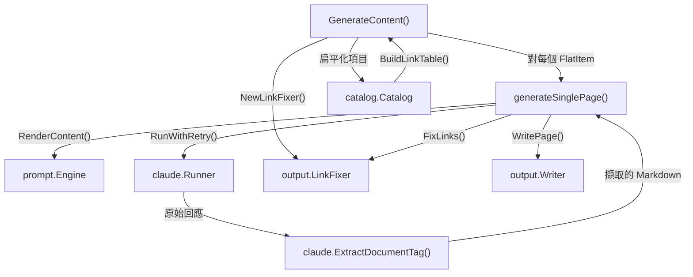
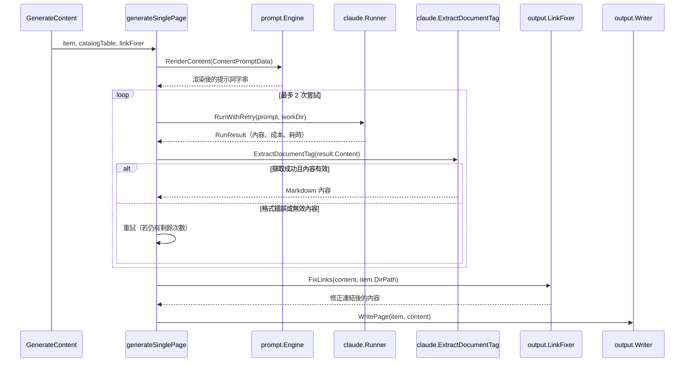

# 內容階段

內容階段是 selfmd 四階段文件生成管線中的第三階段。它接收扁平化的目錄結構，並透過呼叫 Claude CLI 為每個目錄項目並行生成 Markdown 文件頁面。

## 概述

內容階段負責文件生成的主要工作。在第二階段建立目錄結構後，此階段會遍歷每個目錄項目、以專案上下文渲染提示詞、發送給 Claude、驗證回應、後處理連結，並將產生的 Markdown 頁面寫入磁碟。

主要職責：

- **並行頁面生成** — 使用 Go 的 `errgroup` 搭配信號量來並行生成多個頁面，由 `max_concurrent` 設定值控制。
- **提示詞組裝** — 將專案元資料、檔案樹、目錄連結表和頁面特定上下文填入 `ContentPromptData`，然後透過 `content.tmpl` 範本渲染。
- **回應驗證** — 從 `<document>` XML 標籤中擷取內容，並驗證其以 Markdown 標題（`#`）開頭。格式錯誤時最多重試 2 次。
- **連結後處理** — 在寫入前對生成的內容執行 `LinkFixer.FixLinks`，以修正損壞的相對連結。
- **跳過既有頁面優化** — 非全新建置時，磁碟上已存在且內容有效的頁面會被跳過。
- **失敗容錯** — 失敗的頁面會收到佔位內容，而非中止整個生成流程。

## 架構



## 核心元件

### GenerateContent — 並行協調器

`GenerateContent` 是內容階段的進入點。它將目錄結構扁平化為 `FlatItem` 值的列表，建立共享資源（目錄連結表和連結修正器），並為每個項目啟動並行的 goroutine。

```go
func (g *Generator) GenerateContent(ctx context.Context, scan *scanner.ScanResult, cat *catalog.Catalog, concurrency int, skipExisting bool) error {
	items := cat.Flatten()
	total := len(items)

	// Build the catalog link table once for all pages
	catalogTable := cat.BuildLinkTable()

	// Build the link fixer once for all pages
	linkFixer := output.NewLinkFixer(cat)

	var done atomic.Int32
	var failed atomic.Int32
	var skipped atomic.Int32
	var costMu sync.Mutex

	eg, ctx := errgroup.WithContext(ctx)
	sem := make(chan struct{}, concurrency)
```

> Source: internal/generator/content_phase.go#L21-L37

並行性由一個帶緩衝的 channel（`sem`）作為信號量來控制。`concurrency` 參數來源於 `ClaudeConfig.MaxConcurrent`（預設值：3），或透過 `GenerateOptions.Concurrency` 覆寫。

### 跳過既有頁面邏輯

當 `skipExisting` 為 true（即非全新建置）時，頁面在生成前會先與磁碟上的檔案進行比對：

```go
if skipExisting && g.Writer.PageExists(item) {
	skipped.Add(1)
	fmt.Printf("      [Skip] %s (exists)\n", item.Title)
	return nil
}
```

> Source: internal/generator/content_phase.go#L43-L47

Writer 中的 `PageExists` 會檢查檔案是否存在、是否非空，以及是否不包含失敗佔位標記 `"This page failed to generate"`：

```go
func (w *Writer) PageExists(item catalog.FlatItem) bool {
	path := filepath.Join(w.BaseDir, item.DirPath, "index.md")
	data, err := os.ReadFile(path)
	if err != nil {
		return false
	}
	content := strings.TrimSpace(string(data))
	if content == "" {
		return false
	}
	head := content
	if len(head) > 500 {
		head = head[:500]
	}
	if strings.Contains(head, "This page failed to generate") {
		return false
	}
	return true
}
```

> Source: internal/output/writer.go#L97-L117

### generateSinglePage — 單頁管線

此私有方法處理單一文件頁面生成的完整生命週期。

```go
func (g *Generator) generateSinglePage(ctx context.Context, scan *scanner.ScanResult, item catalog.FlatItem, catalogTable string, linkFixer *output.LinkFixer, existingContent string) error {
	langName := config.GetLangNativeName(g.Config.Output.Language)
	data := prompt.ContentPromptData{
		RepositoryName:       g.Config.Project.Name,
		Language:             g.Config.Output.Language,
		LanguageName:         langName,
		LanguageOverride:     g.Config.Output.NeedsLanguageOverride(),
		LanguageOverrideName: langName,
		CatalogPath:          item.Path,
		CatalogTitle:         item.Title,
		CatalogDirPath:       item.DirPath,
		ProjectDir:           g.RootDir,
		FileTree:             scanner.RenderTree(scan.Tree, 3),
		CatalogTable:         catalogTable,
		ExistingContent:      existingContent,
	}

	rendered, err := g.Engine.RenderContent(data)
	if err != nil {
		return err
	}
```

> Source: internal/generator/content_phase.go#L89-L107

### ContentPromptData 結構

`ContentPromptData` 結構體承載 `content.tmpl` 提示詞範本所需的所有上下文：

```go
type ContentPromptData struct {
	RepositoryName       string
	Language             string
	LanguageName         string
	LanguageOverride     bool
	LanguageOverrideName string
	CatalogPath          string
	CatalogTitle         string
	CatalogDirPath       string // filesystem dir path of THIS item, e.g., "configuration/claude-config"
	ProjectDir           string
	FileTree             string
	CatalogTable         string // formatted table of all catalog items with their dir paths
	ExistingContent      string // existing page content for update context (empty for new pages)
}
```

> Source: internal/prompt/engine.go#L54-L67

`ExistingContent` 欄位在初次生成時為空，但在增量更新時會被填入（參見 `updater.go` 中的 `Update` 方法），讓 Claude 能夠保留並更新既有文件。

## 核心流程

### 單頁生成流程



### 重試與驗證邏輯

此階段採用兩層重試策略：

1. **Claude CLI 重試** — `Runner.RunWithRetry` 以指數退避處理暫時性 CLI 故障（透過 `max_retries` 設定，預設值：2）。
2. **內容格式重試** — `generateSinglePage` 在回應無法解析或缺少有效 Markdown 標題時，最多重試 2 次。

```go
maxAttempts := 2
var lastErr error

for attempt := 1; attempt <= maxAttempts; attempt++ {
	result, err := g.Runner.RunWithRetry(ctx, claude.RunOptions{
		Prompt:  rendered,
		WorkDir: g.RootDir,
	})
	if err != nil {
		return err
	}

	g.TotalCost += result.CostUSD

	// Extract content from <document> tag
	content, extractErr := claude.ExtractDocumentTag(result.Content)
	if extractErr != nil {
		lastErr = fmt.Errorf("failed to extract document content: %w", extractErr)
		if attempt < maxAttempts {
			fmt.Printf(" Format error, retrying...\n      ")
			continue
		}
		fmt.Printf(" Failed (format error)\n")
		return lastErr
	}

	content = strings.TrimSpace(content)
	if content == "" || !strings.HasPrefix(content, "#") {
		lastErr = fmt.Errorf("Claude did not output valid Markdown document (missing heading)")
		if attempt < maxAttempts {
			fmt.Printf(" Invalid content, retrying...\n      ")
			continue
		}
		fmt.Printf(" Failed (invalid content)\n")
		return lastErr
	}
```

> Source: internal/generator/content_phase.go#L111-L146

### Document 標籤擷取

`ExtractDocumentTag` 解析 `<document>` 標籤