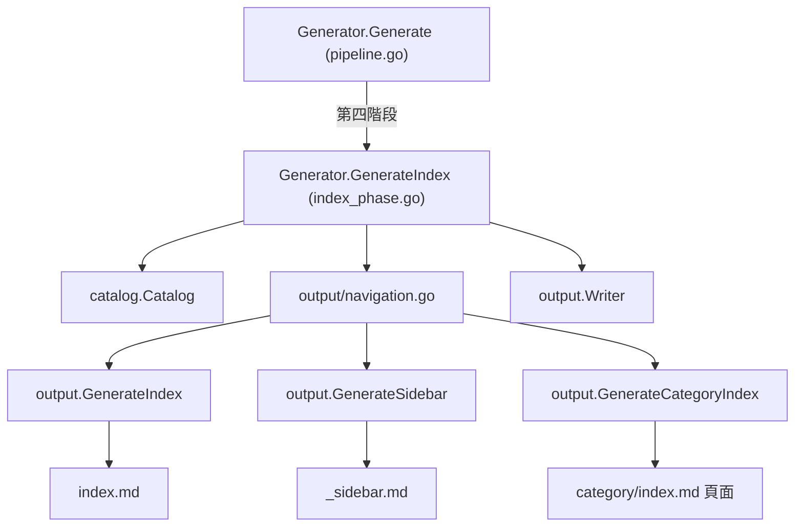
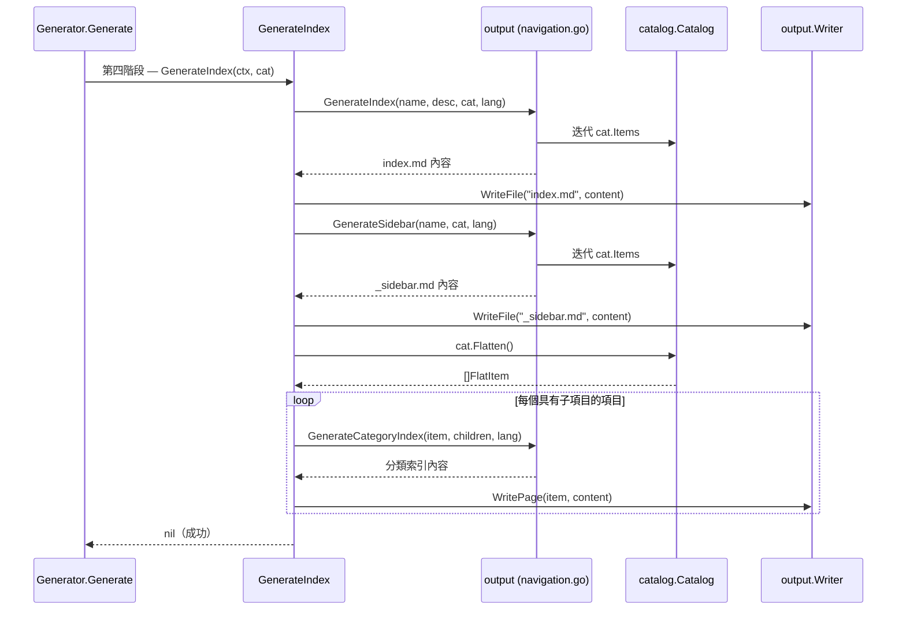

# 索引階段

索引階段是 selfmd 文件產生管線的最終生成階段（第四階段），負責從目錄結構產生導覽檔案 — `index.md`、`_sidebar.md` 以及分類索引頁面。

## 概述

在內容階段產生所有文件頁面之後，管線需要導覽入口點，讓讀者能夠瀏覽和探索內容。索引階段透過讀取已完成的 `Catalog` 並產生三種類型的輸出來實現此功能：

- **主索引頁面**（`index.md`）— 文件首頁，包含完整的目錄
- **側邊欄導覽**（`_sidebar.md`）— 靜態檢視器使用的樹狀導覽選單
- **分類索引頁面** — 為每個具有子項目的目錄項目自動產生的樞紐頁面

索引階段是完全確定性的 — 不會調用 Claude 或任何 AI 模型。它使用 `output` 套件中的 Go 範本邏輯，將目錄樹轉換為 Markdown 檔案。

## 架構



## 運作方式

`Generator` 上的 `GenerateIndex` 方法依序執行三個步驟：

### 步驟一：產生主索引頁面

此函式呼叫 `output.GenerateIndex`，傳入專案名稱、描述、目錄和輸出語言。這會產生一個 Markdown 頁面，包含標題、可選的專案描述，以及所有目錄項目的巢狀連結列表。

```go
indexContent := output.GenerateIndex(
    g.Config.Project.Name,
    g.Config.Project.Description,
    cat,
    lang,
)
if err := g.Writer.WriteFile("index.md", indexContent); err != nil {
    return err
}
```

> Source: internal/generator/index_phase.go#L15-L23

### 步驟二：產生側邊欄

此函式呼叫 `output.GenerateSidebar` 來產生導覽側邊欄，包含「首頁」連結和完整的目錄樹。

```go
sidebarContent := output.GenerateSidebar(g.Config.Project.Name, cat, lang)
if err := g.Writer.WriteFile("_sidebar.md", sidebarContent); err != nil {
    return err
}
```

> Source: internal/generator/index_phase.go#L26-L29

### 步驟三：產生分類索引頁面

對於每個具有子項目的目錄項目，此階段會產生一個樞紐頁面，列出其直接子頁面。它透過扁平化目錄、篩選 `HasChildren == true` 的項目，然後透過比對 `ParentPath` 收集其直接子項目來完成此操作。

```go
items := cat.Flatten()
for _, item := range items {
    if !item.HasChildren {
        continue
    }

    // find direct children
    var children []catalog.FlatItem
    for _, child := range items {
        if child.ParentPath == item.Path && child.Path != item.Path {
            children = append(children, child)
        }
    }

    if len(children) > 0 {
        categoryContent := output.GenerateCategoryIndex(item, children, lang)
        if err := g.Writer.WritePage(item, categoryContent); err != nil {
            g.Logger.Warn("failed to write category index", "path", item.Path, "error", err)
        }
    }
}
```

> Source: internal/generator/index_phase.go#L32-L52

## 核心流程



## 導覽檔案產生細節

### 主索引頁面結構

`output.GenerateIndex` 建構一個具有以下結構的 Markdown 文件：

```
# {ProjectName} Technical Documentation

{Project description}

---

## Table of Contents

- [Overview](../../../overview/index.md)
  - [Introduction](../../../overview/introduction/index.md)
  ...

---

*This documentation was automatically generated by selfmd*
```

此函式使用透過 `getUIStrings(lang)` 取得的本地化 UI 字串，支援 `zh-TW` 和 `en-US`，預設回退至 `en-US`。

```go
func GenerateIndex(projectName, projectDesc string, cat *catalog.Catalog, lang string) string {
    ui := getUIStrings(lang)
    var sb strings.Builder

    sb.WriteString(fmt.Sprintf("# %s %s\n\n", projectName, ui["techDocs"]))

    if projectDesc != "" {
        sb.WriteString(projectDesc + "\n\n")
    }

    sb.WriteString("---\n\n")
    sb.WriteString(fmt.Sprintf("## %s\n\n", ui["catalog"]))

    for _, item := range cat.Items {
        writeIndexItem(&sb, item, "", 0)
    }

    sb.WriteString("\n---\n\n")
    sb.WriteString(fmt.Sprintf("*%s*\n", ui["autoGenerated"]))

    return sb.String()
}
```

> Source: internal/output/navigation.go#L38-L59

### 側邊欄結構

`output.GenerateSidebar` 產生一個 Markdown 列表，以專案名稱作為標題和「首頁」連結開頭，接著是完整的目錄樹。

```go
func GenerateSidebar(projectName string, cat *catalog.Catalog, lang string) string {
    ui := getUIStrings(lang)
    var sb strings.Builder

    sb.WriteString(fmt.Sprintf("# %s\n\n", projectName))
    sb.WriteString(fmt.Sprintf("- [%s](./index.md)\n", ui["home"]))

    for _, item := range cat.Items {
        writeSidebarItem(&sb, item, "", 0)
    }

    return sb.String()
}
```

> Source: internal/output/navigation.go#L74-L86

### 分類索引頁面

`output.GenerateCategoryIndex` 為父項目建立一個簡單的樞紐頁面，以相對連結列出其直接子項目。

```go
func GenerateCategoryIndex(item catalog.FlatItem, children []catalog.FlatItem, lang string) string {
    ui := getUIStrings(lang)
    var sb strings.Builder

    sb.WriteString(fmt.Sprintf("# %s\n\n", item.Title))
    sb.WriteString(ui["sectionContains"] + "\n\n")

    for _, child := range children {
        relPath := computeRelativePath(item.DirPath, child.DirPath)
        sb.WriteString(fmt.Sprintf("- [%s](%s/index.md)\n", child.Title, relPath))
    }

    return sb.String()
}
```

> Source: internal/output/navigation.go#L101-L114

## 路徑解析

導覽模組包含兩個輔助函式，用於計算生成輸出中的正確連結路徑：

- **`resolveDirPath`** — 處理相對子路徑（例如 `"init"`）和完整路徑（例如 `"cli/init"`），透過有條件地加上父目錄前綴。
- **`computeRelativePath`** — 封裝 `filepath.Rel` 來計算兩個目錄位置之間的相對路徑，並將結果轉換為正斜線以確保 Markdown 相容性。

```go
func resolveDirPath(itemPath, parentDir string) string {
    if parentDir == "" {
        return itemPath
    }
    if strings.HasPrefix(itemPath, parentDir+"/") {
        return itemPath
    }
    return parentDir + "/" + itemPath
}
```

> Source: internal/output/navigation.go#L118-L126

## 索引階段的執行時機

索引階段在兩種情境下被調用：

1. **完整生成**（`selfmd generate`）— 始終作為第四階段執行，在內容生成完成之後。
2. **增量更新**（`selfmd update`）— 僅在有新頁面加入目錄時執行，以用新項目更新導覽。

```go
// In updater.go — only regenerates index when new pages exist
if len(newPages) > 0 {
    fmt.Println("Updating navigation and index...")
    if err := g.GenerateIndex(ctx, cat); err != nil {
        g.Logger.Warn("failed to update index", "error", err)
    }
}
```

> Source: internal/generator/updater.go#L152-L157

## 相關連結

- [文件產生器](../index.md)
- [目錄階段](../catalog-phase/index.md)
- [內容階段](../content-phase/index.md)
- [翻譯階段](../translate-phase/index.md)
- [目錄管理器](../../catalog/index.md)
- [輸出寫入器](../../output-writer/index.md)
- [靜態檢視器](../../static-viewer/index.md)
- [生成管線](../../../architecture/pipeline/index.md)

## 參考檔案

| 檔案路徑 | 說明 |
|-----------|------|
| `internal/generator/index_phase.go` | 索引階段實作 — `GenerateIndex` 方法 |
| `internal/generator/pipeline.go` | 管線編排 — 顯示階段順序和 `Generator` 結構體 |
| `internal/output/navigation.go` | 導覽檔案產生器 — `GenerateIndex`、`GenerateSidebar`、`GenerateCategoryIndex` |
| `internal/output/writer.go` | 輸出寫入器 — `WriteFile`、`WritePage` 方法 |
| `internal/catalog/catalog.go` | 目錄資料模型 — `Catalog`、`CatalogItem`、`FlatItem`、`Flatten` |
| `internal/generator/content_phase.go` | 內容階段 — 理解階段排序的上下文 |
| `internal/generator/updater.go` | 增量更新器 — 顯示條件式索引重新生成 |