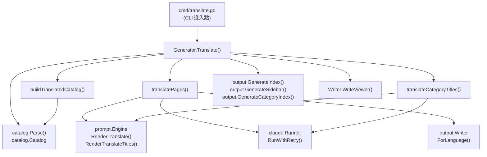
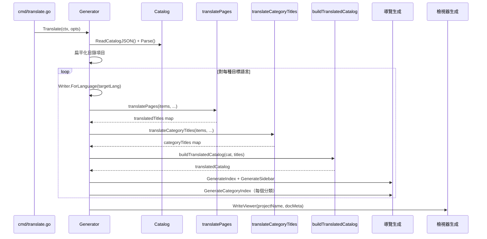
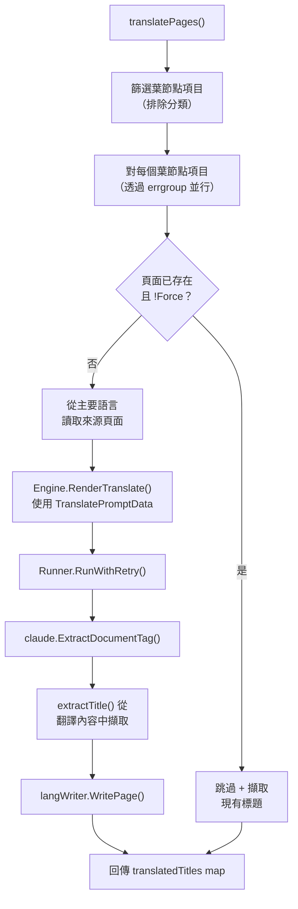

# 翻譯階段

翻譯階段負責使用 Claude AI 將已生成的文件從主要語言翻譯為一種或多種次要語言，產生完整的本地化文件集。

## 概述

翻譯階段是 selfmd 文件產生流程中最後的可選階段。在主要產生流程以主要語言（透過 `output.language` 設定）產出文件後，此階段會將這些頁面翻譯為 `output.secondary_languages` 中定義的每種次要語言。

主要職責：

- **頁面翻譯**：透過 Claude AI 將每個葉節點文件頁面從來源語言翻譯為目標語言
- **分類標題翻譯**：在單次 Claude 呼叫中批次翻譯分類（父區段）標題
- **目錄重建**：為每種目標語言建構完整翻譯的目錄結構
- **導覽生成**：為每種語言產生本地化的 `index.md`、`_sidebar.md` 和分類索引頁面
- **檢視器重新生成**：更新靜態文件檢視器以包含所有可用語言
- **增量跳過**：跳過已有翻譯的頁面，除非指定 `--force`

每種語言的翻譯輸出會寫入文件輸出目錄下的子目錄（例如 `.doc-build/en-US/`、`.doc-build/ja-JP/`）。

## 架構



## 翻譯流程

`Translate` 方法協調整個翻譯工作流程。它依序遍歷每種目標語言，同時在每種語言內並行化頁面翻譯。

### 主要工作流程



### 進入點

`Translate` 函式由 `selfmd translate` CLI 命令呼叫。它載入現有的主目錄、確定來源語言和目標語言，然後依序處理每種目標語言。

```go
func (g *Generator) Translate(ctx context.Context, opts TranslateOptions) error {
	start := time.Now()

	// Read master catalog
	catJSON, err := g.Writer.ReadCatalogJSON()
	if err != nil {
		return fmt.Errorf("failed to read catalog (please run selfmd generate first): %w", err)
	}

	cat, err := catalog.Parse(catJSON)
	if err != nil {
		return fmt.Errorf("failed to parse catalog: %w", err)
	}

	items := cat.Flatten()
	sourceLang := g.Config.Output.Language
	sourceLangName := config.GetLangNativeName(sourceLang)
```

> Source: internal/generator/translate_phase.go#L29-L46

## TranslateOptions

`TranslateOptions` 結構體設定翻譯執行的行為：

```go
type TranslateOptions struct {
	TargetLanguages []string
	Force           bool
	Concurrency     int
}
```

> Source: internal/generator/translate_phase.go#L22-L26

| 欄位 | 型別 | 說明 |
|------|------|------|
| `TargetLanguages` | `[]string` | 要翻譯的語言代碼列表（例如 `["en-US", "ja-JP"]`） |
| `Force` | `bool` | 設為 `true` 時，重新翻譯已存在的頁面 |
| `Concurrency` | `int` | 頁面翻譯的最大 Claude 並行呼叫數 |

這些選項由 `cmd/translate.go` 中的 CLI 旗標填入：

```go
translateCmd.Flags().StringSliceVar(&translateLangs, "lang", nil, "only translate specified languages (default: all secondary languages)")
translateCmd.Flags().BoolVar(&translateForce, "force", false, "force re-translate existing files")
translateCmd.Flags().IntVar(&translateConc, "concurrency", 0, "concurrency (override config)")
```

> Source: cmd/translate.go#L33-L35

## 核心流程

### 頁面翻譯（`translatePages`）

`translatePages` 函式處理所有葉節點（非分類）文件頁面的並行翻譯。它使用 Go 的 `errgroup` 搭配信號量 channel 來控制並行數。



主要實作細節：

1. **僅篩選葉節點**：只翻譯沒有子項目的頁面；分類頁面有獨立的標題翻譯流程。
2. **跳過邏輯**：如果翻譯頁面已存在且 `Force` 為 `false`，則跳過該頁面。現有標題會被擷取用於目錄建構。
3. **並行控制**：信號量 channel（`sem`）將並行 Claude 呼叫數限制為 `opts.Concurrency`。
4. **錯誤容忍**：個別頁面失敗會被記錄但不會中止整個執行。原子計數器追蹤成功、失敗和跳過的數量。

```go
// Only translate leaf items (non-category pages)
var leafItems []catalog.FlatItem
for _, item := range items {
	if !item.HasChildren {
		leafItems = append(leafItems, item)
	}
}

eg, ctx := errgroup.WithContext(ctx)
sem := make(chan struct{}, opts.Concurrency)
```

> Source: internal/generator/translate_phase.go#L153-L162

### 提示詞渲染

每個頁面翻譯使用 `TranslatePromptData` 結構體來渲染 `translate.tmpl` 共用模板：

```go
data := prompt.TranslatePromptData{
	SourceLanguage:     sourceLang,
	SourceLanguageName: sourceLangName,
	TargetLanguage:     targetLang,
	TargetLanguageName: targetLangName,
	SourceContent:      sourceContent,
}

rendered, err := g.Engine.RenderTranslate(data)
```

> Source: internal/generator/translate_phase.go#L197-L206

`translate.tmpl` 模板指示 Claude：

- 保留所有 Markdown 格式、連結、程式碼區塊和 Mermaid 圖表
- 保持程式碼識別符、檔案路徑和來源標註不變
- 自然地翻譯章節標題和正文
- 將結果包裹在 `<document>` 標籤中回傳

```go
// RenderTranslate renders the translation prompt.
func (e *Engine) RenderTranslate(data TranslatePromptData) (string, error) {
	return e.renderShared("translate.tmpl", data)
}
```

> Source: internal/prompt/engine.go#L141-L143

### 回應擷取

Claude 回傳回應後，翻譯內容會使用 `claude.ExtractDocumentTag()` 從 `<document>` 標籤中擷取：

```go
content, err := claude.ExtractDocumentTag(result.Content)
if err != nil {
	failed.Add(1)
	fmt.Printf(" Failed (format error): %v\n", err)
	return nil
}
```

> Source: internal/generator/translate_phase.go#L226-L231

### 分類標題翻譯（`translateCategoryTitles`）

分類標題（具有子項目的項目）在單次 Claude 呼叫中批次翻譯以提高效率，而非逐一翻譯。

```go
func (g *Generator) translateCategoryTitles(
	ctx context.Context,
	items []catalog.FlatItem,
	alreadyTranslated map[string]string,
	sourceLang, sourceLangName, targetLang, targetLangName string,
) (map[string]string, error) {
```

> Source: internal/generator/translate_phase.go#L296-L302

處理流程：

1. 收集所有尚未在 `alreadyTranslated` map 中的分類項目標題
2. 使用所有標題作為批次渲染 `translate_titles.tmpl` 提示詞
3. 將 Claude 回應解析為 JSON 陣列的翻譯字串
4. 驗證回應數量與請求數量一致

`translate_titles.tmpl` 模板要求 Claude 回傳一個 JSON 陣列：

```
## Rules

1. Translate each title naturally into {{.TargetLanguageName}}
2. Keep technical terms, product names, and proper nouns as-is (e.g., "Git", "CLI", "API")
3. Return ONLY a JSON array of translated titles in the same order, no other text
```

> Source: internal/prompt/templates/translate_titles.tmpl#L9-L13

### 翻譯目錄建構

`buildTranslatedCatalog` 函式建立原始目錄的深層複本，並替換為翻譯後的標題：

```go
func buildTranslatedCatalog(original *catalog.Catalog, translatedTitles map[string]string) *catalog.Catalog {
	translated := &catalog.Catalog{
		Items: translateCatalogItems(original.Items, translatedTitles, ""),
	}
	return translated
}
```

> Source: internal/generator/translate_phase.go#L288-L293

遞迴輔助函式 `translateCatalogItems` 遍歷目錄樹，在可用時將每個項目的標題替換為翻譯版本：

```go
func translateCatalogItems(items []catalog.CatalogItem, titles map[string]string, parentPath string) []catalog.CatalogItem {
	result := make([]catalog.CatalogItem, len(items))
	for i, item := range items {
		dotPath := item.Path
		if parentPath != "" {
			dotPath = parentPath + "." + item.Path
		}

		result[i] = catalog.CatalogItem{
			Title:    item.Title,
			Path:     item.Path,
			Order:    item.Order,
			Children: translateCatalogItems(item.Children, titles, dotPath),
		}

		// Use translated title if available
		if translatedTitle, ok := titles[dotPath]; ok {
			result[i].Title = translatedTitle
		}
	}
	return result
}
```

> Source: internal/generator/translate_phase.go#L382-L403

### 導覽與檢視器生成

在所有頁面和標題翻譯完成後，此階段會生成本地化的導覽檔案：

```go
// Generate translated index and sidebar
indexContent := output.GenerateIndex(
	g.Config.Project.Name,
	g.Config.Project.Description,
	translatedCat,
	targetLang,
)
if err := langWriter.WriteFile("index.md", indexContent); err != nil {
	g.Logger.Warn("failed to write translated index", "lang", targetLang, "error", err)
}

sidebarContent := output.GenerateSidebar(g.Config.Project.Name, translatedCat, targetLang)
```

> Source: internal/generator/translate_phase.go#L79-L89

分類索引頁面也會為翻譯後的項目重新生成。最後，文件檢視器會重建以納入所有可用語言：

```go
docMeta := g.buildDocMeta()
fmt.Println("Regenerating documentation viewer...")
if err := g.Writer.WriteViewer(g.Config.Project.Name, docMeta); err != nil {
	g.Logger.Warn("failed to generate viewer", "error", err)
}
```

> Source: internal/generator/translate_phase.go#L118-L121

## 語言專屬輸出結構

`Writer.ForLanguage()` 方法建立一個範圍限定於語言專屬子目錄的子寫入器：

```go
func (w *Writer) ForLanguage(lang string) *Writer {
	return &Writer{
		BaseDir: filepath.Join(w.BaseDir, lang),
	}
}
```

> Source: internal/output/writer.go#L145-L149

這會產生如下的檔案佈局：

```
.doc-build/
├── _catalog.json          # 主要語言目錄
├── index.md               # 主要語言索引
├── _sidebar.md            # 主要語言側邊欄
├── overview/
│   └── index.md
├── en-US/                 # 翻譯語言目錄
│   ├── _catalog.json      # 翻譯後目錄
│   ├── index.md           # 翻譯後索引
│   ├── _sidebar.md        # 翻譯後側邊欄
│   └── overview/
│       └── index.md
└── ja-JP/                 # 另一個翻譯語言
    ├── _catalog.json
    └── ...
```

## 標題擷取輔助函式

`extractTitle` 函式從翻譯後的 Markdown 內容中解析第一個 `#` 標題，以填入翻譯標題對照表：

```go
func extractTitle(content string) string {
	re := regexp.MustCompile(`(?m)^#\s+(.+)$`)
	match := re.FindStringSubmatch(content)
	if len(match) >= 2 {
		return strings.TrimSpace(match[1])
	}
	return ""
}
```

> Source: internal/generator/translate_phase.go#L278-L285

此擷取的標題用於兩個地方：
- 當頁面剛完成翻譯時，從輸出中擷取標題
- 當跳過現有翻譯時，從現有檔案中讀取標題

## 設定

翻譯在 `selfmd.yaml` 的 `output` 區段中設定：

| 設定鍵 | 型別 | 說明 |
|--------|------|------|
| `output.language` | `string` | 主要（來源）語言代碼 |
| `output.secondary_languages` | `[]string` | 翻譯的目標語言 |
| `claude.max_concurrent` | `int` | Claude 呼叫的預設並行數 |

支援的語言定義在 `config.KnownLanguages` 中：

```go
var KnownLanguages = map[string]string{
	"zh-TW": "繁體中文",
	"zh-CN": "简体中文",
	"en-US": "English",
	"ja-JP": "日本語",
	"ko-KR": "한국어",
	"fr-FR": "Français",
	"de-DE": "Deutsch",
	"es-ES": "Español",
	"pt-BR": "Português",
	"th-TH": "ไทย",
	"vi-VN": "Tiếng Việt",
}
```

> Source: internal/config/config.go#L39-L51

## 相關連結

- [文件產生器](../index.md)
- [目錄階段](../catalog-phase/index.md)
- [內容階段](../content-phase/index.md)
- [索引階段](../index-phase/index.md)
- [translate 命令](../../../cli/cmd-translate/index.md)
- [Claude 執行器](../../claude-runner/index.md)
- [提示詞引擎](../../prompt-engine/index.md)
- [輸出寫入器](../../output-writer/index.md)
- [輸出語言](../../../configuration/output-language/index.md)
- [翻譯工作流程](../../../i18n/translation-workflow/index.md)
- [支援的語言](../../../i18n/supported-languages/index.md)

## 參考檔案

| 檔案路徑 | 說明 |
|----------|------|
| `internal/generator/translate_phase.go` | 核心翻譯階段實作 |
| `internal/generator/pipeline.go` | Generator 結構體定義與主要流程 |
| `cmd/translate.go` | 翻譯的 CLI 命令進入點 |
| `internal/prompt/engine.go` | 提示詞模板引擎與翻譯渲染方法 |
| `internal/prompt/templates/translate.tmpl` | 頁面翻譯提示詞模板 |
| `internal/prompt/templates/translate_titles.tmpl` | 分類標題批次翻譯提示詞模板 |
| `internal/output/writer.go` | 支援語言子目錄的輸出寫入器 |
| `internal/output/navigation.go` | 索引、側邊欄與分類索引生成 |
| `internal/catalog/catalog.go` | 目錄資料結構與扁平化邏輯 |
| `internal/claude/runner.go` | 具有重試邏輯的 Claude CLI 執行器 |
| `internal/claude/parser.go` | 回應解析與 document 標籤擷取 |
| `internal/config/config.go` | 設定結構體與語言定義 |