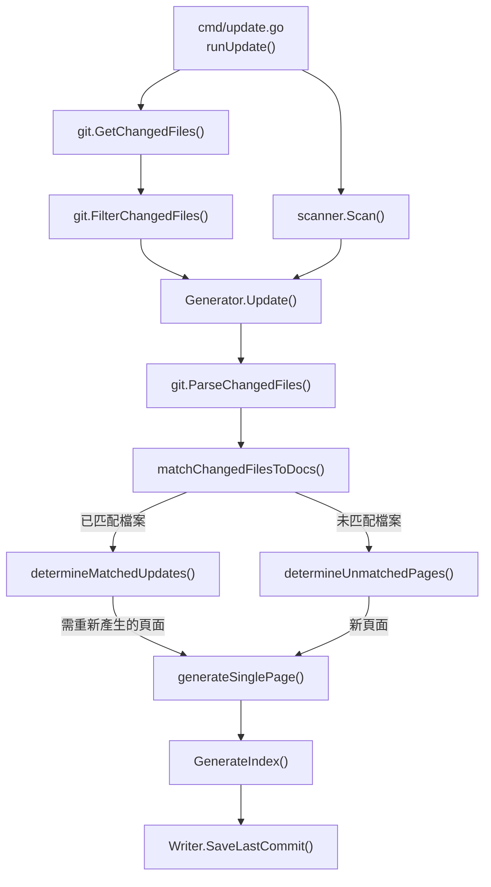
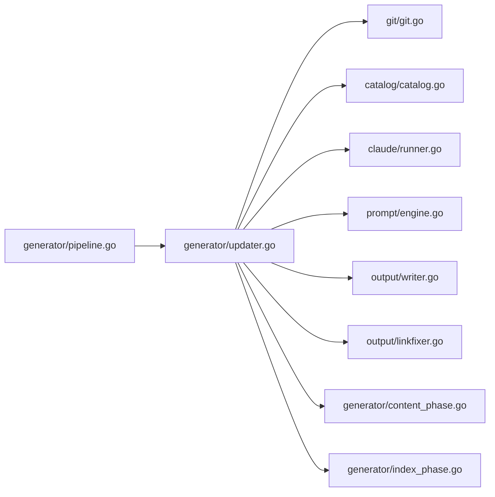
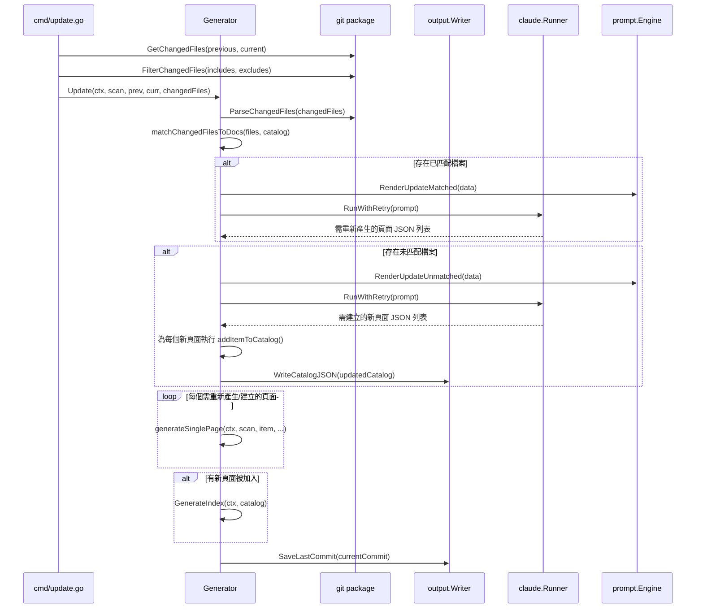
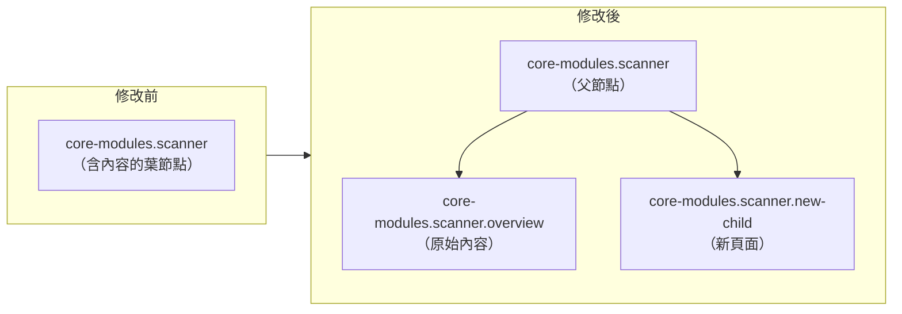

# 增量更新引擎

增量更新引擎能根據 git 變更選擇性地重新產生文件頁面，避免在僅有少數原始檔案被修改時進行高成本的全量重新產生。

## 概述

當專案持續演進時，通常只有一部分文件頁面需要更新。增量更新引擎將 git 變更偵測與 AI 驅動的影響分析串接起來，精確識別哪些文件頁面需要重新產生——以及是否應為新增的原始檔案建立全新的頁面。

此元件是 `selfmd update` CLI 指令背後的實作。它依賴於 `selfmd generate` 已產生的現有文件集，並使用已儲存的 `_last_commit` 標記來決定比較基準。

**核心概念：**

- **已匹配檔案（Matched files）** — 被現有文件頁面引用的已變更原始檔案。這些會觸發基於 Claude 的評估，以判斷頁面內容是否實際受到影響。
- **未匹配檔案（Unmatched files）** — 未被任何現有文件頁面引用的已變更原始檔案。這些會由 Claude 評估是否應建立新的文件頁面。
- **葉節點提升為父節點（Leaf-to-parent promotion）** — 當新頁面需要作為現有葉節點的子頁面加入時，引擎會自動將該葉節點提升為父節點，將其內容移至 `overview` 子頁面中。

## 架構



### 模組依賴關係



## 核心流程

### 更新工作流程

完整的更新生命週期由 `Generator.Update()` 協調，依序經過五個步驟：



### 步驟 1：解析變更檔案

原始的 git diff 輸出由 `git.ParseChangedFiles()` 解析為結構化的 `ChangedFile` 記錄。每筆記錄包含一個狀態碼（`M`、`A`、`D`、`R`）和一個檔案路徑。

```go
type ChangedFile struct {
	Status string // "M", "A", "D", "R"
	Path   string
}
```

> Source: internal/git/git.go#L48-L51

### 步驟 2：將變更檔案匹配至現有文件

`matchChangedFilesToDocs()` 執行文字搜尋掃描：針對每個變更檔案，讀取所有現有文件頁面並檢查頁面內容是否包含該檔案的路徑字串。這會產生兩個群組：

```go
func (g *Generator) matchChangedFilesToDocs(files []git.ChangedFile, cat *catalog.Catalog) (matched []matchResult, unmatched []string) {
	items := cat.Flatten()

	// Pre-read all page contents
	pageContents := make(map[string]string)
	for _, item := range items {
		content, err := g.Writer.ReadPage(item)
		if err != nil {
			continue
		}
		pageContents[item.Path] = content
	}

	// For each changed file, find which pages reference it
	for _, f := range files {
		var matchedPages []catalog.FlatItem
		for _, item := range items {
			content, ok := pageContents[item.Path]
			if !ok {
				continue
			}
			if strings.Contains(content, f.Path) {
				matchedPages = append(matchedPages, item)
			}
		}

		if len(matchedPages) > 0 {
			matched = append(matched, matchResult{
				changedFile: f.Path,
				pages:       matchedPages,
			})
		} else {
			unmatched = append(unmatched, f.Path)
		}
	}

	return matched, unmatched
}
```

> Source: internal/generator/updater.go#L177-L214

### 步驟 3：Claude 評估已匹配頁面

對於已匹配的檔案，`determineMatchedUpdates()` 會向 Claude 發送一個提示，其中包含變更檔案的列表和受影響頁面的摘要。Claude 會讀取實際的原始碼，並回傳一個 JSON 陣列，列出真正需要重新產生的頁面。

提示範本指示 Claude 採取保守策略——僅在變更影響到文件中描述的行為、架構或 API 時，才標記頁面需要重新產生：

```go
data := prompt.UpdateMatchedPromptData{
	RepositoryName: g.Config.Project.Name,
	Language:       g.Config.Output.Language,
	ChangedFiles:   changedFilesList.String(),
	AffectedPages:  affectedPagesInfo.String(),
}

rendered, err := g.Engine.RenderUpdateMatched(data)
```

> Source: internal/generator/updater.go#L257-L264

回應會被解析為 `UpdateMatchedResult` 結構：

```go
type UpdateMatchedResult struct {
	CatalogPath string `json:"catalogPath"`
	Title       string `json:"title"`
	Reason      string `json:"reason"`
}
```

> Source: internal/generator/updater.go#L18-L22

### 步驟 4：Claude 評估未匹配檔案

對於未匹配的檔案，`determineUnmatchedPages()` 會詢問 Claude 是否應建立全新的文件頁面。Claude 會收到未匹配檔案的列表以及完整的現有目錄結構：

```go
data := prompt.UpdateUnmatchedPromptData{
	RepositoryName:  g.Config.Project.Name,
	Language:        g.Config.Output.Language,
	UnmatchedFiles:  fileList.String(),
	ExistingCatalog: existingCatalog,
	CatalogTable:    cat.BuildLinkTable(),
}

rendered, err := g.Engine.RenderUpdateUnmatched(data)
```

> Source: internal/generator/updater.go#L320-L328

新頁面透過 `addItemToCatalog()` 插入目錄樹中。如果新頁面必須放置在現有葉節點之下，該葉節點會被提升為父節點：

```go
type promotedLeaf struct {
	OriginalPath  string
	OverviewPath  string
	OriginalTitle string
}

func addItemToCatalog(cat *catalog.Catalog, catalogPath, title string) *promotedLeaf {
	parts := strings.Split(catalogPath, ".")
	var promoted *promotedLeaf
	addItemToChildren(&cat.Items, parts, title, "", &promoted)
	return promoted
}
```

> Source: internal/generator/updater.go#L360-L377

### 步驟 5：重新產生頁面

所有被識別為需要重新產生的頁面（包括現有頁面和新頁面）會依序透過 `generateSinglePage()` 處理。對於現有頁面，當前內容會作為 `existingContent` 上下文傳入，讓 Claude 能產生經過充分考量的更新：

```go
allPages := append(pagesToRegenerate, newPages...)
if len(allPages) == 0 {
	fmt.Println("[4/4] No documentation pages need updating or creating.")
} else {
	fmt.Printf("[4/4] Regenerating %d pages...\n", len(allPages))
	for i, item := range allPages {
		fmt.Printf("      [%d/%d] %s（%s）...", i+1, len(allPages), item.Title, item.Path)
		existing, _ := g.Writer.ReadPage(item)
		err := g.generateSinglePage(ctx, scan, item, catalogTable, linkFixer, existing)
		if err != nil {
			fmt.Printf(" Failed: %v\n", err)
			g.Logger.Warn("page regeneration failed", "title", item.Title, "path", item.Path, "error", err)
			g.writePlaceholder(item, err)
		}
	}
}
```

> Source: internal/generator/updater.go#L133-L149

如果有新頁面被加入，導覽檔案（索引和側邊欄）會被重新產生，更新後的目錄會儲存至 `_catalog.json`。最後，當前的 commit 雜湊值會被寫入 `_last_commit`，作為下一次增量更新的基準。

## Commit 基準解析

`update` 指令透過三層回退機制來解析比較基準 commit：

1. **明確的 `--since` 旗標** — 使用者提供的 commit 雜湊值具有最高優先權
2. **已儲存的 `_last_commit`** — 從輸出目錄讀取，由上一次 `generate` 或 `update` 執行時寫入
3. **Merge-base 回退** — 使用設定的 `git.base_branch` 計算 `git merge-base <base_branch> HEAD`

```go
previousCommit := sinceCommit
if previousCommit == "" {
	saved, readErr := gen.Writer.ReadLastCommit()
	if readErr == nil && saved != "" {
		previousCommit = saved
	} else {
		base, err := git.GetMergeBase(rootDir, cfg.Git.BaseBranch)
		if err != nil {
			return fmt.Errorf("cannot get base commit: %w\nhint: run selfmd generate first or use --since to specify a commit", err)
		}
		previousCommit = base
	}
}
```

> Source: cmd/update.go#L68-L82

## 目錄修改：葉節點提升為父節點

當 Claude 判定新頁面應加入到現有葉節點（沒有子頁面的頁面）之下時，引擎會自動進行提升。原始內容會移至 `overview` 子頁面，新頁面則作為同層節點插入：



遞迴函式 `addItemToChildren()` 透過根據點號分隔的路徑片段遍歷目錄樹，處理任意巢狀深度：

```go
func addItemToChildren(children *[]catalog.CatalogItem, pathParts []string, title string, parentDotPath string, promoted **promotedLeaf) {
	if len(pathParts) == 1 {
		*children = append(*children, catalog.CatalogItem{
			Title: title,
			Path:  pathParts[0],
			Order: len(*children) + 1,
		})
		return
	}

	parentSlug := pathParts[0]
	currentDotPath := parentSlug
	if parentDotPath != "" {
		currentDotPath = parentDotPath + "." + parentSlug
	}

	for i, item := range *children {
		if item.Path == parentSlug {
			if len(item.Children) == 0 {
				(*children)[i].Children = append((*children)[i].Children, catalog.CatalogItem{
					Title: item.Title,
					Path:  "overview",
					Order: 0,
				})
				*promoted = &promotedLeaf{
					OriginalPath:  currentDotPath,
					OverviewPath:  currentDotPath + ".overview",
					OriginalTitle: item.Title,
				}
			}
			addItemToChildren(&(*children)[i].Children, pathParts[1:], title, currentDotPath, promoted)
			return
		}
	}

	newParent := catalog.CatalogItem{
		Title: parentSlug,
		Path:  parentSlug,
		Order: len(*children) + 1,
	}
	*children = append(*children, newParent)
	addItemToChildren(&(*children)[len(*children)-1].Children, pathParts[1:], title, currentDotPath, promoted)
}
```

> Source: internal/generator/updater.go#L381-L430

## 使用範例

### 執行增量更新

`update` 指令透過 CLI 呼叫。它會比較當前 HEAD 與上次已知的 commit：

```go
var updateCmd = &cobra.Command{
	Use:   "update",
	Short: "Incremental update based on git changes",
	Long: `Analyze git changes and incrementally update affected documentation pages.
Requires initial documentation generated by selfmd generate.`,
	RunE: runUpdate,
}

func init() {
	updateCmd.Flags().StringVar(&sinceCommit, "since", "", "compare with specified commit (default: last generate/update commit)")
	rootCmd.AddCommand(updateCmd)
}
```

> Source: cmd/update.go#L21-L32

### 使用包含/排除模式進行檔案篩選

在進入更新流程之前，變更檔案會透過設定的 `targets.include` 和 `targets.exclude` glob 模式進行篩選：

```go
changedFiles = git.FilterChangedFiles(changedFiles, cfg.Targets.Include, cfg.Targets.Exclude)
```

> Source: cmd/update.go#L94

篩選器使用 doublestar glob 匹配，支援 `src/**`、`**/*.pb.go` 和 `vendor/**` 等模式：

```go
func FilterChangedFiles(changedFiles string, includes, excludes []string) string {
	lines := strings.Split(changedFiles, "\n")
	var filtered []string

	for _, line := range lines {
		line = strings.TrimSpace(line)
		if line == "" {
			continue
		}

		parts := strings.SplitN(line, "\t", 3)
		if len(parts) < 2 {
			continue
		}

		filePath := parts[len(parts)-1]

		excluded := false
		for _, pattern := range excludes {
			if matched, _ := doublestar.Match(pattern, filePath); matched {
				excluded = true
				break
			}
		}
		if excluded {
			continue
		}

		if len(includes) > 0 {
			included := false
			for _, pattern := range includes {
				if matched, _ := doublestar.Match(pattern, filePath); matched {
					included = true
					break
				}
			}
			if !included {
				continue
			}
		}

		filtered = append(filtered, line)
	}

	return strings.Join(filtered, "\n")
}
```

> Source: internal/git/git.go#L73-L122

## 相關連結

- [update 指令](../../cli/cmd-update/index.md)
- [文件產生器](../generator/index.md)
- [內容階段](../generator/content-phase/index.md)
- [目錄管理器](../catalog/index.md)
- [Claude 執行器](../claude-runner/index.md)
- [提示引擎](../prompt-engine/index.md)
- [變更偵測](../../git-integration/change-detection/index.md)
- [受影響頁面匹配](../../git-integration/affected-pages/index.md)
- [產生流程](../../architecture/pipeline/index.md)
- [輸出寫入器](../output-writer/index.md)

## 參考檔案

| 檔案路徑 | 說明 |
|-----------|------|
| `internal/generator/updater.go` | 核心增量更新邏輯：匹配、Claude 評估、目錄修改 |
| `cmd/update.go` | `update` 指令的 CLI 進入點 |
| `internal/git/git.go` | Git 操作：變更檔案、merge-base、篩選 |
| `internal/generator/pipeline.go` | Generator 結構定義與完整產生流程 |
| `internal/generator/content_phase.go` | 單頁產生邏輯，由更新引擎重複使用 |
| `internal/generator/index_phase.go` | 索引與導覽重新產生 |
| `internal/catalog/catalog.go` | 目錄資料模型、展平與連結表建構 |
| `internal/output/writer.go` | 檔案 I/O：讀寫頁面、目錄 JSON、commit 標記 |
| `internal/output/linkfixer.go` | 產生的 Markdown 後處理連結修正器 |
| `internal/prompt/engine.go` | 提示範本引擎與資料結構 |
| `internal/config/config.go` | 設定模型，包含 git 與目標設定 |
| `internal/prompt/templates/en-US/update_matched.tmpl` | 用於評估已匹配頁面的提示範本 |
| `internal/prompt/templates/en-US/update_unmatched.tmpl` | 用於評估未匹配檔案的提示範本 |