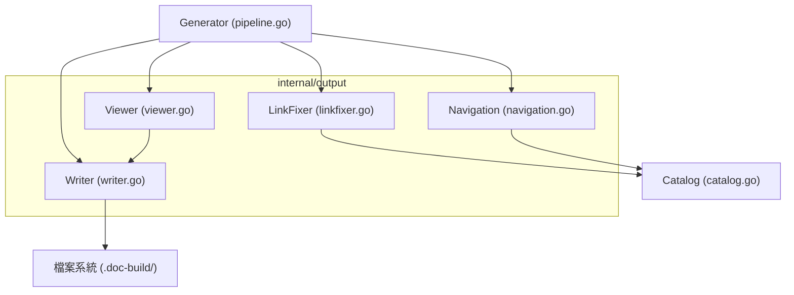
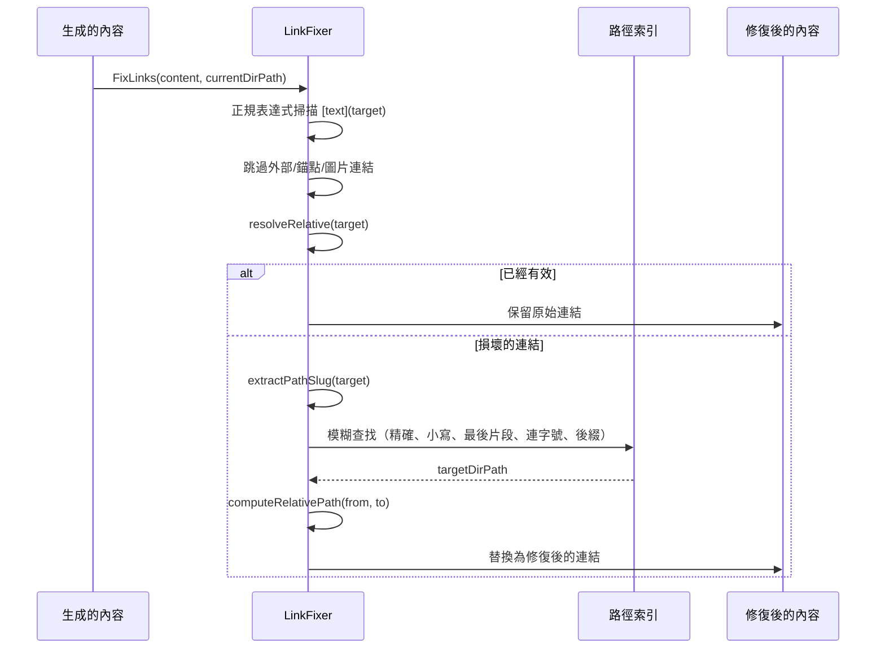
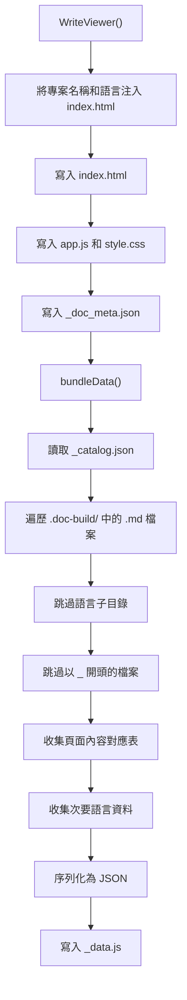
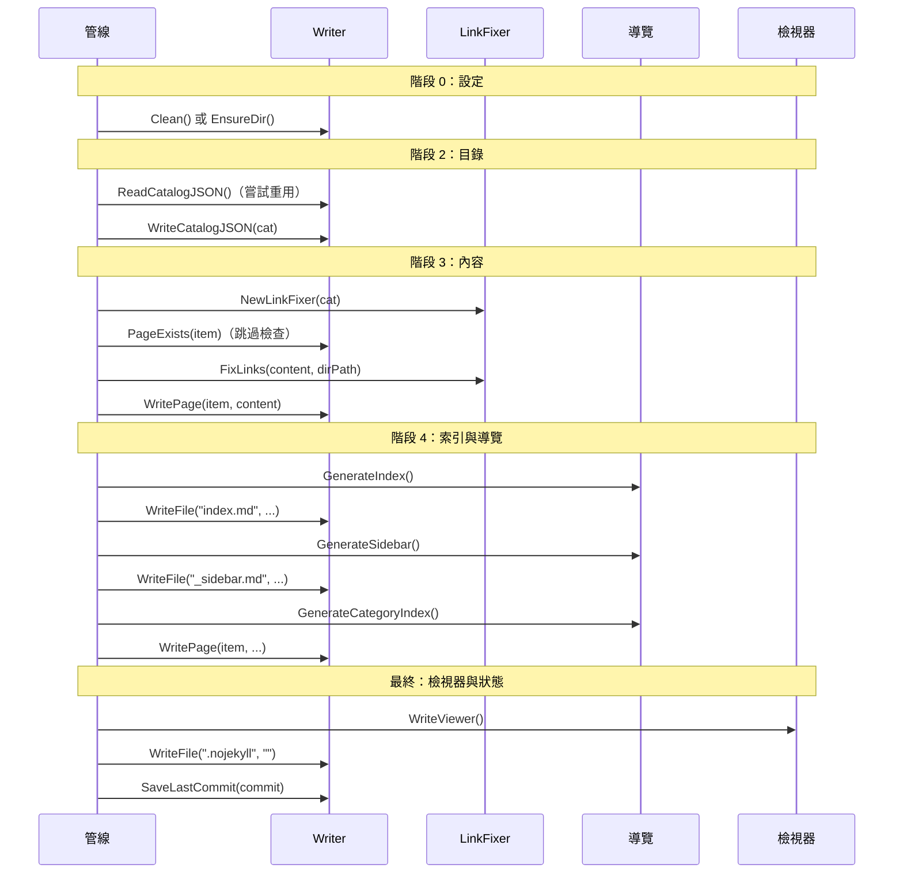

# 輸出寫入器

輸出寫入器模組（`internal/output`）負責所有與生成文件相關的檔案 I/O 操作。它將 Markdown 頁面、導覽檔案、目錄 JSON 以及靜態檢視器資源寫入輸出目錄。

## 概覽

輸出寫入器位於文件生成管線的最終階段。在 Claude 生成 Markdown 內容後，輸出寫入器負責處理：

- **檔案持久化** — 將生成的 Markdown 頁面寫入正確的目錄結構
- **連結驗證與修復** — 修復 AI 產生的錯誤相對連結
- **導覽生成** — 建立索引頁面、側邊欄和分類索引
- **靜態檢視器打包** — 將所有內容封裝成可離線使用的 HTML 檢視器
- **增量狀態追蹤** — 儲存目錄 JSON 和 commit 雜湊值以支援增量更新
- **多語言支援** — 將翻譯內容寫入語言專屬子目錄

此模組包含在 `internal/output` 套件中，提供四個主要元件：`Writer`、`LinkFixer`、導覽生成器和檢視器打包器。

## 架構



`Writer` 結構體是核心 I/O 元件。`LinkFixer`、導覽生成器和檢視器打包器都與 `Writer` 協作以產生最終的文件輸出。

## Writer

`Writer` 結構體管理所有檔案系統互動。它以基礎目錄（通常為 `.doc-build/`）為相對路徑進行操作。

### 結構體定義

```go
type Writer struct {
	BaseDir string // absolute path to .doc-build/
}
```

> Source: internal/output/writer.go#L26-L28

### 主要操作

| 方法 | 用途 |
|--------|---------|
| `Clean()` | 移除並重新建立輸出目錄 |
| `EnsureDir()` | 若輸出目錄不存在則建立 |
| `WritePage()` | 為目錄項目寫入文件頁面 |
| `WriteFile()` | 在輸出目錄下寫入任意檔案 |
| `WriteCatalogJSON()` | 將目錄儲存為 `_catalog.json` |
| `ReadCatalogJSON()` | 讀取已儲存的目錄 JSON |
| `PageExists()` | 檢查頁面是否存在且內容有效 |
| `ReadPage()` | 讀取文件頁面的內容 |
| `SaveLastCommit()` | 儲存當前 commit 雜湊值以供增量更新使用 |
| `ReadLastCommit()` | 讀取已儲存的 commit 雜湊值 |
| `ForLanguage()` | 回傳一個限定在語言子目錄的新 Writer |

### 頁面寫入

`WritePage` 將目錄項目對應到目錄路徑，並將內容寫入為 `index.md`：

```go
func (w *Writer) WritePage(item catalog.FlatItem, content string) error {
	dir := filepath.Join(w.BaseDir, item.DirPath)
	if err := os.MkdirAll(dir, 0755); err != nil {
		return fmt.Errorf("failed to create directory %s: %w", dir, err)
	}

	path := filepath.Join(dir, "index.md")
	if err := os.WriteFile(path, []byte(content), 0644); err != nil {
		return fmt.Errorf("failed to write %s: %w", path, err)
	}
	return nil
}
```

> Source: internal/output/writer.go#L49-L60

### 頁面存在檢查

`PageExists` 驗證頁面檔案是否存在、非空，且不包含失敗標記。管線在非清除模式執行時，會使用此方法跳過已生成的頁面：

```go
func (w *Writer) PageExists(item catalog.FlatItem) bool {
	path := filepath.Join(w.BaseDir, item.DirPath, "index.md")
	data, err := os.ReadFile(path)
	if err != nil {
		return false
	}
	content := strings.TrimSpace(string(data))
	if content == "" {
		return false
	}
	// Only check the first 500 bytes for the failure marker to avoid false positives
	// when translated docs reference the marker string in their content.
	head := content
	if len(head) > 500 {
		head = head[:500]
	}
	if strings.Contains(head, "This page failed to generate") {
		return false
	}
	return true
}
```

> Source: internal/output/writer.go#L96-L117

### 多語言支援

`ForLanguage` 建立一個衍生的 Writer，將內容寫入語言專屬子目錄（例如 `.doc-build/en-US/`）：

```go
func (w *Writer) ForLanguage(lang string) *Writer {
	return &Writer{
		BaseDir: filepath.Join(w.BaseDir, lang),
	}
}
```

> Source: internal/output/writer.go#L145-L149

## LinkFixer

`LinkFixer` 對生成的 Markdown 進行後處理，以修復損壞的相對連結。由於 Claude 可能產生不正確的連結格式（點記法、缺少路徑、錯誤的相對深度），LinkFixer 使用模糊匹配策略來解析並修復這些連結。

### 運作方式



### 索引建構

建立時，`LinkFixer` 會從目錄建構一個查找索引，為每個項目建立多個鍵值 — 使其能對點記法路徑、斜線路徑和最後片段 slug 進行模糊匹配：

```go
func NewLinkFixer(cat *catalog.Catalog) *LinkFixer {
	items := cat.Flatten()
	dirPaths := make(map[string]bool)
	pathIndex := make(map[string]string)

	for _, item := range items {
		dirPaths[item.DirPath] = true

		// index by multiple keys for fuzzy matching
		pathIndex[item.DirPath] = item.DirPath
		pathIndex[item.Path] = item.DirPath                          // dot-notation
		pathIndex[strings.ReplaceAll(item.Path, ".", "/")] = item.DirPath // explicit slash conversion

		// index by last segment (e.g., "scanner" → "core-modules/scanner")
		parts := strings.Split(item.DirPath, "/")
		lastSeg := parts[len(parts)-1]
		if _, exists := pathIndex[lastSeg]; !exists {
			pathIndex[lastSeg] = item.DirPath
		}

		// index by slug-like variations
		pathIndex[strings.ToLower(item.DirPath)] = item.DirPath
	}

	return &LinkFixer{
		allItems:  items,
		dirPaths:  dirPaths,
		pathIndex: pathIndex,
	}
}
```

> Source: internal/output/linkfixer.go#L19-L48

### 模糊解析策略

`fixSingleLink` 方法依序嘗試多種策略：

1. **直接解析** — 檢查相對路徑是否已指向有效的目錄項目
2. **精確索引匹配** — 在路徑索引中查找清理後的 slug
3. **不分大小寫匹配** — 嘗試小寫版本
4. **最後片段匹配** — 擷取路徑的最後一段並查找
5. **連字號組合** — 將最後兩段以連字號組合（例如 `prompt/engine` → `prompt-engine`）
6. **後綴匹配** — 掃描所有已知目錄路徑以尋找匹配的後綴

```go
func (lf *LinkFixer) fixSingleLink(target, currentDirPath string) string {
	// already a valid relative link pointing to existing page?
	resolved := lf.resolveRelative(target, currentDirPath)
	if resolved != "" && lf.isValidTarget(resolved) {
		return target // already correct
	}

	// extract the "meaningful" part from the target
	cleaned := lf.extractPathSlug(target)
	if cleaned == "" {
		return ""
	}

	// look up in index
	targetDirPath, found := lf.pathIndex[cleaned]
	if !found {
		// try lowercase
		targetDirPath, found = lf.pathIndex[strings.ToLower(cleaned)]
	}
	if !found {
		// try last segment only
		segments := strings.FieldsFunc(cleaned, func(r rune) bool {
			return r == '.' || r == '/'
		})
		if len(segments) > 0 {
			last := segments[len(segments)-1]
			targetDirPath, found = lf.pathIndex[last]
		}
		// try combining last two segments with hyphen
		if !found && len(segments) >= 2 {
			hyphenated := segments[len(segments)-2] + "-" + segments[len(segments)-1]
			targetDirPath, found = lf.pathIndex[hyphenated]
		}
	}
	if !found {
		// substring match: find any dirPath that ends with the cleaned slug
		for dp := range lf.dirPaths {
			if strings.HasSuffix(dp, "/"+cleaned) || strings.HasSuffix(dp, "/"+strings.ReplaceAll(cleaned, "/", "-")) {
				targetDirPath = dp
				found = true
				break
			}
		}
	}
	if !found {
		return "" // can't fix
	}

	// compute correct relative path from currentDirPath to targetDirPath
	return lf.computeRelativePath(currentDirPath, targetDirPath)
}
```

> Source: internal/output/linkfixer.go#L84-L134

## 導覽生成

`navigation.go` 檔案提供生成結構化導覽頁面的函式：主索引、側邊欄和分類索引頁面。這些函式是無狀態的 — 它們接收目錄資料和語言代碼，並回傳 Markdown 字串。

### 本地化 UI 字串

導覽頁面使用本地化 UI 字串。此模組內建 `zh-TW` 和 `en-US` 的字串，以 `en-US` 作為後備語言：

```go
var UIStrings = map[string]map[string]string{
	"zh-TW": {
		"techDocs":        "技術文件",
		"catalog":         "目錄",
		"home":            "首頁",
		"sectionContains": "本章節包含以下內容：",
		"autoGenerated":   "本文件由 [selfmd](https://github.com/monkenwu/selfmd) 自動產生",
	},
	"en-US": {
		"techDocs":        "Technical Documentation",
		"catalog":         "Table of Contents",
		"home":            "Home",
		"sectionContains": "This section contains the following:",
		"autoGenerated":   "This documentation was automatically generated by [selfmd](https://github.com/monkenwu/selfmd)",
	},
}
```

> Source: internal/output/navigation.go#L12-L27

### 生成的檔案

| 函式 | 輸出檔案 | 說明 |
|----------|-------------|-------------|
| `GenerateIndex` | `index.md` | 主頁面，包含專案名稱、描述和完整目錄 |
| `GenerateSidebar` | `_sidebar.md` | 具有階層連結的側邊欄導覽 |
| `GenerateCategoryIndex` | `{category}/index.md` | 列出子頁面的章節索引 |

### 分類索引生成

對於具有子項目的目錄項目，`GenerateCategoryIndex` 會產生一個簡單的列表頁面：

```go
func GenerateCategoryIndex(item catalog.FlatItem, children []catalog.FlatItem, lang string) string {
	ui := getUIStrings(lang)
	var sb strings.Builder

	sb.WriteString(fmt.Sprintf("# %s\n\n", item.Title))
	sb.WriteString(ui["sectionContains"] + "\n\n")

	for _, child := range children {
		relPath := computeRelativePath(item.DirPath, child.DirPath)
		sb.WriteString(fmt.Sprintf("- [%s](%s/index.md)\n", child.Title, relPath))
	}

	return sb.String()
}
```

> Source: internal/output/navigation.go#L100-L114

## 靜態檢視器

`viewer.go` 檔案負責寫入靜態文件檢視器 — 一個可離線使用的 HTML/JS/CSS 應用程式，能在瀏覽器中渲染 Markdown 文件。它使用 Go 的 `embed` 指令在編譯時打包檢視器資源。

### 嵌入資源

```go
//go:embed viewer/index.html
var viewerHTML string

//go:embed viewer/app.js
var viewerJS string

//go:embed viewer/style.css
var viewerCSS string
```

> Source: internal/output/viewer.go#L13-L20

### WriteViewer 流程



`bundleData` 方法遍歷輸出目錄，收集所有 `.md` 檔案和目錄資料，然後將所有內容序列化為單一 `_data.js` 檔案，作為 `window.DOC_DATA`：

```go
content := "window.DOC_DATA = " + string(jsonBytes) + ";\n"
return w.WriteFile("_data.js", content)
```

> Source: internal/output/viewer.go#L193-L194

### DocMeta 結構體

`DocMeta` 結構體攜帶檢視器和資料打包所使用的語言中繼資料：

```go
type DocMeta struct {
	DefaultLanguage    string     `json:"default_language"`
	AvailableLanguages []LangInfo `json:"available_languages"`
}

type LangInfo struct {
	Code       string `json:"code"`
	NativeName string `json:"native_name"`
	IsDefault  bool   `json:"is_default"`
}
```

> Source: internal/output/writer.go#L13-L23

## 核心流程

### 完整生成管線整合

Writer 在整個生成管線中被使用。以下是各管線階段與輸出模組的互動方式：



### 增量更新流程

在增量更新期間，Writer 的讀取功能同樣重要 — `ReadCatalogJSON`、`ReadPage` 和 `ReadLastCommit` 讓更新器能偵測哪些內容已存在、哪些需要重新生成：

```go
// Read existing catalog
existingCatalogJSON, err := g.Writer.ReadCatalogJSON()
```

> Source: internal/generator/updater.go#L34

```go
// Read existing content to pass as context for regeneration
existing, _ := g.Writer.ReadPage(item)
```

> Source: internal/generator/updater.go#L141

### 翻譯輸出流程

對於多語言支援，`ForLanguage` 方法為每個目標語言建立一個限定範圍的 Writer。翻譯階段會將翻譯後的頁面、目錄、導覽和分類索引寫入語言子目錄：

```go
langWriter := g.Writer.ForLanguage(targetLang)
if err := langWriter.EnsureDir(); err != nil {
    return fmt.Errorf("failed to create language directory: %w", err)
}
```

> Source: internal/generator/translate_phase.go#L55-L58

## 輸出目錄結構

Writer 產生以下目錄結構：

```
.doc-build/
├── index.html              # 靜態檢視器入口點
├── app.js                  # 檢視器 JavaScript
├── style.css               # 檢視器樣式表
├── _data.js                # 打包的離線檢視內容
├── _catalog.json           # 目錄結構（JSON）
├── _doc_meta.json          # 語言中繼資料
├── _sidebar.md             # 側邊欄導覽
├── _last_commit            # 最後處理的 git commit 雜湊值
├── .nojekyll               # GitHub Pages 相容性
├── index.md                # 主頁面
├── overview/
│   └── index.md
├── core-modules/
│   ├── index.md            # 分類索引（自動生成）
│   ├── scanner/
│   │   └── index.md
│   └── ...
└── en-US/                  # 次要語言目錄
    ├── _catalog.json
    ├── _sidebar.md
    ├── index.md
    └── ...
```

## 相關連結

- [文件生成器](../generator/index.md)
- [內容階段](../generator/content-phase/index.md)
- [索引階段](../generator/index-phase/index.md)
- [翻譯階段](../generator/translate-phase/index.md)
- [目錄管理器](../catalog/index.md)
- [靜態檢視器](../static-viewer/index.md)
- [增量更新引擎](../incremental-update/index.md)
- [生成管線](../../architecture/pipeline/index.md)
- [輸出結構](../../overview/output-structure/index.md)
- [輸出語言](../../configuration/output-language/index.md)

## 參考檔案

| 檔案路徑 | 說明 |
|-----------|-------------|
| `internal/output/writer.go` | 核心 Writer 結構體，包含檔案 I/O 操作和 DocMeta 類型 |
| `internal/output/linkfixer.go` | LinkFixer，用於驗證和修復相對連結 |
| `internal/output/navigation.go` | 導覽頁面生成器（索引、側邊欄、分類） |
| `internal/output/viewer.go` | 靜態檢視器寫入器和資料打包器 |
| `internal/generator/pipeline.go` | Generator 結構體和完整管線協調 |
| `internal/generator/content_phase.go` | 使用 Writer 和 LinkFixer 的內容生成階段 |
| `internal/generator/index_phase.go` | 使用導覽函式的索引生成階段 |
| `internal/generator/translate_phase.go` | 使用 ForLanguage Writer 的翻譯階段 |
| `internal/generator/updater.go` | 使用 Writer 讀寫方法的增量更新 |
| `internal/catalog/catalog.go` | Writer 和 LinkFixer 使用的目錄類型 |
| `internal/config/config.go` | 定義輸出目錄和語言設定的 OutputConfig |