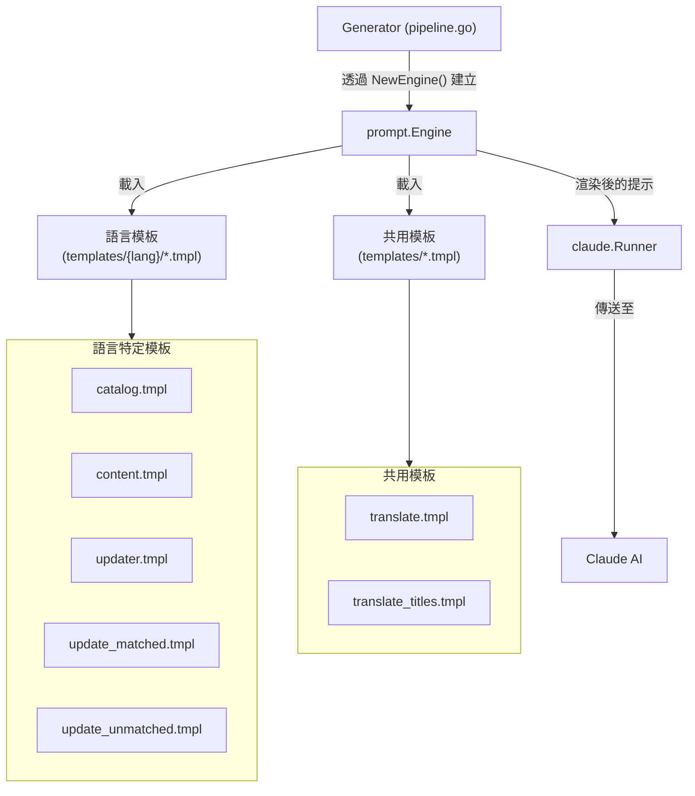
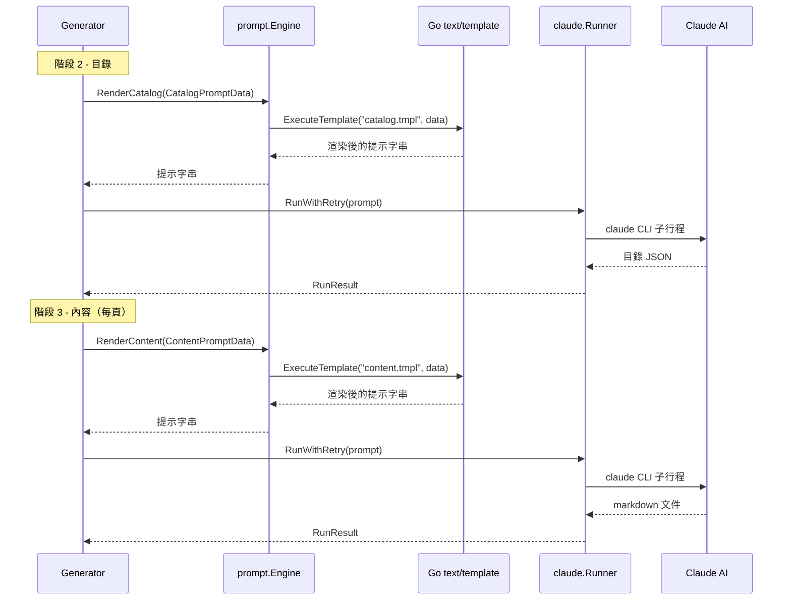

# 提示引擎

提示引擎是模板渲染子系統，負責將結構化資料轉換為完整的 Claude AI 提示詞，驅動文件生成管線的每個階段。

## 概述

提示引擎（`internal/prompt/engine.go`）作為 selfmd 生成邏輯與 Claude AI 模型之間的橋樑。它管理一組依語言組織的 Go `text/template` 檔案，使用各階段特定的上下文資料進行渲染，並產生最終透過 Runner 傳送給 Claude 的提示字串。

**主要職責：**

- **模板管理** — 使用 Go 的 `embed.FS` 從語言特定目錄和共用目錄載入並解析嵌入的 `.tmpl` 檔案
- **多語言支援** — 根據設定的輸出語言（例如 `zh-TW`、`en-US`）選擇對應的模板子目錄，不支援的語言則回退至 `en-US`
- **提示渲染** — 為每個生成階段提供具型別的渲染方法：目錄、內容、更新（已匹配/未匹配）及翻譯
- **資料綁定** — 接受強型別資料結構，將專案中繼資料、掃描結果、目錄資訊和語言設定帶入每個模板

引擎在每個 `Generator` 中實例化一次，並在所有管線階段中使用。

## 架構



## 模板組織

模板在編譯期間使用 Go 的 `//go:embed` 指令嵌入至二進位檔案中。它們分為兩個類別：

### 語言特定模板

位於 `internal/prompt/templates/{lang}/` 下，其中 `{lang}` 是語言代碼，例如 `zh-TW` 或 `en-US`。每個語言資料夾包含相同的模板檔案，內含本地化的提示指令：

| 模板檔案 | 渲染方法 | 管線階段 | 用途 |
|---|---|---|---|
| `catalog.tmpl` | `RenderCatalog()` | 目錄階段 | 指示 Claude 分析專案結構並產生文件目錄 |
| `content.tmpl` | `RenderContent()` | 內容階段 | 指示 Claude 撰寫單一文件頁面 |
| `updater.tmpl` | `RenderUpdater()` | 舊版更新 | 完整的增量更新提示（保留作為參考） |
| `update_matched.tmpl` | `RenderUpdateMatched()` | 更新階段 | 詢問 Claude 哪些現有頁面需要重新生成 |
| `update_unmatched.tmpl` | `RenderUpdateUnmatched()` | 更新階段 | 詢問 Claude 是否需要為未匹配的檔案建立新頁面 |

### 共用模板

位於 `internal/prompt/templates/` 下，這些模板與語言無關：

| 模板檔案 | 渲染方法 | 管線階段 | 用途 |
|---|---|---|---|
| `translate.tmpl` | `RenderTranslate()` | 翻譯階段 | 指示 Claude 翻譯文件頁面 |
| `translate_titles.tmpl` | `RenderTranslateTitles()` | 翻譯階段 | 批次翻譯目錄分類標題 |

### 模板語言選擇

引擎根據 `OutputConfig.GetEffectiveTemplateLang()` 選擇要載入的模板子目錄。如果設定的輸出語言有內建的模板資料夾（目前為 `zh-TW` 和 `en-US`），則使用該資料夾。否則，回退至 `en-US` 並設定語言覆寫旗標，使提示明確指示 Claude 以所需語言撰寫。

```go
func (o *OutputConfig) GetEffectiveTemplateLang() string {
	for _, lang := range SupportedTemplateLangs {
		if o.Language == lang {
			return o.Language
		}
	}
	return "en-US"
}
```

> Source: internal/config/config.go#L58-L65

## 資料結構

引擎為每種提示類型定義了具型別的資料結構。這些結構攜帶模板產生完整提示所需的所有上下文。

### CatalogPromptData

由 `RenderCatalog()` 在目錄生成階段使用。攜帶專案中繼資料、掃描的檔案樹、關鍵檔案、進入點和 README 內容。

```go
type CatalogPromptData struct {
	RepositoryName       string
	ProjectType          string
	Language             string
	LanguageName         string
	LanguageOverride     bool
	LanguageOverrideName string
	KeyFiles             string
	EntryPoints          string
	FileTree             string
	ReadmeContent        string
}
```

> Source: internal/prompt/engine.go#L40-L51

### ContentPromptData

由 `RenderContent()` 用於生成單一文件頁面。包含目錄路徑資訊、專案目錄、檔案樹、完整的目錄連結表，以及可選的現有內容作為更新上下文。

```go
type ContentPromptData struct {
	RepositoryName       string
	Language             string
	LanguageName         string
	LanguageOverride     bool
	LanguageOverrideName string
	CatalogPath          string
	CatalogTitle         string
	CatalogDirPath       string
	ProjectDir           string
	FileTree             string
	CatalogTable         string
	ExistingContent      string
}
```

> Source: internal/prompt/engine.go#L54-L67

### TranslatePromptData

由 `RenderTranslate()` 用於在語言之間翻譯文件頁面。包含來源/目標語言代碼、顯示名稱和完整的來源內容。

```go
type TranslatePromptData struct {
	SourceLanguage     string
	SourceLanguageName string
	TargetLanguage     string
	TargetLanguageName string
	SourceContent      string
}
```

> Source: internal/prompt/engine.go#L98-L104

### 更新相關資料結構

兩個資料結構支援增量更新工作流程：

- **`UpdateMatchedPromptData`** — 攜帶變更檔案清單和受影響頁面摘要，用於判斷哪些現有頁面需要重新生成
- **`UpdateUnmatchedPromptData`** — 攜帶未匹配的變更檔案和現有目錄，用於判斷是否需要建立新頁面

```go
type UpdateMatchedPromptData struct {
	RepositoryName string
	Language       string
	ChangedFiles   string
	AffectedPages  string
}

type UpdateUnmatchedPromptData struct {
	RepositoryName  string
	Language        string
	UnmatchedFiles  string
	ExistingCatalog string
	CatalogTable    string
}
```

> Source: internal/prompt/engine.go#L81-L95

## 核心流程

以下時序圖展示了引擎在文件生成管線中的使用方式：



### 引擎初始化

引擎在 `Generator` 實例化時建立一次。它載入兩組模板：語言特定模板和共用模板。

```go
func NewEngine(templateLang string) (*Engine, error) {
	langGlob := fmt.Sprintf("templates/%s/*.tmpl", templateLang)
	tmpl, err := template.New("").ParseFS(templateFS, langGlob)
	if err != nil {
		return nil, fmt.Errorf("failed to load prompt templates (%s): %w", templateLang, err)
	}

	shared, err := template.New("").ParseFS(templateFS, "templates/*.tmpl")
	if err != nil {
		return nil, fmt.Errorf("failed to load shared templates: %w", err)
	}

	return &Engine{
		templates:       tmpl,
		sharedTemplates: shared,
	}, nil
}
```

> Source: internal/prompt/engine.go#L21-L37

### 模板渲染

所有渲染方法遵循相同的模式：接受具型別的資料結構、執行指定的模板，並回傳渲染後的字串。語言特定模板使用 `render()` 方法，共用模板使用 `renderShared()`。

```go
func (e *Engine) render(name string, data any) (string, error) {
	var buf bytes.Buffer
	if err := e.templates.ExecuteTemplate(&buf, name, data); err != nil {
		return "", fmt.Errorf("failed to render template %s: %w", name, err)
	}
	return buf.String(), nil
}

func (e *Engine) renderShared(name string, data any) (string, error) {
	var buf bytes.Buffer
	if err := e.sharedTemplates.ExecuteTemplate(&buf, name, data); err != nil {
		return "", fmt.Errorf("failed to render shared template %s: %w", name, err)
	}
	return buf.String(), nil
}
```

> Source: internal/prompt/engine.go#L150-L164

## 使用範例

### 目錄階段用法

`Generator.GenerateCatalog()` 方法從掃描結果和設定中填充 `CatalogPromptData` 結構，然後呼叫 `Engine.RenderCatalog()`：

```go
data := prompt.CatalogPromptData{
	RepositoryName:       g.Config.Project.Name,
	ProjectType:          g.Config.Project.Type,
	Language:             g.Config.Output.Language,
	LanguageName:         langName,
	LanguageOverride:     g.Config.Output.NeedsLanguageOverride(),
	LanguageOverrideName: langName,
	KeyFiles:             scan.KeyFiles(),
	EntryPoints:          scan.EntryPointsFormatted(),
	FileTree:             scanner.RenderTree(scan.Tree, 4),
	ReadmeContent:        scan.ReadmeContent,
}

rendered, err := g.Engine.RenderCatalog(data)
```

> Source: internal/generator/catalog_phase.go#L17-L31

### 內容階段用法

每個文件頁面都使用專案上下文和目錄資訊進行渲染：

```go
data := prompt.ContentPromptData{
	RepositoryName:       g.Config.Project.Name,
	Language:             g.Config.Output.Language,
	LanguageName:         langName,
	LanguageOverride:     g.Config.Output.NeedsLanguageOverride(),
	LanguageOverrideName: langName,
	CatalogPath:          item.Path,
	CatalogTitle:         item.Title,
	CatalogDirPath:       item.DirPath,
	ProjectDir:           g.RootDir,
	FileTree:             scanner.RenderTree(scan.Tree, 3),
	CatalogTable:         catalogTable,
	ExistingContent:      existingContent,
}

rendered, err := g.Engine.RenderContent(data)
```

> Source: internal/generator/content_phase.go#L91-L107

### 翻譯階段用法

翻譯提示使用共用模板引擎：

```go
data := prompt.TranslatePromptData{
	SourceLanguage:     sourceLang,
	SourceLanguageName: sourceLangName,
	TargetLanguage:     targetLang,
	TargetLanguageName: targetLangName,
	SourceContent:      sourceContent,
}

rendered, err := g.Engine.RenderTranslate(data)
```

> Source: internal/generator/translate_phase.go#L197-L206

## 相關連結

- [Claude Runner](../claude-runner/index.md) — 透過 Claude CLI 執行渲染後提示的子行程執行器
- [文件生成器](../generator/index.md) — 在所有階段使用引擎的管線協調器
- [目錄階段](../generator/catalog-phase/index.md) — 使用 `RenderCatalog()` 生成文件結構的階段
- [內容階段](../generator/content-phase/index.md) — 使用 `RenderContent()` 生成個別頁面的階段
- [翻譯階段](../generator/translate-phase/index.md) — 使用 `RenderTranslate()` 和 `RenderTranslateTitles()` 的階段
- [增量更新引擎](../incremental-update/index.md) — 使用 `RenderUpdateMatched()` 和 `RenderUpdateUnmatched()` 的更新工作流程
- [設定概述](../../configuration/config-overview/index.md) — 語言和模板設定選項
- [輸出語言](../../configuration/output-language/index.md) — 影響模板選擇的輸出語言設定

## 參考檔案

| 檔案路徑 | 說明 |
|-----------|------|
| `internal/prompt/engine.go` | 引擎結構、資料型別和渲染方法 |
| `internal/prompt/templates/en-US/catalog.tmpl` | 英文目錄生成提示模板 |
| `internal/prompt/templates/en-US/content.tmpl` | 英文內容頁面生成提示模板 |
| `internal/prompt/templates/en-US/update_matched.tmpl` | 英文判斷需要重新生成頁面的提示 |
| `internal/prompt/templates/en-US/update_unmatched.tmpl` | 英文判斷是否需要新頁面的提示 |
| `internal/prompt/templates/en-US/updater.tmpl` | 舊版增量更新提示模板 |
| `internal/prompt/templates/translate.tmpl` | 共用翻譯提示模板 |
| `internal/prompt/templates/translate_titles.tmpl` | 共用批次標題翻譯提示模板 |
| `internal/prompt/templates/zh-TW/catalog.tmpl` | 繁體中文目錄提示（已確認存在） |
| `internal/generator/pipeline.go` | Generator 結構定義和引擎初始化 |
| `internal/generator/catalog_phase.go` | 使用 RenderCatalog() 的目錄階段 |
| `internal/generator/content_phase.go` | 使用 RenderContent() 的內容階段 |
| `internal/generator/translate_phase.go` | 使用 RenderTranslate() 和 RenderTranslateTitles() 的翻譯階段 |
| `internal/generator/updater.go` | 使用 RenderUpdateMatched() 和 RenderUpdateUnmatched() 的更新工作流程 |
| `internal/config/config.go` | GetEffectiveTemplateLang() 和語言設定 |