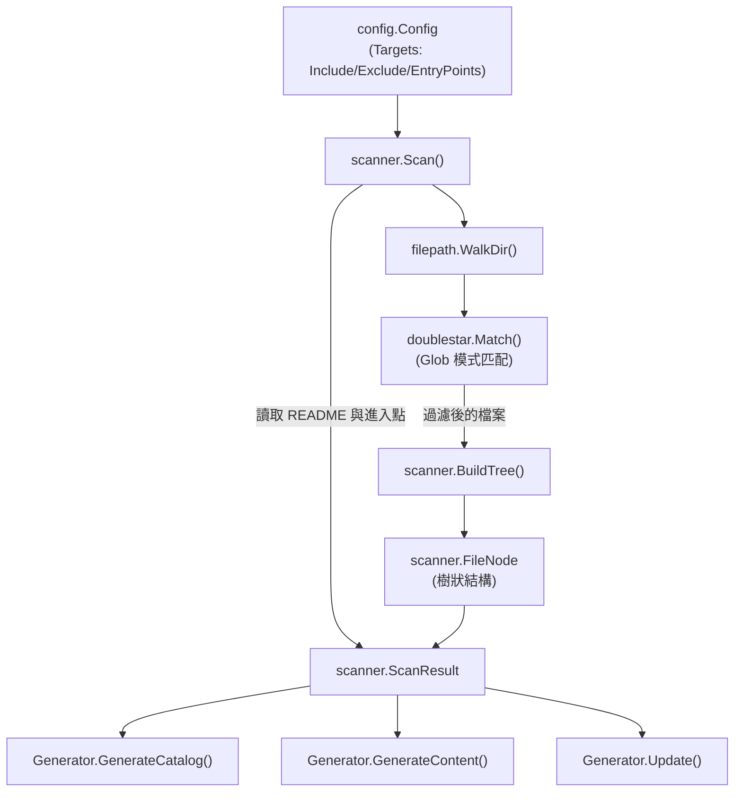
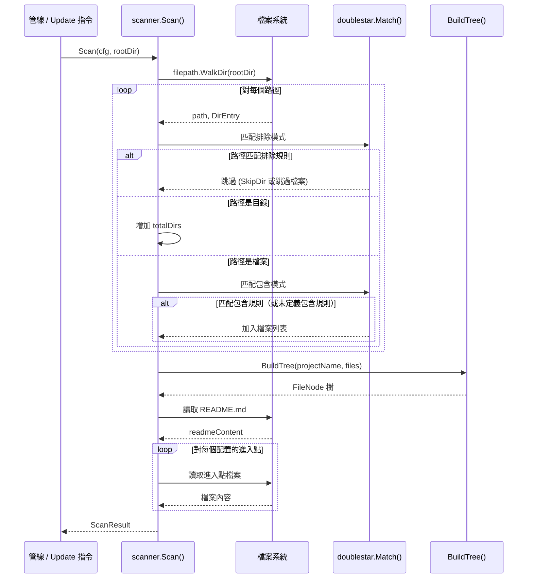

# 專案掃描器

專案掃描器是基礎模組，負責遍歷專案的目錄結構、根據配置規則過濾檔案，並產生結構化表示供整個文件生成管線使用。

## 概觀

`scanner` 套件（`internal/scanner/`）是 selfmd 文件生成管線的第一個階段。其主要職責包括：

- **目錄遍歷** — 遞迴走訪專案目錄，探索所有檔案與目錄
- **檔案過濾** — 套用配置中的 include/exclude glob 模式，決定哪些檔案與文件生成相關
- **樹狀結構建構** — 從扁平的檔案路徑列表建構記憶體中的樹狀結構（`FileNode`）
- **中繼資料擷取** — 讀取 README 檔案與配置的進入點檔案，為下游的 Claude 提示詞提供上下文
- **關鍵檔案偵測** — 識別專案中的重要檔案（例如 `main.go`、`package.json`、`Dockerfile`），用於目錄生成

掃描器在 `generate` 和 `update` 指令開始時被調用，其輸出（`ScanResult`）會流入目錄階段、內容階段和增量更新引擎。

## 架構



## 核心資料結構

### FileNode

`FileNode` 是掃描檔案樹的基本建構單元。每個節點代表一個檔案或目錄，並持有其子節點的參考。

```go
type FileNode struct {
	Name     string
	Path     string // relative path from project root
	IsDir    bool
	Children []*FileNode
}
```

> Source: internal/scanner/filetree.go#L11-L16

### ScanResult

`ScanResult` 彙整掃描過程中收集的所有資料 — 檔案樹、扁平檔案列表、統計資訊，以及 README 和進入點檔案的內容。

```go
type ScanResult struct {
	RootDir            string
	Tree               *FileNode
	FileList           []string
	TotalFiles         int
	TotalDirs          int
	ReadmeContent      string
	EntryPointContents map[string]string
}
```

> Source: internal/scanner/filetree.go#L19-L27

## 核心流程

### 掃描工作流程

`Scan` 函式協調整個掃描流程。它走訪目錄、套用過濾規則、建構樹狀結構，並讀取補充檔案。



### 檔案過濾邏輯

掃描器使用 `doublestar` glob 匹配函式庫，採用兩階段過濾策略：

1. **排除檢查（優先）** — 每個路徑都會與 `cfg.Targets.Exclude` 模式進行比對。如果目錄匹配，則透過 `filepath.SkipDir` 跳過整個子樹。如果檔案匹配，則靜默忽略。

2. **包含檢查（其次）** — 如果 `cfg.Targets.Include` 非空，則只保留至少匹配一個包含模式的檔案。如果未配置包含模式，則接受所有未被排除的檔案。

```go
// check excludes
for _, pattern := range cfg.Targets.Exclude {
    matched, _ := doublestar.Match(pattern, rel)
    if matched {
        if d.IsDir() {
            return filepath.SkipDir
        }
        return nil
    }
}
```

> Source: internal/scanner/scanner.go#L33-L41

```go
// check includes
if len(cfg.Targets.Include) > 0 {
    included := false
    for _, pattern := range cfg.Targets.Include {
        matched, _ := doublestar.Match(pattern, rel)
        if matched {
            included = true
            break
        }
    }
    if !included {
        return nil
    }
}
```

> Source: internal/scanner/scanner.go#L49-L61

預設配置為兩種模式提供了合理的預設值：

```go
Targets: TargetsConfig{
    Include: []string{"src/**", "pkg/**", "cmd/**", "internal/**", "lib/**", "app/**"},
    Exclude: []string{
        "vendor/**", "node_modules/**", ".git/**", ".doc-build/**",
        "**/*.pb.go", "**/generated/**", "dist/**", "build/**",
    },
    EntryPoints: []string{},
},
```

> Source: internal/config/config.go#L102-L109

### 樹狀結構建構

`BuildTree` 將扁平的相對檔案路徑列表轉換為階層式的 `FileNode` 樹。它以 `/` 分割每個路徑，遍歷或建立中間目錄節點，並將最後一個片段標記為檔案。

```go
func BuildTree(rootName string, paths []string) *FileNode {
	root := &FileNode{
		Name:  rootName,
		Path:  "",
		IsDir: true,
	}

	for _, p := range paths {
		parts := strings.Split(filepath.ToSlash(p), "/")
		current := root
		for i, part := range parts {
			isLast := i == len(parts)-1
			child := findChild(current, part)
			if child == nil {
				child = &FileNode{
					Name:  part,
					Path:  strings.Join(parts[:i+1], "/"),
					IsDir: !isLast,
				}
				current.Children = append(current.Children, child)
			}
			if !isLast {
				child.IsDir = true
			}
			current = child
		}
	}

	sortTree(root)
	return root
}
```

> Source: internal/scanner/filetree.go#L30-L60

建構完成後，`sortTree` 會排序每個目錄的子節點，**目錄優先**，然後在每個群組內按字母順序排列：

```go
func sortTree(node *FileNode) {
	sort.Slice(node.Children, func(i, j int) bool {
		if node.Children[i].IsDir != node.Children[j].IsDir {
			return node.Children[i].IsDir
		}
		return node.Children[i].Name < node.Children[j].Name
	})
	for _, c := range node.Children {
		if c.IsDir {
			sortTree(c)
		}
	}
}
```

> Source: internal/scanner/filetree.go#L71-L84

### 樹狀結構渲染

`RenderTree` 產生人類可讀的樹狀文字表示，用於 Claude 提示詞中。它支援深度限制（`maxDepth`）以及對超過 30 個子節點的目錄進行截斷。

```go
func RenderTree(node *FileNode, maxDepth int) string {
	var sb strings.Builder
	sb.WriteString(node.Name + "/\n")
	renderChildren(&sb, node, "", maxDepth, 0)
	return sb.String()
}
```

> Source: internal/scanner/filetree.go#L87-L92

渲染器使用標準的樹狀繪製字元（`├──`、`└──`、`│`），並截斷過大的目錄：

```go
// truncate if too many children
truncated := false
if len(children) > 30 {
    children = children[:30]
    truncated = true
}
```

> Source: internal/scanner/filetree.go#L104-L108

## ScanResult 的工具方法

### KeyFiles

`KeyFiles` 掃描檔案列表中的知名專案檔案（例如 `main.go`、`Dockerfile`、`package.json`），並以逗號分隔的字串返回。此方法在目錄生成時使用，幫助 Claude 理解專案的技術堆疊。

```go
func (s *ScanResult) KeyFiles() string {
	notable := []string{}
	patterns := []string{
		"main.go", "main.py", "main.rs", "main.ts", "main.js",
		"index.ts", "index.js", "app.go", "app.py", "app.ts",
		"Makefile", "Dockerfile", "docker-compose.yml", "compose.yaml",
		"package.json", "go.mod", "Cargo.toml", "pom.xml",
		"README.md", "CHANGELOG.md",
	}

	for _, f := range s.FileList {
		base := filepath.Base(f)
		for _, p := range patterns {
			if strings.EqualFold(base, p) {
				notable = append(notable, f)
				break
			}
		}
	}

	if len(notable) > 20 {
		notable = notable[:20]
	}
	return strings.Join(notable, ", ")
}
```

> Source: internal/scanner/scanner.go#L117-L141

### EntryPointsFormatted

`EntryPointsFormatted` 將配置的進入點檔案內容格式化為適合嵌入 Claude 提示詞的 Markdown 字串。每個進入點以其路徑作為標題，內容放在程式碼區塊中，超過 10,000 個字元時會被截斷。

```go
func (s *ScanResult) EntryPointsFormatted() string {
	if len(s.EntryPointContents) == 0 {
		return "(no entry points specified)"
	}

	var sb strings.Builder
	for path, content := range s.EntryPointContents {
		sb.WriteString("### " + path + "\n```\n")
		if len(content) > 10000 {
			content = content[:10000] + "\n... (truncated)"
		}
		sb.WriteString(content)
		sb.WriteString("\n```\n\n")
	}
	return sb.String()
}
```

> Source: internal/scanner/scanner.go#L144-L160

## 在管線中的使用

掃描器作為生成管線的**第一階段**被調用，也在增量更新時使用：

**完整生成**（`selfmd generate`）：

```go
// Phase 1: Scan
fmt.Println("[1/4] Scanning project structure...")
scan, err := scanner.Scan(g.Config, g.RootDir)
if err != nil {
    return fmt.Errorf("failed to scan project: %w", err)
}
fmt.Printf("      Found %d files in %d directories\n", scan.TotalFiles, scan.TotalDirs)
```

> Source: internal/generator/pipeline.go#L86-L92

**增量更新**（`selfmd update`）：

```go
// Scan project structure (needed for content generation)
scan, err := scanner.Scan(cfg, rootDir)
if err != nil {
    return fmt.Errorf("failed to scan project: %w", err)
}
```

> Source: cmd/update.go#L104-L108

`ScanResult` 隨後被以下模組使用：

- **`GenerateCatalog`** — 使用 `KeyFiles()`、`EntryPointsFormatted()`、`RenderTree()` 和 `ReadmeContent` 來建構目錄提示詞
- **`GenerateContent`** — 使用 `RenderTree()` 在每個頁面的內容提示詞中提供檔案樹上下文
- **`Update`** — 將完整的 `ScanResult` 傳遞給增量更新引擎，在頁面重新生成時提供上下文

## 相關連結

- [配置概觀](../../configuration/config-overview/index.md)
- [專案目標](../../configuration/project-targets/index.md)
- [生成管線](../../architecture/pipeline/index.md)
- [核心模組](../index.md)
- [目錄管理器](../catalog/index.md)
- [文件生成器](../generator/index.md)
- [目錄階段](../generator/catalog-phase/index.md)
- [內容階段](../generator/content-phase/index.md)
- [增量更新引擎](../incremental-update/index.md)

## 參考檔案

| 檔案路徑 | 說明 |
|-----------|------|
| `internal/scanner/scanner.go` | 核心 `Scan` 函式、檔案讀取輔助函式、`KeyFiles` 和 `EntryPointsFormatted` 方法 |
| `internal/scanner/filetree.go` | `FileNode` 和 `ScanResult` 結構體、`BuildTree`、`RenderTree` 和排序邏輯 |
| `internal/config/config.go` | `Config` 和 `TargetsConfig` 結構體及預設的 include/exclude 模式 |
| `internal/generator/pipeline.go` | 生成管線，調用 `scanner.Scan` 作為第一階段 |
| `internal/generator/catalog_phase.go` | 目錄生成，使用 `ScanResult` 欄位 |
| `internal/generator/content_phase.go` | 內容生成，使用 `RenderTree` 和 `ScanResult` |
| `internal/generator/updater.go` | 增量更新引擎，接收 `ScanResult` |
| `cmd/update.go` | Update 指令，調用 `scanner.Scan` |