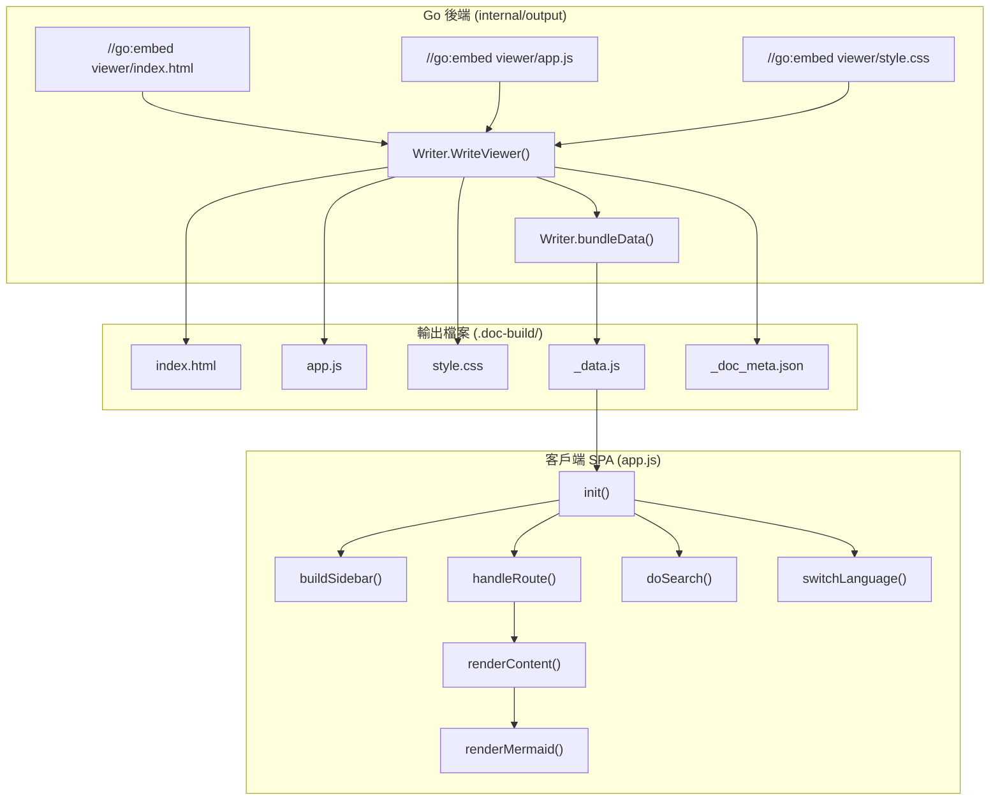
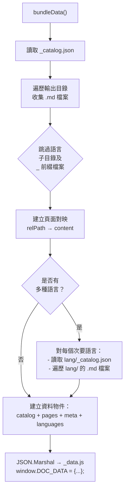

# 靜態檢視器

靜態檢視器是一個獨立的單頁文件瀏覽器，將所有生成的 Markdown 內容打包成無需伺服器的 HTML/JS/CSS 應用程式，供離線瀏覽使用。

## 概述

靜態檢視器是 selfmd 文件生成流水線的最終輸出產物。在所有 Markdown 頁面生成（並選擇性翻譯）完成後，檢視器模組會：

- **在編譯時嵌入檢視器資源** — HTML、JavaScript 和 CSS 檔案透過 `//go:embed` 指令編譯進 Go 二進位檔中，確保建置時零外部依賴
- **將所有文件打包成單一 `_data.js` 檔案** — 所有 Markdown 頁面、目錄結構和語言中繼資料被序列化為可由 JavaScript 載入的資料物件
- **提供完整的 SPA 體驗** — 基於 Hash 的路由、側邊欄導覽、全文搜尋、Mermaid 圖表渲染（支援全螢幕/縮放/平移）、語言切換，以及響應式行動裝置版面
- **無需伺服器** — 輸出可直接以本機檔案開啟（`index.html`），或部署至任何靜態託管服務（GitHub Pages、Netlify 等）

檢視器在 `generate` 和 `translate` 流水線的最後階段透過 `Writer.WriteViewer()` 呼叫。

## 架構



## 嵌入資源

檢視器資源在編譯時使用 Go 的 `embed` 套件嵌入 Go 二進位檔中。這確保檢視器檔案作為 selfmd 二進位檔的一部分發布，無需任何外部檔案依賴。

```go
//go:embed viewer/index.html
var viewerHTML string

//go:embed viewer/app.js
var viewerJS string

//go:embed viewer/style.css
var viewerCSS string
```

> Source: internal/output/viewer.go#L13-L20

三個嵌入檔案構成完整的檢視器：

| 檔案 | 用途 |
|------|------|
| `viewer/index.html` | 含有範本佔位符（`{{PROJECT_NAME}}`、`{{LANG}}`）的 HTML 外殼 |
| `viewer/app.js` | 完整 SPA 邏輯：路由、渲染、搜尋、語言切換、Mermaid 支援 |
| `viewer/style.css` | 響應式樣式，包含深色側邊欄、排版設計和 Mermaid 全螢幕支援 |

## WriteViewer 流程

`Writer` 上的 `WriteViewer` 方法是主要進入點。它寫入所有靜態資源並打包文件資料。

```go
func (w *Writer) WriteViewer(projectName string, docMeta *DocMeta) error {
	// Write index.html with project name and language injected
	html := strings.ReplaceAll(viewerHTML, "{{PROJECT_NAME}}", projectName)
	lang := "zh-TW"
	if docMeta != nil {
		lang = docMeta.DefaultLanguage
	}
	html = strings.ReplaceAll(html, "{{LANG}}", lang)

	if err := w.WriteFile("index.html", html); err != nil {
		return fmt.Errorf("failed to write index.html: %w", err)
	}

	// Write static assets
	if err := w.WriteFile("app.js", viewerJS); err != nil {
		return fmt.Errorf("failed to write app.js: %w", err)
	}
	if err := w.WriteFile("style.css", viewerCSS); err != nil {
		return fmt.Errorf("failed to write style.css: %w", err)
	}

	// Write _doc_meta.json
	if docMeta != nil {
		metaBytes, err := json.MarshalIndent(docMeta, "", "  ")
		if err != nil {
			return fmt.Errorf("failed to serialize _doc_meta.json: %w", err)
		}
		if err := w.WriteFile("_doc_meta.json", string(metaBytes)); err != nil {
			return fmt.Errorf("failed to write _doc_meta.json: %w", err)
		}
	}

	// Bundle all content into _data.js
	return w.bundleData(projectName, docMeta)
}
```

> Source: internal/output/viewer.go#L24-L58

### 範本替換

HTML 範本包含兩個在寫入時被替換的佔位符：

- `{{PROJECT_NAME}}` — 注入至 `<title>` 標籤和側邊欄標頭 `<h1>`
- `{{LANG}}` — 從 `DocMeta.DefaultLanguage` 設定到 `<html lang="...">` 屬性

## 資料打包

`bundleData` 方法會遍歷輸出目錄，收集所有 Markdown 檔案和目錄資料，並將所有內容寫入單一 `_data.js` 檔案供客戶端應用程式使用。



### 資料物件結構

打包後的 `_data.js` 檔案會指派一個全域 `window.DOC_DATA` 物件，結構如下：

```javascript
window.DOC_DATA = {
    "catalog": { /* 解析後的 _catalog.json */ },
    "pages": {
        "overview/index.md": "# Overview\n...",
        "configuration/index.md": "# Configuration\n..."
    },
    "meta": {
        "default_language": "en-US",
        "available_languages": [
            { "code": "en-US", "native_name": "English", "is_default": true },
            { "code": "zh-TW", "native_name": "繁體中文", "is_default": false }
        ]
    },
    "languages": {
        "zh-TW": {
            "catalog": { /* 翻譯後的目錄 */ },
            "pages": { /* 翻譯後的頁面 */ }
        }
    }
};
```

### 檔案收集邏輯

打包器在收集 Markdown 檔案時會套用特定的過濾規則：

```go
// Skip files starting with _
if strings.HasPrefix(filepath.Base(relPath), "_") {
    return nil
}

// Skip files inside language subdirectories
topDir := strings.SplitN(relPath, "/", 2)[0]
if langDirs[topDir] {
    return nil
}
```

> Source: internal/output/viewer.go#L103-L112

以 `_` 為前綴的檔案（如 `_catalog.json`、`_sidebar.md`）以及次要語言目錄內的檔案會被排除在主要頁面集合之外。次要語言的內容會另外收集並放置在 `languages` 鍵下。

## 客戶端應用程式

`app.js` 檔案實作了一個完整的單頁應用程式，包含以下子系統。

### 初始化

在 DOM 準備就緒時，`init()` 函式會啟動檢視器：

```javascript
function init() {
    if (!window.DOC_DATA) {
        document.getElementById("article").innerHTML = "<p>Error: _data.js not found.</p>";
        return;
    }

    catalog = window.DOC_DATA.catalog;
    pages = window.DOC_DATA.pages;
    docMeta = window.DOC_DATA.meta || null;

    configureMarked();
    mermaid.initialize({ startOnLoad: false, theme: "default" });

    if (docMeta && docMeta.available_languages && docMeta.available_languages.length > 1) {
        buildLangSwitcher();
        var urlLang = getQueryParam("lang");
        if (urlLang && urlLang !== docMeta.default_language) {
            switchLanguage(urlLang);
        }
    }

    buildSidebar();
    handleRoute();
    window.addEventListener("hashchange", handleRoute);
    setupMobileMenu();
    setupGlobalEsc();
    setupSearch();
}
```

> Source: internal/output/viewer/app.js#L36-L64

### 基於 Hash 的路由

導覽使用 URL 的 hash 片段。`handleRoute()` 函式從 `location.hash` 擷取路徑，並從記憶體中的 `pages` 對映載入對應頁面：

```javascript
function handleRoute() {
    var path = location.hash.slice(1) || "index.md";
    loadPage(path);
}
```

> Source: internal/output/viewer/app.js#L212-L215

### Markdown 渲染

內容渲染使用 [marked.js](https://github.com/markedjs/marked) 搭配 [highlight.js](https://highlightjs.org/) 進行語法高亮。Mermaid 程式碼區塊不經由 highlight.js 處理，而是由 mermaid.js 單獨渲染：

```javascript
function configureMarked() {
    marked.setOptions({
        highlight: function (code, lang) {
            if (lang === "mermaid") {
                return code.replace(/&/g, "&amp;").replace(/</g, "&lt;").replace(/>/g, "&gt;");
            }
            if (lang && hljs.getLanguage(lang)) {
                return hljs.highlight(code, { language: lang }).value;
            }
            return hljs.highlightAuto(code).value;
        },
        breaks: false,
        gfm: true
    });
}
```

> Source: internal/output/viewer/app.js#L128-L143

### 相對連結解析

內部 Markdown 連結（如 `../overview/index.md` 等相對路徑）在渲染時由 `fixLinks()` 函式轉換為基於 Hash 的連結：

```javascript
function fixLinks(container, currentPath) {
    var baseDir = currentPath.replace(/[^/]*$/, "");
    var links = container.querySelectorAll("a[href]");

    for (var i = 0; i < links.length; i++) {
        var href = links[i].getAttribute("href");
        if (href.indexOf("://") !== -1 || href.charAt(0) === "#" || href.indexOf("mailto:") === 0) continue;
        var resolved = resolvePath(baseDir, href);
        links[i].setAttribute("href", "#" + resolved);
    }
}
```

> Source: internal/output/viewer/app.js#L325-L338

### 全文搜尋

搜尋系統提供即時的客戶端全文搜尋功能，涵蓋所有已載入的頁面，並帶有 200 毫秒的防抖動機制：

```javascript
function doSearch(query) {
    var results = [];
    var lowerQuery = query.toLowerCase();
    var pageKeys = Object.keys(pages);

    for (var i = 0; i < pageKeys.length; i++) {
        var path = pageKeys[i];
        var content = pages[path];
        var lowerContent = content.toLowerCase();
        var idx = lowerContent.indexOf(lowerQuery);
        if (idx === -1) continue;

        var titleMatch = content.match(/^#\s+(.+)/m);
        var title = titleMatch ? titleMatch[1] : path;

        var start = Math.max(0, idx - 30);
        var end = Math.min(content.length, idx + query.length + 60);
        var snippet = (start > 0 ? "…" : "") +
            content.substring(start, end).replace(/\n/g, " ") +
            (end < content.length ? "…" : "");

        results.push({ path: path, title: title, snippet: snippet, matchIdx: idx - start + (start > 0 ? 1 : 0) });
    }

    showSearchResults(results, query);
}
```

> Source: internal/output/viewer/app.js#L633-L660

當搜尋結果被點擊時，檢視器會導覽至該頁面並捲動至第一個匹配處，同時以 `<mark>` 元素暫時標示該匹配文字。

### 語言切換

當有多種語言可用時，檢視器會在側邊欄渲染一個 `<select>` 下拉選單。切換語言時會將 `catalog` 和 `pages` 變數替換為次要語言的資料，然後重建側邊欄並重新渲染當前頁面：

```javascript
function switchLanguage(langCode) {
    if (!docMeta) return;

    if (langCode === docMeta.default_language) {
        catalog = window.DOC_DATA.catalog;
        pages = window.DOC_DATA.pages;
        currentLang = null;
    } else {
        var langData = window.DOC_DATA.languages;
        if (langData && langData[langCode]) {
            if (langData[langCode].catalog) {
                catalog = langData[langCode].catalog;
            }
            pages = langData[langCode].pages || {};
            currentLang = langCode;
        }
    }

    buildSidebar();
    handleRoute();

    var select = document.getElementById("lang-select");
    if (select) select.value = langCode;

    setQueryParam("lang", langCode === (docMeta && docMeta.default_language) ? null : langCode);
}
```

> Source: internal/output/viewer/app.js#L98-L124

所選語言透過 URL 查詢參數 `?lang=zh-TW` 持久化，因此語言偏好在頁面重新載入後仍會保留。

### Mermaid 圖表支援

Mermaid 程式碼區塊在 Markdown 渲染後被偵測並由 mermaid.js 處理。每個圖表被包裝在 `mindmap-wrapper` 中，並附帶一個全螢幕按鈕，支援縮放（滑鼠滾輪，0.8x–2.0x）和平移（點擊拖曳）：

```javascript
function renderMermaid(container) {
    var codeBlocks = container.querySelectorAll("pre code.language-mermaid");
    if (codeBlocks.length === 0) return;

    for (var i = 0; i < codeBlocks.length; i++) {
        var block = codeBlocks[i];
        var pre = block.parentElement;

        var wrapper = document.createElement("div");
        wrapper.className = "mindmap-wrapper";

        var div = document.createElement("div");
        div.className = "mermaid";
        var mermaidText = decodeHtmlEntities(block.textContent).replace(/\\n/g, "<br/>");
        div.textContent = mermaidText;

        var btn = document.createElement("button");
        btn.className = "mindmap-fullscreen-btn";
        btn.title = uiText("fullscreen");
        btn.innerHTML = "&#x26F6;";

        wrapper.appendChild(div);
        wrapper.appendChild(btn);
        pre.parentNode.replaceChild(wrapper, pre);
    }

    try {
        mermaid.run();
    } catch (e) {
        console.warn("Mermaid rendering error:", e);
    }
}
```

> Source: internal/output/viewer/app.js#L356-L404

### UI 國際化

檢視器的 UI 字串（按鈕標籤、搜尋佔位符、錯誤訊息）透過內建的 `uiI18n` 字典支援在地化：

```javascript
var uiI18n = {
    "zh-TW": {
        home: "首頁", overview: "概覽", pageNotFound: "頁面未找到",
        notFoundPrefix: "找不到", copyTitle: "複製本頁 .md 相對路徑",
        copyLabel: "複製本頁位置", dlTitle: "下載本頁 Markdown",
        dlLabel: "下載本頁", copied: "已複製", fullscreen: "全螢幕檢視",
        zoomHint: "滾輪縮放 / 拖曳平移", noResults: "找不到符合的結果",
        resultsPrefix: "找到 ", resultsSuffix: " 筆結果"
    },
    "en-US": {
        home: "Home", overview: "Overview", pageNotFound: "Page Not Found",
        notFoundPrefix: "Could not find", copyTitle: "Copy .md relative path",
        copyLabel: "Copy Path", dlTitle: "Download Markdown",
        dlLabel: "Download", copied: "Copied", fullscreen: "Fullscreen",
        zoomHint: "Scroll to zoom / Drag to pan", noResults: "No results found",
        resultsPrefix: "Found ", resultsSuffix: " results"
    }
};
```

> Source: internal/output/viewer/app.js#L9-L26

### 頁面工具列

每個渲染的頁面都包含一個帶有兩個操作的工具列：

- **複製路徑** — 將頁面的相對 `.md` 路徑複製到剪貼簿
- **下載** — 以檔案形式下載原始 Markdown 內容

```javascript
function buildPageToolbar(path) {
    return '<div class="page-toolbar">' +
        '<button id="btn-copy-path" class="toolbar-btn" title="' + uiText("copyTitle") + '">' +
        '<span class="toolbar-icon">&#128203;</span> ' + uiText("copyLabel") + '</button>' +
        '<button id="btn-download" class="toolbar-btn" title="' + uiText("dlTitle") + '">' +
        '<span class="toolbar-icon">&#11015;</span> ' + uiText("dlLabel") + '</button>' +
        '</div>';
}
```

> Source: internal/output/viewer/app.js#L270-L277

## 流水線整合

檢視器在兩個流水線的末尾生成：

### 生成流水線（第 4 階段）

在內容生成和索引建立之後，`WriteViewer` 作為最後一步被呼叫：

```go
// Build doc metadata for multi-language support
docMeta := g.buildDocMeta()

// Generate static viewer (HTML/JS/CSS + _data.js bundle)
fmt.Println("Generating documentation viewer...")
if err := g.Writer.WriteViewer(g.Config.Project.Name, docMeta); err != nil {
    g.Logger.Warn("failed to generate viewer", "error", err)
    fmt.Printf("      Viewer generation failed: %v\n", err)
} else {
    fmt.Println("      Done, open .doc-build/index.html to browse")
}
```

> Source: internal/generator/pipeline.go#L146-L155

### 翻譯流水線

翻譯完成後，檢視器會重新生成以包含所有語言資料：

```go
// Regenerate viewer bundle with all language data
docMeta := g.buildDocMeta()
fmt.Println("Regenerating documentation viewer...")
if err := g.Writer.WriteViewer(g.Config.Project.Name, docMeta); err != nil {
    g.Logger.Warn("failed to generate viewer", "error", err)
} else {
    fmt.Println("      Done")
}
```

> Source: internal/generator/translate_phase.go#L117-L124

## 輸出檔案結構

`WriteViewer` 完成後，輸出目錄包含：

```
.doc-build/
├── index.html          # 主 HTML 外殼（來自嵌入範本）
├── app.js              # SPA 應用程式邏輯
├── style.css           # 樣式表
├── _data.js            # 打包的文件資料
├── _doc_meta.json      # 語言中繼資料
├── _catalog.json       # 目錄結構
├── .nojekyll           # GitHub Pages 相容性
├── overview/
│   └── index.md        # 主要語言頁面
├── core-modules/
│   └── ...
└── zh-TW/              # 次要語言（若已翻譯）
    ├── _catalog.json
    └── overview/
        └── index.md
```

## 第三方依賴

檢視器在執行時從 CDN 載入三個外部函式庫：

| 函式庫 | 用途 | 載入來源 |
|--------|------|----------|
| marked.js | Markdown → HTML 渲染 | `cdn.jsdelivr.net/npm/marked/marked.min.js` |
| highlight.js | 程式碼區塊語法高亮 | `cdn.jsdelivr.net/npm/highlight.js@11` |
| mermaid.js | 圖表渲染（流程圖、時序圖等） | `cdn.jsdelivr.net/npm/mermaid/dist/mermaid.min.js` |

## 響應式設計

檢視器使用 CSS 媒體查詢來適配不同螢幕尺寸：

- **桌面版 (> 860px)** — 固定 280px 側邊欄，主要內容區域帶有 56px 內距
- **行動版 (≤ 860px)** — 側邊欄預設隱藏，透過漢堡選單按鈕搭配遮罩層顯示
- **小螢幕 (≤ 480px)** — 縮小標題字型大小
- **列印** — 隱藏側邊欄和選單按鈕，內容填滿頁面

```css
@media (max-width: 860px) {
    #menu-toggle {
        display: block;
    }

    #sidebar {
        position: fixed;
        left: 0;
        top: 0;
        height: 100vh;
        z-index: 150;
        transform: translateX(-100%);
        transition: transform 0.25s ease;
        box-shadow: 4px 0 24px rgba(0, 0, 0, 0.3);
    }

    #sidebar.open {
        transform: translateX(0);
    }
}
```

> Source: internal/output/viewer/style.css#L632-L662

## 相關連結

- [核心模組](../index.md)
- [輸出寫入器](../output-writer/index.md)
- [文件生成器](../generator/index.md)
- [生成流水線](../../architecture/pipeline/index.md)
- [翻譯工作流程](../../i18n/translation-workflow/index.md)
- [輸出結構](../../overview/output-structure/index.md)
- [技術棧](../../overview/tech-stack/index.md)

## 參考檔案

| 檔案路徑 | 說明 |
|-----------|------|
| `internal/output/viewer.go` | `WriteViewer` 和 `bundleData` 實作，包含 `//go:embed` 指令 |
| `internal/output/viewer/index.html` | 含有 `{{PROJECT_NAME}}` 和 `{{LANG}}` 佔位符的 HTML 範本 |
| `internal/output/viewer/app.js` | 完整 SPA 邏輯：路由、渲染、搜尋、語言切換、Mermaid |
| `internal/output/viewer/style.css` | 響應式 CSS，包含深色側邊欄主題和 Mermaid 全螢幕樣式 |
| `internal/output/writer.go` | `Writer` 結構體、`DocMeta`/`LangInfo` 型別、檔案寫入工具 |
| `internal/output/navigation.go` | `GenerateIndex`、`GenerateSidebar`、導覽頁面的 UI 字串 |
| `internal/output/linkfixer.go` | `LinkFixer`，用於驗證和修復 Markdown 中的相對連結 |
| `internal/generator/pipeline.go` | `Generate()` 流水線呼叫 `WriteViewer`、`buildDocMeta()` |
| `internal/generator/translate_phase.go` | 翻譯流水線在翻譯後呼叫 `WriteViewer` |