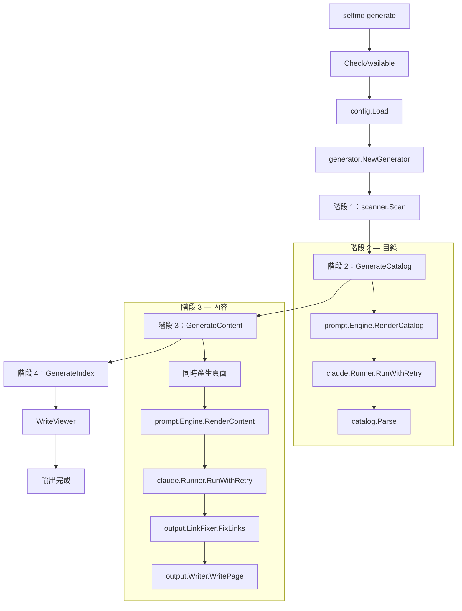
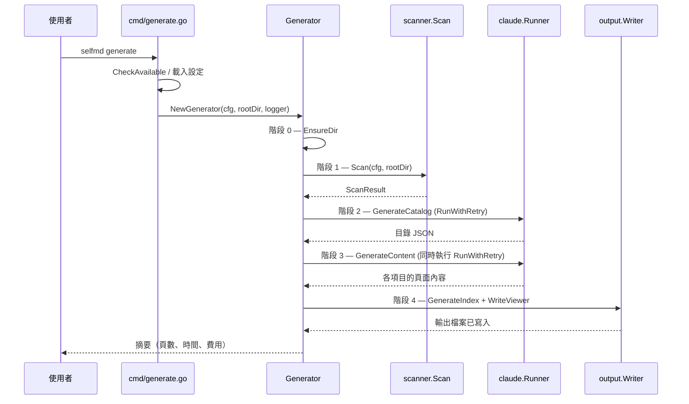

# 首次執行

使用 `selfmd init` 初始化專案後，您就可以使用 `selfmd generate` 命令來產生第一組文件了。

## 概覽

首次執行 `selfmd generate` 會執行一個四階段的流水線：掃描您的專案、透過 Claude 產生文件目錄、為每個目錄項目同時產生內容頁面，最後建立導覽檔案和靜態檢視器。整個過程完全自動化——一旦啟動，selfmd 會處理從程式碼分析到最終輸出的所有工作。

### 前置條件

在執行 `selfmd generate` 之前，請確認以下條件已就緒：

1. **`selfmd.yaml` 設定檔** — 由 `selfmd init` 建立。此檔案定義了您的專案名稱、掃描目標、輸出設定和 Claude 設定。
2. **Claude Code CLI (`claude`)** — 必須已安裝並可在系統 `PATH` 中使用。selfmd 會以子程序的方式呼叫 Claude 來分析您的程式碼庫。
3. **原始碼** — 您的專案必須包含符合 `selfmd.yaml` 中定義的 `targets.include` glob 模式的檔案。

## 架構



## 執行命令

要首次產生文件，請在專案根目錄下執行以下命令：

```bash
selfmd generate
```

### 命令列旗標

`generate` 命令支援多個可覆寫設定值的旗標：

```go
generateCmd.Flags().BoolVar(&cleanFlag, "clean", false, "Force clean the output directory")
generateCmd.Flags().BoolVar(&noCleanFlag, "no-clean", false, "Do not clean the output directory")
generateCmd.Flags().BoolVar(&dryRun, "dry-run", false, "Show plan only, do not execute")
generateCmd.Flags().IntVar(&concurrencyNum, "concurrency", 0, "Concurrency (overrides config file)")
```

> Source: cmd/generate.go#L35-L38

所有命令皆可使用的全域旗標：

```go
rootCmd.PersistentFlags().StringVarP(&cfgFile, "config", "c", "selfmd.yaml", "config file path")
rootCmd.PersistentFlags().BoolVarP(&verbose, "verbose", "v", false, "enable verbose output")
rootCmd.PersistentFlags().BoolVarP(&quiet, "quiet", "q", false, "show errors only")
```

> Source: cmd/root.go#L37-L39

| 旗標 | 預設值 | 說明 |
|------|---------|-------------|
| `--clean` | `false` | 產生前強制清除輸出目錄 |
| `--no-clean` | `false` | 跳過清除，即使在 `selfmd.yaml` 中已設定 |
| `--dry-run` | `false` | 掃描專案並顯示檔案樹，但不呼叫 Claude |
| `--concurrency` | `0`（使用設定值） | 覆寫 `claude.max_concurrent` 設定 |
| `--config`, `-c` | `selfmd.yaml` | 設定檔路徑 |
| `--verbose`, `-v` | `false` | 啟用除錯層級的日誌輸出 |
| `--quiet`, `-q` | `false` | 僅顯示錯誤訊息 |

### 試執行模式

使用 `--dry-run` 可預覽掃描結果，不會發出任何 Claude API 呼叫：

```bash
selfmd generate --dry-run
```

這會印出偵測到的檔案樹（最多深度 3 層）並結束，讓您在產生 API 費用之前確認目標檔案是否正確。

## 核心流程

產生流水線由四個依序執行的階段組成，前面還有一個設定步驟。



### 階段 0：設定

在開始掃描之前，會先準備輸出目錄：

```go
clean := opts.Clean || g.Config.Output.CleanBeforeGenerate
if clean {
    fmt.Println("[0/4] Cleaning output directory...")
    if !opts.DryRun {
        if err := g.Writer.Clean(); err != nil {
            return err
        }
    }
} else {
    if err := g.Writer.EnsureDir(); err != nil {
        return err
    }
}
```

> Source: internal/generator/pipeline.go#L72-L84

在使用預設設定（`clean_before_generate: false`）的首次執行中，這只是透過 `os.MkdirAll` 建立輸出目錄。

### 階段 1：掃描專案結構

掃描器會遍歷專案目錄、套用包含/排除的 glob 模式、建立檔案樹，並讀取 README 和進入點檔案：

```go
scan, err := scanner.Scan(g.Config, g.RootDir)
if err != nil {
    return fmt.Errorf("failed to scan project: %w", err)
}
fmt.Printf("      Found %d files in %d directories\n", scan.TotalFiles, scan.TotalDirs)
```

> Source: internal/generator/pipeline.go#L87-L92

掃描器會產生一個 `ScanResult`，包含：
- **檔案樹** — 用於在提示詞中顯示的階層式 `FileNode` 樹
- **檔案清單** — 所有符合條件的原始碼檔案
- **README 內容** — 截斷至 50,000 個字元
- **進入點內容** — `targets.entry_points` 中列出的檔案原始碼

### 階段 2：產生目錄

Claude 分析專案並產生結構化的文件目錄：

```go
fmt.Println("[2/4] Generating catalog...")
cat, err = g.GenerateCatalog(ctx, scan)
if err != nil {
    return fmt.Errorf("failed to generate catalog: %w", err)
}
items := cat.Flatten()
fmt.Printf("      Catalog: %d sections, %d items\n", len(cat.Items), len(items))
```

> Source: internal/generator/pipeline.go#L114-L121

目錄產生流程：

1. 組裝提示詞資料（專案名稱、類型、關鍵檔案、進入點、檔案樹、README）
2. 透過 `prompt.Engine.RenderCatalog` 渲染目錄提示詞模板
3. 透過 `claude.Runner.RunWithRetry` 以重試邏輯呼叫 Claude CLI
4. 從 Claude 的回應中擷取並解析 JSON 目錄
5. 將目錄儲存為輸出目錄中的 `_catalog.json`，以供後續執行重複使用

Claude 以子程序方式呼叫，使用以下旗標：

```go
args := []string{
    "-p",
    "--output-format", "json",
}
// ...
args = append(args, "--disallowedTools", "Write", "--disallowedTools", "Edit")
```

> Source: internal/claude/runner.go#L32-L56

`--disallowedTools Write --disallowedTools Edit` 旗標會防止 Claude 嘗試寫入檔案，確保所有輸出都透過 selfmd 的流水線處理。

### 階段 3：產生內容頁面

每個目錄項目都會有自己的文件頁面，以同時方式產生：

```go
concurrency := g.Config.Claude.MaxConcurrent
if opts.Concurrency > 0 {
    concurrency = opts.Concurrency
}
fmt.Printf("[3/4] Generating content pages (concurrency: %d)...\n", concurrency)
if err := g.GenerateContent(ctx, scan, cat, concurrency, !clean); err != nil {
    g.Logger.Warn("some pages failed to generate", "error", err)
}
```

> Source: internal/generator/pipeline.go#L130-L137

對於每個頁面，`generateSinglePage` 會執行：

1. 建立包含專案上下文、檔案樹和目錄連結表的提示詞資料
2. 渲染內容提示詞模板
3. 呼叫 Claude，Claude 會使用 Read/Glob/Grep 工具來分析實際原始碼
4. 從 Claude 回應中的 `<document>` 標籤擷取文件
5. 驗證輸出（必須以 Markdown 標題 `#` 開頭）
6. 透過 `output.LinkFixer` 修復損壞的相對連結
7. 將頁面寫入為 `<dirPath>/index.md`

如果頁面在重試後仍無法產生，會寫入一個佔位頁面，流水線繼續執行：

```go
func (g *Generator) writePlaceholder(item catalog.FlatItem, genErr error) {
	content := fmt.Sprintf("# %s\n\n> This page failed to generate. Please re-run `selfmd generate`.\n>\n> Error: %v\n", item.Title, genErr)
	if err := g.Writer.WritePage(item, content); err != nil {
		g.Logger.Warn("failed to write placeholder page", "path", item.Path, "error", err)
	}
}
```

> Source: internal/generator/content_phase.go#L159-L164

### 階段 4：產生索引與導覽

最後階段產生確定性的導覽檔案，不需呼叫 Claude：

```go
func (g *Generator) GenerateIndex(_ context.Context, cat *catalog.Catalog) error {
	lang := g.Config.Output.Language

	indexContent := output.GenerateIndex(
		g.Config.Project.Name,
		g.Config.Project.Description,
		cat,
		lang,
	)
	if err := g.Writer.WriteFile("index.md", indexContent); err != nil {
		return err
	}

	sidebarContent := output.GenerateSidebar(g.Config.Project.Name, cat, lang)
	if err := g.Writer.WriteFile("_sidebar.md", sidebarContent); err != nil {
		return err
	}
	// ... category index pages
}
```

> Source: internal/generator/index_phase.go#L11-L30

此階段會產生：
- **`index.md`** — 包含階層式目錄的首頁
- **`_sidebar.md`** — 靜態檢視器的側邊欄導覽
- **分類索引頁面** — 為有子項目的父項目列出其子頁面

此階段完成後，會產生靜態檢視器：

```go
fmt.Println("Generating documentation viewer...")
if err := g.Writer.WriteViewer(g.Config.Project.Name, docMeta); err != nil {
    g.Logger.Warn("failed to generate viewer", "error", err)
} else {
    fmt.Println("      Done, open .doc-build/index.html to browse")
}
```

> Source: internal/generator/pipeline.go#L149-L155

檢視器會將所有 Markdown 內容打包成單一的 `_data.js` 檔案，實現完全離線的文件瀏覽功能。

## 輸出結構

成功首次執行後，輸出目錄包含：

```
<output_dir>/
├── index.html          # 靜態檢視器 HTML
├── app.js              # 檢視器 JavaScript
├── style.css           # 檢視器 CSS
├── index.md            # 包含目錄的首頁
├── _sidebar.md         # 側邊欄導覽
├── _catalog.json       # 目錄 JSON（後續執行時重複使用）
├── _data.js            # 打包的離線瀏覽內容
├── _doc_meta.json      # 語言中繼資料
├── _last_commit        # 用於增量更新的 Git commit 雜湊值
├── .nojekyll           # GitHub Pages 相容性標記
├── overview/
│   ├── index.md        # 分類索引
│   └── introduction/
│       └── index.md    # Claude 產生的內容頁面
├── getting-started/
│   ├── index.md
│   ├── installation/
│   │   └── index.md
│   └── ...
└── ...
```

### 檢視輸出

在任何瀏覽器中開啟產生的 `index.html` 即可使用內建的靜態檢視器瀏覽您的文件。不需要 Web 伺服器——檢視器使用打包的 `_data.js` 檔案完全離線運作。

## 完成摘要

當產生完成時，selfmd 會印出一份摘要：

```go
fmt.Println("========================================")
fmt.Println("Documentation generation complete!")
fmt.Printf("  Output dir: %s\n", g.Config.Output.Dir)
fmt.Printf("  Pages: %d succeeded", g.TotalPages)
if g.FailedPages > 0 {
    fmt.Printf(", %d failed", g.FailedPages)
}
fmt.Println()
fmt.Printf("  Total time: %s\n", elapsed.Round(time.Second))
fmt.Printf("  Total cost: $%.4f USD\n", g.TotalCost)
fmt.Println("========================================")
```

> Source: internal/generator/pipeline.go#L173-L183

摘要包含：
- **輸出目錄**路徑
- **頁面數量** — 成功產生的頁面數和失敗數
- **總耗時**
- **總費用** — Claude API 使用的美元費用

## 錯誤處理

selfmd 在產生前和產生過程中會驗證多項前置條件：

| 檢查項目 | 行為 |
|-------|----------|
| Claude CLI 不在 PATH 中 | 立即失敗並顯示安裝 URL |
| 設定檔遺失或無效 | 以解析錯誤失敗 |
| `output.dir` 為空 | 驗證錯誤 |
| `output.language` 為空 | 驗證錯誤 |
| Claude CLI 逾時 | 回傳逾時錯誤，觸發重試 |
| Claude 回應格式錯誤 | 每個頁面最多重試 2 次 |
| 單一頁面產生失敗 | 寫入佔位頁面，繼續處理其他頁面 |
| 收到 SIGINT/SIGTERM | 透過 Go context 優雅取消 |
| 檢視器產生失敗 | 記錄警告，流水線仍然完成 |

失敗的頁面會收到一個佔位內容，在後續執行時會自動偵測並重新產生：

```go
func (w *Writer) PageExists(item catalog.FlatItem) bool {
	path := filepath.Join(w.BaseDir, item.DirPath, "index.md")
	data, err := os.ReadFile(path)
	if err != nil {
		return false
	}
	content := strings.TrimSpace(string(data))
	if content == "" {
		return false
	}
	head := content
	if len(head) > 500 {
		head = head[:500]
	}
	if strings.Contains(head, "This page failed to generate") {
		return false
	}
	return true
}
```

> Source: internal/output/writer.go#L97-L117

## 增量行為

在後續執行時（未使用 `--clean`），selfmd 會透過以下方式進行最佳化：

1. **重複使用目錄** — 如果 `_catalog.json` 存在，會直接載入而不再呼叫 Claude
2. **跳過已存在的頁面** — 已存在且內容有效的頁面不會重新產生
3. **重新產生失敗的頁面** — 偵測到佔位頁面後會重新產生

這意味著您可以安全地重新執行 `selfmd generate` 來補全首次嘗試中失敗的頁面，而不會重新產生已成功的頁面。

## 相關連結

- [安裝](../installation/index.md)
- [初始化](../init/index.md)
- [generate 命令](../../cli/cmd-generate/index.md)
- [設定概覽](../../configuration/config-overview/index.md)
- [產生流水線](../../architecture/pipeline/index.md)
- [文件產生器](../../core-modules/generator/index.md)

## 參考檔案

| 檔案路徑 | 說明 |
|-----------|-------------|
| `cmd/generate.go` | Generate 命令定義與進入點 |
| `cmd/root.go` | 根命令與全域旗標定義 |
| `internal/generator/pipeline.go` | 四階段產生流水線協調器 |
| `internal/generator/catalog_phase.go` | 透過 Claude 產生目錄 |
| `internal/generator/content_phase.go` | 同時產生內容頁面 |
| `internal/generator/index_phase.go` | 索引與導覽檔案產生 |
| `internal/config/config.go` | 設定結構體、載入與驗證 |
| `internal/scanner/scanner.go` | 專案目錄掃描與檔案樹建立 |
| `internal/claude/runner.go` | Claude CLI 子程序呼叫與重試邏輯 |
| `internal/output/writer.go` | 輸出檔案寫入與頁面存在性檢查 |
| `internal/output/navigation.go` | 索引、側邊欄與分類索引產生 |
| `internal/output/viewer.go` | 靜態檢視器與資料打包產生 |
| `selfmd.yaml` | 範例專案設定檔 |