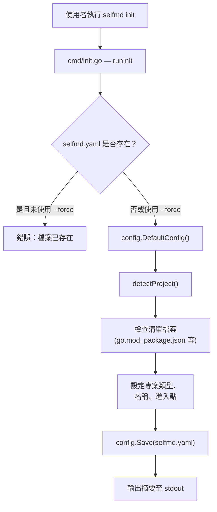
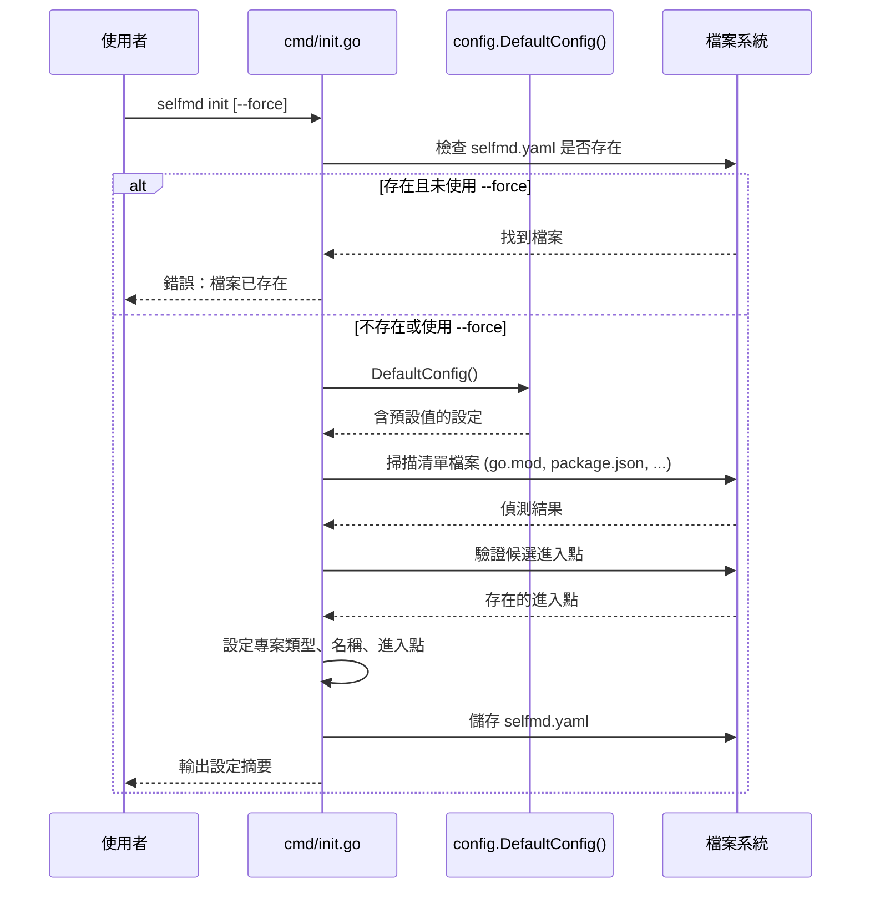

# 初始化

透過自動偵測專案類型來生成 `selfmd.yaml` 設定檔，完成 selfmd 專案的初始設定。

## 概述

在 selfmd 能為您的專案生成文件之前，它需要一個描述專案結構、輸出偏好和 Claude 設定的設定檔（`selfmd.yaml`）。**初始化**步驟會自動建立這個檔案。

`selfmd init` 命令會掃描您目前的工作目錄，偵測專案類型（例如 backend、frontend、fullstack），識別可能的進入點，並寫入一個填充了合理預設值的完整 `selfmd.yaml`。這為您提供了一個可用的起始點，您可以在執行文件生成器之前進行自訂。

核心概念：

- **專案偵測** — selfmd 檢查常見的清單檔案（`go.mod`、`package.json`、`Cargo.toml` 等）來分類您的專案並定位進入點。
- **預設設定** — 所有設定欄位都預先填入預設值，因此生成的檔案可以立即使用。
- **預設安全** — 當設定檔已存在時執行 `init` 會失敗，除非您傳入 `--force`。

## 架構



## 初始化流程

### 步驟 1：安全檢查

在寫入任何內容之前，命令會檢查 `selfmd.yaml` 是否已存在於設定的路徑（預設：當前目錄下的 `selfmd.yaml`）。如果檔案存在且未設定 `--force`，命令會以錯誤退出，以防止意外覆寫。

```go
if _, err := os.Stat(cfgFile); err == nil && !forceInit {
    return fmt.Errorf("config file %s already exists, use --force to overwrite", cfgFile)
}
```

> Source: cmd/init.go#L28-L30

### 步驟 2：生成預設設定

透過 `config.DefaultConfig()` 將 `Config` 結構體填入預設值。這些預設值涵蓋設定的每個區段：

```go
func DefaultConfig() *Config {
    return &Config{
        Project: ProjectConfig{
            Name: filepath.Base(mustGetwd()),
            Type: "backend",
        },
        Targets: TargetsConfig{
            Include: []string{"src/**", "pkg/**", "cmd/**", "internal/**", "lib/**", "app/**"},
            Exclude: []string{
                "vendor/**", "node_modules/**", ".git/**", ".doc-build/**",
                "**/*.pb.go", "**/generated/**", "dist/**", "build/**",
            },
            EntryPoints: []string{},
        },
        Output: OutputConfig{
            Dir:                 ".doc-build",
            Language:            "zh-TW",
            SecondaryLanguages:  []string{},
            CleanBeforeGenerate: false,
        },
        Claude: ClaudeConfig{
            Model:          "sonnet",
            MaxConcurrent:  3,
            TimeoutSeconds: 1800,
            MaxRetries:     2,
            AllowedTools:   []string{"Read", "Glob", "Grep"},
            ExtraArgs:      []string{},
        },
        Git: GitConfig{
            Enabled:    true,
            BaseBranch: "main",
        },
    }
}
```

> Source: internal/config/config.go#L96-L129

### 步驟 3：偵測專案類型

`detectProject()` 函式掃描工作目錄中的已知清單檔案，並將其對應到專案類型和候選進入點：

```go
func detectProject() (projectType string, entryPoints []string) {
    checks := []struct {
        file    string
        pType   string
        entries []string
    }{
        {"go.mod", "backend", []string{"main.go", "cmd/root.go"}},
        {"Cargo.toml", "backend", []string{"src/main.rs", "src/lib.rs"}},
        {"package.json", "frontend", []string{"src/index.ts", "src/index.js", "src/main.ts", "src/App.tsx"}},
        {"pom.xml", "backend", []string{"src/main/java"}},
        {"build.gradle", "backend", []string{"src/main/java"}},
        {"requirements.txt", "backend", []string{"main.py", "app.py", "src/main.py"}},
        {"pyproject.toml", "backend", []string{"src/main.py", "main.py"}},
        {"composer.json", "backend", []string{"public/index.php", "src/Kernel.php"}},
        {"Gemfile", "backend", []string{"config/application.rb", "app/"}},
    }

    for _, c := range checks {
        if _, err := os.Stat(c.file); err == nil {
            var found []string
            for _, ep := range c.entries {
                if _, err := os.Stat(ep); err == nil {
                    found = append(found, ep)
                }
            }
            if c.pType == "frontend" {
                if _, err := os.Stat("go.mod"); err == nil {
                    return "fullstack", found
                }
                if _, err := os.Stat("server"); err == nil {
                    return "fullstack", found
                }
            }
            return c.pType, found
        }
    }

    return "library", nil
}
```

> Source: cmd/init.go#L60-L98

偵測邏輯支援以下專案類型：

| 清單檔案 | 偵測類型 | 候選進入點 |
|---|---|---|
| `go.mod` | backend | `main.go`, `cmd/root.go` |
| `Cargo.toml` | backend | `src/main.rs`, `src/lib.rs` |
| `package.json` | frontend | `src/index.ts`, `src/index.js`, `src/main.ts`, `src/App.tsx` |
| `pom.xml` | backend | `src/main/java` |
| `build.gradle` | backend | `src/main/java` |
| `requirements.txt` | backend | `main.py`, `app.py`, `src/main.py` |
| `pyproject.toml` | backend | `src/main.py`, `main.py` |
| `composer.json` | backend | `public/index.php`, `src/Kernel.php` |
| `Gemfile` | backend | `config/application.rb`, `app/` |
| *（無符合項目）* | library | *（無）* |

如果找到 `package.json`（frontend）**且**同時存在 `go.mod` 或 `server/` 目錄，則類型會提升為 `fullstack`。

只有實際存在於磁碟上的進入點才會被包含在最終設定中。

### 步驟 4：寫入與報告

組裝好的設定會序列化為 YAML 並寫入設定檔路徑。摘要會輸出至 stdout：

```go
cfg.Project.Type = projectType
cfg.Project.Name = filepath.Base(mustCwd())
cfg.Targets.EntryPoints = entryPoints

if err := cfg.Save(cfgFile); err != nil {
    return fmt.Errorf("failed to write config file: %w", err)
}

fmt.Printf("Config file created: %s\n", cfgFile)
fmt.Printf("  Project name: %s\n", cfg.Project.Name)
fmt.Printf("  Project type: %s\n", cfg.Project.Type)
fmt.Printf("  Output dir: %s\n", cfg.Output.Dir)
fmt.Printf("  Doc language: %s\n", cfg.Output.Language)
```

> Source: cmd/init.go#L35-L47

## 核心流程



## 使用範例

在 Go 專案目錄中進行**基本初始化**：

```bash
cd my-go-project
selfmd init
```

預期輸出：

```
Config file created: selfmd.yaml
  Project name: my-go-project
  Project type: backend
  Output dir: .doc-build
  Doc language: zh-TW
  Entry points: main.go, cmd/root.go

Please edit the config file as needed, then run selfmd generate to generate documentation.
```

**強制覆寫**現有設定：

```bash
selfmd init --force
```

**使用自訂設定路徑**（透過全域 `--config` 旗標）：

```bash
selfmd --config my-config.yaml init
```

> Source: cmd/init.go#L15-L57, cmd/root.go#L37

## 生成的設定結構

執行 `selfmd init` 後，生成的 `selfmd.yaml` 包含以下區段：

| 區段 | 主要欄位 | 用途 |
|---|---|---|
| `project` | `name`, `type`, `description` | 專案中繼資料 |
| `targets` | `include`, `exclude`, `entry_points` | 指定哪些檔案需要掃描以生成文件 |
| `output` | `dir`, `language`, `secondary_languages` | 輸出目錄與語言設定 |
| `claude` | `model`, `max_concurrent`, `timeout_seconds` | Claude CLI 執行器設定 |
| `git` | `enabled`, `base_branch` | 用於增量更新的 Git 整合 |

設定結構體定義於 `internal/config/config.go`：

```go
type Config struct {
    Project ProjectConfig `yaml:"project"`
    Targets TargetsConfig `yaml:"targets"`
    Output  OutputConfig  `yaml:"output"`
    Claude  ClaudeConfig  `yaml:"claude"`
    Git     GitConfig     `yaml:"git"`
}
```

> Source: internal/config/config.go#L11-L17

## 後續步驟

初始化完成後，您應該：

1. **檢閱並編輯 `selfmd.yaml`** — 根據需要調整專案描述、include/exclude 模式、輸出語言和 Claude 模型。
2. **執行 `selfmd generate`** — 執行完整的文件生成流程。

## 相關連結

- [安裝](../installation/index.md) — 如何安裝 selfmd 執行檔
- [首次執行](../first-run/index.md) — 首次執行文件生成
- [init 命令](../../cli/cmd-init/index.md) — init 命令的 CLI 參考
- [設定總覽](../../configuration/config-overview/index.md) — 所有設定選項的詳細說明
- [專案目標](../../configuration/project-targets/index.md) — 設定 include/exclude 模式與進入點

## 參考檔案

| 檔案路徑 | 說明 |
|-----------|------|
| `cmd/init.go` | init 命令實作與專案偵測邏輯 |
| `cmd/root.go` | 根命令定義與全域旗標 |
| `cmd/generate.go` | generate 命令（展示設定載入流程） |
| `internal/config/config.go` | 設定結構體定義、預設值、載入、儲存與驗證 |
| `selfmd.yaml` | 實際專案設定檔範例 |
| `go.mod` | 模組定義，確認專案結構 |