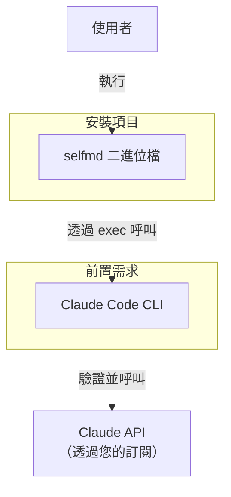
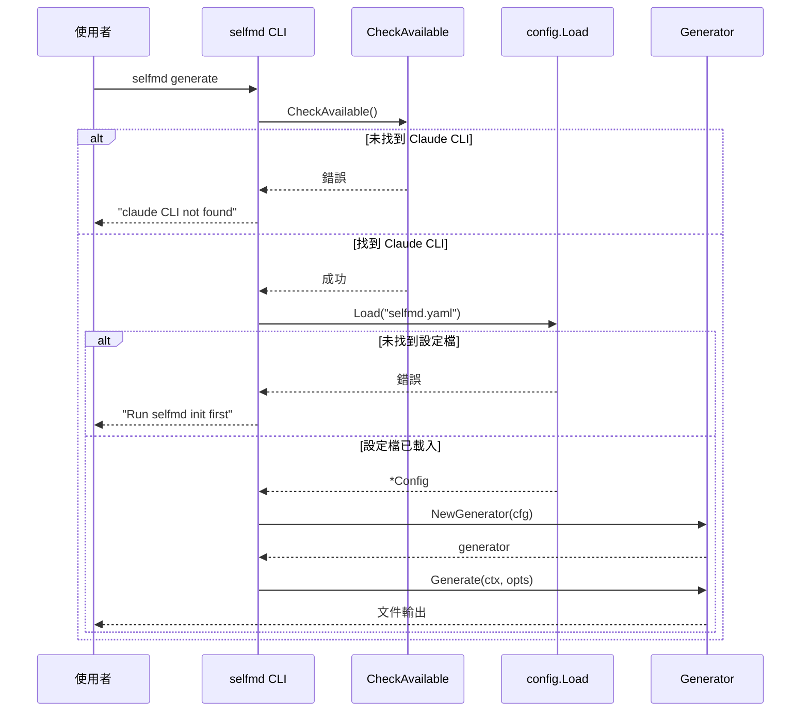

# 安裝

SelfMD 以單一預建二進位檔案發佈，除了 Claude Code CLI 之外沒有其他外部依賴。本頁涵蓋所有支援的平台、安裝方法及驗證步驟。

## 概述

SelfMD 是一個獨立的 Go 二進位檔案，透過將 [Claude Code CLI](https://code.claude.com/docs/en/overview) 作為子程序呼叫來協調文件生成。由於這種架構，安裝過程包含兩個部分：

1. **安裝前置需求** — Claude Code CLI 必須已安裝且可在系統 `PATH` 中使用
2. **安裝 SelfMD 本身** — 下載預建二進位檔案或從原始碼建置

不需要伺服器、資料庫、Docker 或其他執行環境。只要二進位檔案在您的 `PATH` 中，就可以從任何專案目錄執行 `selfmd`。

## 架構



SelfMD 使用 Go 的 `os/exec` 套件呼叫 `claude` 命令列執行檔。`CheckAvailable` 函式會在任何生成作業開始前，驗證 CLI 是否存在於系統 `PATH` 中：

```go
// CheckAvailable verifies that the claude CLI is installed and accessible.
func CheckAvailable() error {
	_, err := exec.LookPath("claude")
	if err != nil {
		return fmt.Errorf("claude CLI not found. Please install Claude Code: https://docs.anthropic.com/en/docs/claude-code")
	}
	return nil
}
```

> Source: internal/claude/runner.go#L146-L152

## 前置需求

在安裝 SelfMD 之前，請確認已具備以下條件：

| 需求 | 詳細說明 |
|------|----------|
| **Claude Code CLI** | 必須已安裝且可在您的 `PATH` 中使用。請參閱 [Claude Code 文件](https://code.claude.com/docs/en/overview) 了解安裝說明。 |
| **有效的 Claude 訂閱** | SelfMD 透過 Claude Code CLI 使用您現有的 Claude Pro / Max 訂閱。不需要另外的 API 金鑰。 |
| **Git**（選用） | 若要使用增量更新（`selfmd update`）或基於 git 的變更偵測，則需要安裝。 |

## 支援的平台

SelfMD 為以下平台和架構提供預建二進位檔案：

| 平台 | 架構 | 二進位檔案名稱 |
|------|------|----------------|
| macOS | Apple Silicon (arm64) | `selfmd-macos-arm64` |
| macOS | Intel (amd64) | `selfmd-macos-amd64` |
| Linux | arm64 | `selfmd-linux-arm64` |
| Linux | amd64 | `selfmd-linux-amd64` |
| Windows | arm64 | `selfmd-windows-arm64.exe` |
| Windows | amd64 | `selfmd-windows-amd64.exe` |

## 安裝方法

### 方法一：下載預建二進位檔案（推薦）

從 [Releases](https://github.com/monkenWu/selfmd-claude-code/releases) 頁面下載適用於您平台的最新二進位檔案。

#### macOS / Linux

```bash
# macOS / Linux: make it executable, rename, and move to PATH
chmod +x selfmd-macos-arm64
sudo mv selfmd-macos-arm64 /usr/local/bin/selfmd
```

> Source: README.md#L48-L51

將 `selfmd-macos-arm64` 替換為適用於您平台的正確二進位檔案名稱（例如，在 x86_64 架構的 Linux 上使用 `selfmd-linux-amd64`）。

#### Windows (PowerShell)

```powershell
# Windows (PowerShell): create a directory, move the binary, and add to PATH
mkdir "$env:USERPROFILE\selfmd"
Rename-Item selfmd-windows-amd64.exe selfmd.exe
Move-Item selfmd.exe "$env:USERPROFILE\selfmd\selfmd.exe"
[Environment]::SetEnvironmentVariable("Path", "$env:Path;$env:USERPROFILE\selfmd", "User")
```

> Source: README.md#L53-L59

#### Windows (CMD)

```cmd
:: Windows (CMD): create a directory, move the binary, and add to PATH
mkdir "%USERPROFILE%\selfmd"
ren selfmd-windows-amd64.exe selfmd.exe
move selfmd.exe "%USERPROFILE%\selfmd\selfmd.exe"
setx Path "%Path%;%USERPROFILE%\selfmd"
```

> Source: README.md#L61-L67

### 方法二：從原始碼建置

從原始碼建置需要 **Go 1.25 或更新版本**。

```bash
# Clone the repository
git clone https://github.com/monkenWu/selfmd-claude-code.git
cd selfmd-claude-code

# Build the binary
go build -o selfmd .

# Move to PATH (optional)
sudo mv selfmd /usr/local/bin/selfmd
```

程式進入點為 `main.go`，它將控制權委派給基於 Cobra 的命令路由器：

```go
package main

import (
	"os"

	"github.com/monkenwu/selfmd/cmd"
)

func main() {
	if err := cmd.Execute(); err != nil {
		os.Exit(1)
	}
}
```

> Source: main.go#L1-L13

## 驗證安裝

安裝完成後，驗證前置需求是否正常運作：

```bash
# Verify selfmd is accessible
selfmd --help

# Verify Claude Code CLI is accessible
claude --version
```

成功執行 `selfmd --help` 將顯示 CLI 橫幅和可用命令：

```go
var rootCmd = &cobra.Command{
	Use:   "selfmd",
	Short: "selfmd — Auto Documentation Generator for Claude Code CLI",
	Long: banner + `Automatically generate structured, high-quality technical documentation
for any codebase — powered by Claude Code CLI.`,
}
```

> Source: cmd/root.go#L25-L30

### 全域旗標

根命令提供以下可用於所有子命令的全域旗標：

```go
func init() {
	rootCmd.PersistentFlags().StringVarP(&cfgFile, "config", "c", "selfmd.yaml", "config file path")
	rootCmd.PersistentFlags().BoolVarP(&verbose, "verbose", "v", false, "enable verbose output")
	rootCmd.PersistentFlags().BoolVarP(&quiet, "quiet", "q", false, "show errors only")
}
```

> Source: cmd/root.go#L36-L40

| 旗標 | 縮寫 | 預設值 | 說明 |
|------|------|--------|------|
| `--config` | `-c` | `selfmd.yaml` | 設定檔路徑 |
| `--verbose` | `-v` | `false` | 啟用除錯層級輸出 |
| `--quiet` | `-q` | `false` | 僅顯示錯誤訊息 |

## 核心流程

以下序列圖展示使用者在安裝後首次執行 `selfmd generate` 時的流程，說明 CLI 可用性檢查如何融入啟動流程：



## 疑難排解

| 問題 | 原因 | 解決方案 |
|------|------|----------|
| `claude CLI not found` | Claude Code CLI 未安裝或不在 `PATH` 中 | 安裝 Claude Code CLI 並確保 `claude` 命令可從終端機存取 |
| `selfmd: command not found` | 二進位檔案不在 `PATH` 中 | 將二進位檔案移至 `PATH` 中的目錄（例如 `/usr/local/bin/`）或將其所在目錄加入 `PATH` |
| `permission denied` | 二進位檔案缺少執行權限（macOS/Linux） | 執行 `chmod +x selfmd` |
| `config file selfmd.yaml already exists` | 在已初始化的專案中執行 `init` | 使用 `selfmd init --force` 覆寫，或編輯現有檔案 |

## 相關連結

- [初始化](../init/index.md) — 安裝後在專案中設定 `selfmd.yaml`
- [首次執行](../first-run/index.md) — 生成您的第一個文件網站
- [設定總覽](../../configuration/config-overview/index.md) — 所有設定選項的詳細說明
- [CLI 命令](../../cli/index.md) — 所有可用命令的完整參考
- [Claude 設定](../../configuration/claude-config/index.md) — 設定 Claude CLI 整合

## 參考檔案

| 檔案路徑 | 說明 |
|----------|------|
| `main.go` | 應用程式進入點 |
| `cmd/root.go` | 根命令定義及全域旗標 |
| `cmd/init.go` | 初始化命令與專案類型偵測 |
| `cmd/generate.go` | 生成命令與 CLI 可用性檢查 |
| `internal/claude/runner.go` | Claude CLI 執行器與 `CheckAvailable` 函式 |
| `internal/config/config.go` | 設定結構定義及預設值 |
| `go.mod` | Go 模組定義及依賴項 |
| `selfmd.yaml` | 範例設定檔 |
| `README.md` | 專案 README 與安裝說明 |