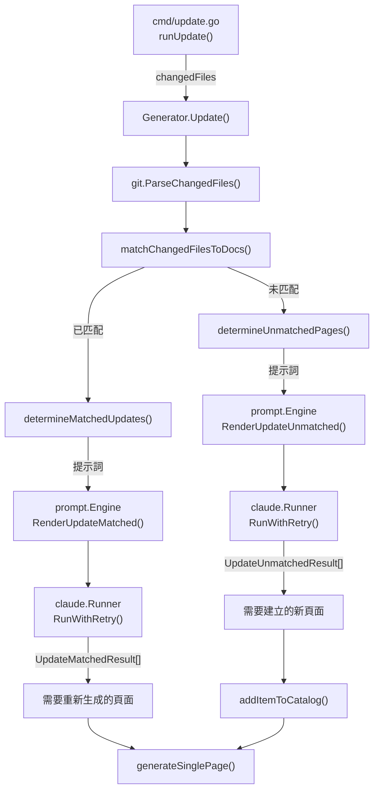
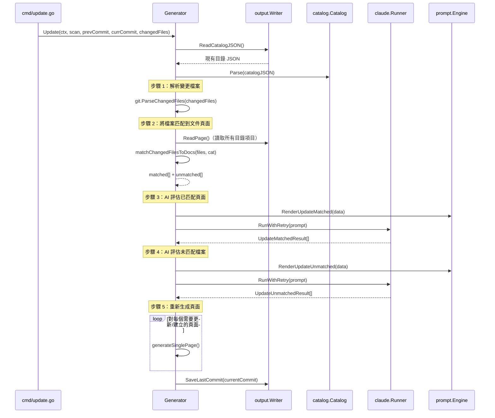

# 受影響頁面匹配

當原始碼發生變更時，selfmd 會判斷哪些現有文件頁面受到影響，以及是否需要建立新頁面——這是增量更新背後的核心智慧。

## 概述

受影響頁面匹配是 `selfmd update` 工作流程中的決策層。在 git 變更偵測識別出哪些原始檔案被修改之後，此子系統負責：

- **將變更檔案匹配到現有文件頁面** — 透過掃描頁面內容中的檔案路徑參考
- **諮詢 Claude 確認是否需要重新生成** — 使用 AI 驅動的評估來避免不必要的重建
- **識別未匹配的檔案** — 未被任何文件頁面引用的變更檔案
- **判斷是否需要建立新頁面** — 詢問 Claude 未匹配的檔案是否需要新的文件條目

這種兩階段方法（已匹配 + 未匹配）確保文件與程式碼保持同步，同時將不必要的重新生成降到最低。

## 架構



## 核心資料結構

匹配系統運作於兩個關鍵的結果類型上，用以記錄 Claude 的決策：

```go
// UpdateMatchedResult represents a page that Claude determined needs regeneration.
type UpdateMatchedResult struct {
	CatalogPath string `json:"catalogPath"`
	Title       string `json:"title"`
	Reason      string `json:"reason"`
}

// UpdateUnmatchedResult represents a new page that Claude determined should be created.
type UpdateUnmatchedResult struct {
	CatalogPath string `json:"catalogPath"`
	Title       string `json:"title"`
	Reason      string `json:"reason"`
}
```

> Source: internal/generator/updater.go#L18-L29

中間匹配結構將變更檔案連結到引用它們的文件頁面：

```go
// matchResult holds the mapping between changed files and the doc pages that reference them.
type matchResult struct {
	// changedFile is the source file path that changed
	changedFile string
	// pages are the doc pages that reference this file
	pages []catalog.FlatItem
}
```

> Source: internal/generator/updater.go#L168-L174

## 匹配流程

### 階段 1：基於內容的檔案匹配

`matchChangedFilesToDocs` 方法對變更檔案路徑與現有文件頁面內容進行字串搜尋匹配。對於每個變更檔案，它會掃描所有扁平化的目錄頁面，找出哪些頁面包含對該檔案路徑的引用。

```go
func (g *Generator) matchChangedFilesToDocs(files []git.ChangedFile, cat *catalog.Catalog) (matched []matchResult, unmatched []string) {
	items := cat.Flatten()

	// Pre-read all page contents
	pageContents := make(map[string]string) // key: item.Path, value: page content
	for _, item := range items {
		content, err := g.Writer.ReadPage(item)
		if err != nil {
			continue
		}
		pageContents[item.Path] = content
	}

	// For each changed file, find which pages reference it
	for _, f := range files {
		var matchedPages []catalog.FlatItem
		for _, item := range items {
			content, ok := pageContents[item.Path]
			if !ok {
				continue
			}
			if strings.Contains(content, f.Path) {
				matchedPages = append(matchedPages, item)
			}
		}

		if len(matchedPages) > 0 {
			matched = append(matched, matchResult{
				changedFile: f.Path,
				pages:       matchedPages,
			})
		} else {
			unmatched = append(unmatched, f.Path)
		}
	}

	return matched, unmatched
}
```

> Source: internal/generator/updater.go#L177-L213

匹配邏輯的運作方式如下：

1. **扁平化目錄** — 將階層式目錄樹轉換為 `FlatItem` 條目的扁平列表
2. **預先讀取所有頁面** — 將每個現有文件頁面的 Markdown 內容載入記憶體
3. **字串搜尋** — 對每個變更檔案，檢查其路徑字串是否出現在頁面內容中的任何位置
4. **分類** — 至少有一個匹配頁面的檔案歸入 `matched`；沒有匹配的檔案歸入 `unmatched`

此方法利用了 selfmd 生成的文件頁面包含帶有檔案路徑的 `> Source:` 標註這一特性，使字串匹配成為一個可靠的啟發式方法。

### 階段 2：AI 驅動的重新生成決策（已匹配檔案）

在識別出哪些頁面引用了變更檔案後，`determineMatchedUpdates` 會請求 Claude 決定哪些頁面實際上需要重新生成。

```go
func (g *Generator) determineMatchedUpdates(ctx context.Context, matched []matchResult, cat *catalog.Catalog) ([]catalog.FlatItem, error) {
	// Build changed files list
	var changedFilesList strings.Builder
	for _, m := range matched {
		changedFilesList.WriteString(fmt.Sprintf("- `%s`\n", m.changedFile))
	}

	// Build affected pages info (deduplicated)
	seenPages := make(map[string]bool)
	var affectedPagesInfo strings.Builder
	for _, m := range matched {
		for _, page := range m.pages {
			if seenPages[page.Path] {
				continue
			}
			seenPages[page.Path] = true

			summary := ""
			content, err := g.Writer.ReadPage(page)
			if err == nil && len(content) > 500 {
				summary = content[:500] + "..."
			} else if err == nil {
				summary = content
			}

			affectedPagesInfo.WriteString(fmt.Sprintf("### %s (catalogPath: %s)\n", page.Title, page.Path))
			affectedPagesInfo.WriteString("Referenced changed files: ")
			for _, m2 := range matched {
				for _, p := range m2.pages {
					if p.Path == page.Path {
						affectedPagesInfo.WriteString(fmt.Sprintf("`%s` ", m2.changedFile))
					}
				}
			}
			affectedPagesInfo.WriteString("\n")
			affectedPagesInfo.WriteString(fmt.Sprintf("Summary:\n%s\n\n", summary))
		}
	}

	data := prompt.UpdateMatchedPromptData{
		RepositoryName: g.Config.Project.Name,
		Language:       g.Config.Output.Language,
		ChangedFiles:   changedFilesList.String(),
		AffectedPages:  affectedPagesInfo.String(),
	}

	rendered, err := g.Engine.RenderUpdateMatched(data)
	// ...
}
```

> Source: internal/generator/updater.go#L217-L262

提示詞範本指示 Claude 採取**保守策略** — 僅在變更確實影響到文件中描述的行為、架構或 API 時才標記頁面需要重新生成。Claude 會讀取實際變更的原始檔案，並與頁面摘要進行比對後再做出判斷。

### 階段 3：AI 驅動的新頁面決策（未匹配檔案）

對於未被任何現有頁面引用的檔案，`determineUnmatchedPages` 會詢問 Claude 是否應該建立新的文件頁面。

```go
func (g *Generator) determineUnmatchedPages(ctx context.Context, unmatchedFiles []string, cat *catalog.Catalog) ([]UpdateUnmatchedResult, error) {
	var fileList strings.Builder
	for _, f := range unmatchedFiles {
		fileList.WriteString(fmt.Sprintf("- `%s`\n", f))
	}

	existingCatalog, err := cat.ToJSON()
	if err != nil {
		return nil, err
	}

	data := prompt.UpdateUnmatchedPromptData{
		RepositoryName:  g.Config.Project.Name,
		Language:        g.Config.Output.Language,
		UnmatchedFiles:  fileList.String(),
		ExistingCatalog: existingCatalog,
		CatalogTable:    cat.BuildLinkTable(),
	}

	rendered, err := g.Engine.RenderUpdateUnmatched(data)
	// ...
}
```

> Source: internal/generator/updater.go#L309-L329

Claude 會收到完整的現有目錄結構和連結表，使其能夠判斷未匹配的檔案應該歸入現有章節，還是需要構成一個全新的章節。

## 核心流程

以下序列圖展示了從接收變更檔案到產生更新文件的完整流程：



## 新頁面的目錄擴展

當 Claude 判定需要從未匹配檔案建立新頁面時，`addItemToCatalog` 函式會將它們插入目錄樹中。它透過點號分隔路徑（例如 `core-modules.new-feature`）支援任意層級的巢狀結構。

一個值得注意的邊界情況是**葉節點提升為父節點**：當新頁面需要作為現有葉節點的子項目新增時，該葉節點會被提升為父節點，方法是自動建立一個 `overview` 子項目來保留原始內容。

```go
func addItemToCatalog(cat *catalog.Catalog, catalogPath, title string) *promotedLeaf {
	parts := strings.Split(catalogPath, ".")
	var promoted *promotedLeaf
	addItemToChildren(&cat.Items, parts, title, "", &promoted)
	return promoted
}
```

> Source: internal/generator/updater.go#L372-L377

```go
type promotedLeaf struct {
	OriginalPath  string
	OverviewPath  string
	OriginalTitle string
}
```

> Source: internal/generator/updater.go#L360-L367

## Claude 提示詞範本

兩個專用的提示詞範本驅動 AI 決策：

### update_matched.tmpl

用於引用了變更檔案的頁面。給予 Claude 的關鍵指示：

- 在做出判斷之前**讀取實際變更的原始檔案**
- 採取保守策略 — 僅在變更影響到已記錄的行為、架構或 API 時才標記頁面
- 純樣式變更、內部重構或行為未改變的錯誤修復不需要重新生成
- 回傳 `{catalogPath, title, reason}` 物件的 JSON 陣列

### update_unmatched.tmpl

用於未被現有文件引用的檔案。給予 Claude 的關鍵指示：

- 讀取每個未匹配的原始檔案以理解其功能
- 僅為全新的模組、重要的 API 群組、新的架構元件或重要的組態機制建立新頁面
- 輔助檔案、測試、錯誤修復以及邏輯上屬於現有頁面範圍的檔案不需要建立新頁面
- 回傳帶有正確目錄位置的 `{catalogPath, title, reason}` 物件的 JSON 陣列

兩個範本都強制要求 Claude **僅進行判斷，不生成內容** — 實際的頁面內容會在內容生成階段另行產生。

## 與更新管線的整合

受影響頁面匹配邏輯位於 `selfmd update` 指令四步驟管線的核心位置：

| 步驟 | 描述 | 實作 |
|------|------|------|
| 1 | 將變更檔案解析為結構化列表 | `git.ParseChangedFiles()` |
| 2 | 將變更檔案匹配到現有文件頁面 | `matchChangedFilesToDocs()` |
| 3 | AI 判斷哪些已匹配頁面需要重新生成 | `determineMatchedUpdates()` |
| 4 | AI 判斷未匹配檔案是否需要建立新頁面 | `determineUnmatchedPages()` |

上游的 `cmd/update.go` 負責處理 git diff 擷取和 glob 過濾，然後將變更檔案傳遞給此子系統。下游的內容生成階段（`generateSinglePage`）負責實際的頁面撰寫。

## 相關連結

- [Git 整合](../index.md)
- [變更偵測](../change-detection/index.md)
- [增量更新引擎](../../core-modules/incremental-update/index.md)
- [文件生成器](../../core-modules/generator/index.md)
- [內容生成階段](../../core-modules/generator/content-phase/index.md)
- [目錄管理器](../../core-modules/catalog/index.md)
- [提示詞引擎](../../core-modules/prompt-engine/index.md)
- [Claude 執行器](../../core-modules/claude-runner/index.md)
- [update 指令](../../cli/cmd-update/index.md)
- [Git 整合設定](../../configuration/git-config/index.md)

## 參考檔案

| 檔案路徑 | 描述 |
|-----------|------|
| `internal/generator/updater.go` | 核心匹配邏輯、AI 決策方法、目錄擴展 |
| `internal/git/git.go` | Git 操作：變更檔案擷取、解析、glob 過濾 |
| `internal/catalog/catalog.go` | 目錄資料結構、Flatten()、BuildLinkTable() |
| `internal/prompt/engine.go` | 提示詞範本引擎及已匹配/未匹配提示詞的資料結構 |
| `internal/prompt/templates/en-US/update_matched.tmpl` | Claude 提示詞：判斷哪些已匹配頁面需要重新生成 |
| `internal/prompt/templates/en-US/update_unmatched.tmpl` | Claude 提示詞：判斷是否需要建立新頁面 |
| `internal/generator/pipeline.go` | Generator 結構定義及完整生成管線 |
| `internal/config/config.go` | GitConfig 和 TargetsConfig：包含/排除模式 |
| `internal/output/writer.go` | ReadPage、ReadCatalogJSON、SaveLastCommit 操作 |
| `cmd/update.go` | CLI update 指令 — 協調增量更新流程 |