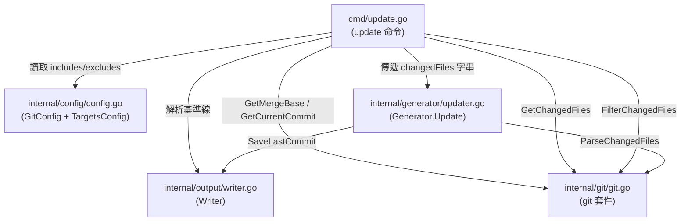
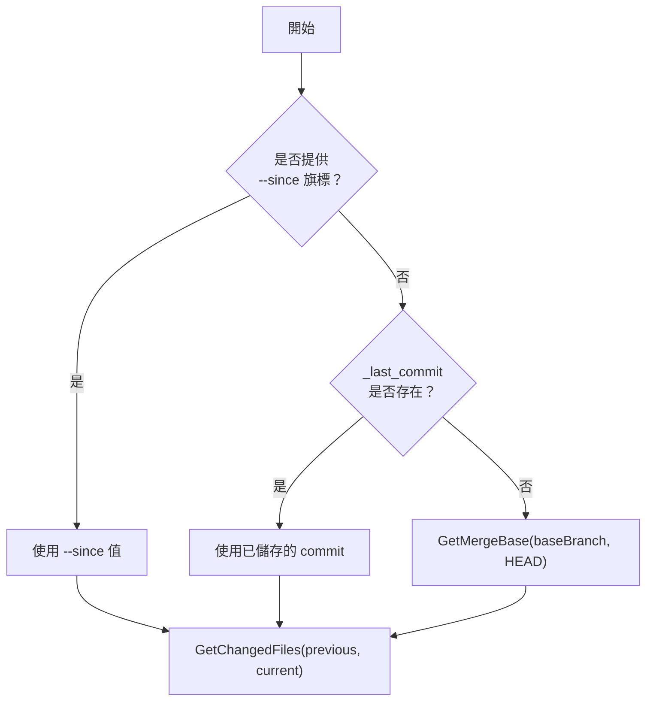
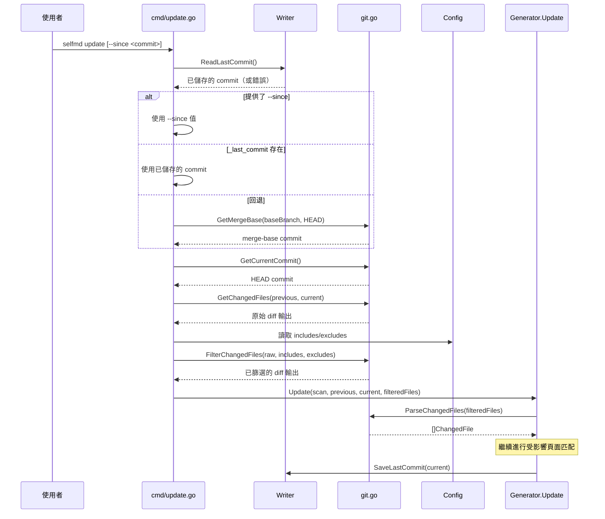

# 變更偵測

變更偵測子系統識別兩個 git commit 之間哪些原始檔案被修改，構成增量文件更新的基礎。

## 概述

變更偵測是增量更新管線的第一階段。它回答一個問題：**自上次文件建置以來，哪些檔案發生了變更？** `internal/git` 套件封裝了底層的 `git diff` 命令，將其輸出解析為結構化資料，並套用可設定的 include/exclude glob 過濾器。最終產生一份經過篩選的變更檔案清單，供下游元件決定哪些文件頁面需要重新產生。

核心概念：

- **比較基準線** — 代表上次已知文件狀態的 commit 雜湊值，透過三層回退鏈解析
- **變更檔案** — 一個結構體，將 git 狀態碼（`M`、`A`、`D`、`R`）與檔案路徑配對
- **Glob 過濾** — 使用 doublestar 語法的 include/exclude 模式，將 diff 輸出縮減至與專案相關的原始檔案

## 架構



## 基準 Commit 解析

在計算 diff 之前，系統必須確定要與哪個 commit 進行比較。`update` 命令實作了一個三層回退鏈：



`cmd/update.go` 中的解析邏輯：

```go
// Determine comparison commit
previousCommit := sinceCommit
if previousCommit == "" {
    // Try reading saved commit from last generate/update
    saved, readErr := gen.Writer.ReadLastCommit()
    if readErr == nil && saved != "" {
        previousCommit = saved
    } else {
        // Fallback to merge-base
        base, err := git.GetMergeBase(rootDir, cfg.Git.BaseBranch)
        if err != nil {
            return fmt.Errorf("cannot get base commit: %w\nhint: run selfmd generate first or use --since to specify a commit", err)
        }
        previousCommit = base
    }
}
```

> Source: cmd/update.go#L68-L82

| 優先順序 | 來源 | 說明 |
|----------|--------|-------------|
| 1 | `--since` CLI 旗標 | 使用者明確提供的 commit 雜湊值 |
| 2 | `_last_commit` 檔案 | 由前一次 `generate` 或 `update` 執行時透過 `Writer.SaveLastCommit()` 持久化 |
| 3 | `git merge-base` | 根據 `GitConfig.BaseBranch` 和 `HEAD` 計算 |

## 核心 Git 操作

`internal/git` 套件提供一組小型函式，封裝 `git` CLI 命令。所有函式都接受 `dir` 參數來設定子行程的工作目錄。

### 儲存庫偵測

```go
// IsGitRepo checks if the given directory is a git repository.
func IsGitRepo(dir string) bool {
    cmd := exec.Command("git", "rev-parse", "--is-inside-work-tree")
    cmd.Dir = dir
    err := cmd.Run()
    return err == nil
}
```

> Source: internal/git/git.go#L13-L18

### Commit 取得

```go
// GetCurrentCommit returns the current HEAD commit hash.
func GetCurrentCommit(dir string) (string, error) {
    return runGit(dir, "rev-parse", "HEAD")
}

// GetMergeBase finds the merge base between the current branch and the given base branch.
func GetMergeBase(dir, baseBranch string) (string, error) {
    return runGit(dir, "merge-base", baseBranch, "HEAD")
}
```

> Source: internal/git/git.go#L21-L28

### Diff 計算

兩個函式用於取得變更檔案。兩者都使用 `--relative`，使路徑相對於工作目錄而非 git 儲存庫根目錄。

```go
// GetChangedFiles returns the list of changed files between two commits.
func GetChangedFiles(dir, fromCommit, toCommit string) (string, error) {
    return runGit(dir, "diff", "--relative", "--name-status", fromCommit+".."+toCommit)
}

// GetChangedFilesSince returns changed files since the given commit.
func GetChangedFilesSince(dir, sinceCommit string) (string, error) {
    return runGit(dir, "diff", "--relative", "--name-status", sinceCommit+"..HEAD")
}
```

> Source: internal/git/git.go#L30-L40

## 解析變更檔案

`git diff --name-status` 的原始輸出是以換行分隔的 tab 分隔記錄字串。`ParseChangedFiles` 將其轉換為具型別的 `[]ChangedFile` 切片。

```go
// ChangedFile represents a single file from git diff --name-status output.
type ChangedFile struct {
    Status string // "M", "A", "D", "R"
    Path   string
}

// ParseChangedFiles parses git diff --name-status output into structured ChangedFile list.
func ParseChangedFiles(changedFiles string) []ChangedFile {
    var result []ChangedFile
    for _, line := range strings.Split(changedFiles, "\n") {
        line = strings.TrimSpace(line)
        if line == "" {
            continue
        }
        parts := strings.SplitN(line, "\t", 3)
        if len(parts) < 2 {
            continue
        }
        status := string(parts[0][0]) // "M", "A", "D", or "R" (R100 → R)
        path := parts[len(parts)-1]   // for renames, use destination path
        result = append(result, ChangedFile{Status: status, Path: path})
    }
    return result
}
```

> Source: internal/git/git.go#L47-L70

| 狀態碼 | 含義 | 使用的路徑 |
|-------------|---------|-----------|
| `M` | 已修改 | 檔案路徑 |
| `A` | 已新增 | 檔案路徑 |
| `D` | 已刪除 | 檔案路徑 |
| `R` | 已重新命名 | 目標路徑（最後一個 tab 分隔欄位） |

## Glob 過濾

在變更檔案傳遞至更新引擎之前，會透過專案的 `targets.include` 和 `targets.exclude` glob 模式進行過濾。這確保了文件範圍之外的檔案（例如 `vendor/`、`node_modules/`、產生的程式碼）被排除。

```go
// FilterChangedFiles filters git diff --name-status output using include/exclude glob patterns.
func FilterChangedFiles(changedFiles string, includes, excludes []string) string {
    lines := strings.Split(changedFiles, "\n")
    var filtered []string

    for _, line := range lines {
        line = strings.TrimSpace(line)
        if line == "" {
            continue
        }

        parts := strings.SplitN(line, "\t", 3)
        if len(parts) < 2 {
            continue
        }

        // For renames, check the destination path (last element)
        filePath := parts[len(parts)-1]

        // Check excludes
        excluded := false
        for _, pattern := range excludes {
            if matched, _ := doublestar.Match(pattern, filePath); matched {
                excluded = true
                break
            }
        }
        if excluded {
            continue
        }

        // Check includes (if configured)
        if len(includes) > 0 {
            included := false
            for _, pattern := range includes {
                if matched, _ := doublestar.Match(pattern, filePath); matched {
                    included = true
                    break
                }
            }
            if !included {
                continue
            }
        }

        filtered = append(filtered, line)
    }

    return strings.Join(filtered, "\n")
}
```

> Source: internal/git/git.go#L72-L122

過濾邏輯遵循以下規則：

1. **先排除** — 若任何 exclude 模式匹配，該檔案立即被丟棄
2. **後包含** — 若設定了 include 模式，檔案必須至少匹配其中一個才會被保留
3. **空 includes** — 若未定義 include 模式，所有未被排除的檔案都會通過

模式使用 [doublestar](https://github.com/bmatcuk/doublestar) 函式庫，支援 `**` 進行遞迴目錄匹配（例如 `vendor/**`、`**/*.pb.go`）。

## 端到端流程



## Commit 持久化

`generate` 和 `update` 管線在完成工作後都會持久化目前的 commit 雜湊值。這確保下一次 `update` 執行時有準確的基準線。

在 `generate` 管線中：

```go
// Save current commit for incremental updates
if git.IsGitRepo(g.RootDir) {
    if commit, err := git.GetCurrentCommit(g.RootDir); err == nil {
        if err := g.Writer.SaveLastCommit(commit); err != nil {
            g.Logger.Warn("failed to save commit record", "error", err)
        }
    }
}
```

> Source: internal/generator/pipeline.go#L163-L169

在 `update` 管線中：

```go
// Save current commit for next incremental update
if err := g.Writer.SaveLastCommit(currentCommit); err != nil {
    g.Logger.Warn("failed to save commit record", "error", err)
}
```

> Source: internal/generator/updater.go#L160-L162

Commit 會被寫入輸出目錄中的 `_last_commit` 檔案：

```go
// SaveLastCommit saves the current commit hash for incremental updates.
func (w *Writer) SaveLastCommit(commit string) error {
    return w.WriteFile("_last_commit", commit)
}

// ReadLastCommit reads the saved commit hash.
func (w *Writer) ReadLastCommit() (string, error) {
    path := filepath.Join(w.BaseDir, "_last_commit")
    data, err := os.ReadFile(path)
    if err != nil {
        return "", fmt.Errorf("failed to read last commit: %w", err)
    }
    return strings.TrimSpace(string(data)), nil
}
```

> Source: internal/output/writer.go#L129-L142

## 設定

變更偵測由 `selfmd.yaml` 中的兩個設定區段控制：

### Git 設定

```yaml
git:
    enabled: true
    base_branch: develop
```

> Source: selfmd.yaml#L40-L42

對應的結構體：

```go
type GitConfig struct {
    Enabled    bool   `yaml:"enabled"`
    BaseBranch string `yaml:"base_branch"`
}
```

> Source: internal/config/config.go#L91-L94

| 欄位 | 預設值 | 說明 |
|-------|---------|-------------|
| `enabled` | `true` | 是否啟用 git 整合 |
| `base_branch` | `main` | 當沒有已儲存的 commit 時，用於 `merge-base` 回退的分支 |

### 目標過濾器

用於專案掃描的 `targets.include` 和 `targets.exclude` 模式同樣會被重複使用來過濾變更檔案：

```yaml
targets:
    include:
        - src/**
        - pkg/**
        - cmd/**
        - internal/**
        - lib/**
        - app/**
    exclude:
        - vendor/**
        - node_modules/**
        - .git/**
        - .doc-build/**
        - '**/*.pb.go'
        - '**/generated/**'
        - dist/**
        - build/**
```

> Source: selfmd.yaml#L5-L22

## 相關連結

- [Git 整合](../index.md)
- [受影響頁面匹配](../affected-pages/index.md)
- [update 命令](../../cli/cmd-update/index.md)
- [Git 整合設定](../../configuration/git-config/index.md)
- [增量更新引擎](../../core-modules/incremental-update/index.md)
- [專案目標](../../configuration/project-targets/index.md)

## 參考檔案

| 檔案路徑 | 說明 |
|-----------|-------------|
| `internal/git/git.go` | 核心 git 操作：diff、解析、過濾、merge-base |
| `cmd/update.go` | 包含基準 commit 解析邏輯的 update 命令 |
| `internal/generator/updater.go` | 使用已解析變更檔案的增量更新引擎 |
| `internal/generator/pipeline.go` | 包含 commit 持久化的完整產生管線 |
| `internal/config/config.go` | `GitConfig` 和 `TargetsConfig` 結構體定義 |
| `internal/output/writer.go` | 用於 commit 雜湊值持久化的 `SaveLastCommit` / `ReadLastCommit` |
| `selfmd.yaml` | 包含 git 和目標過濾器設定的專案設定檔 |