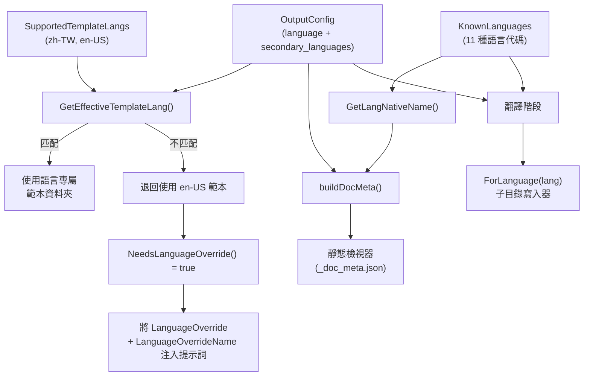
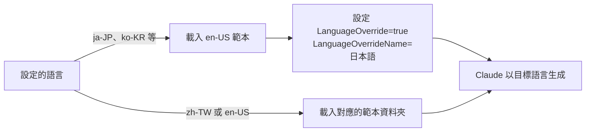
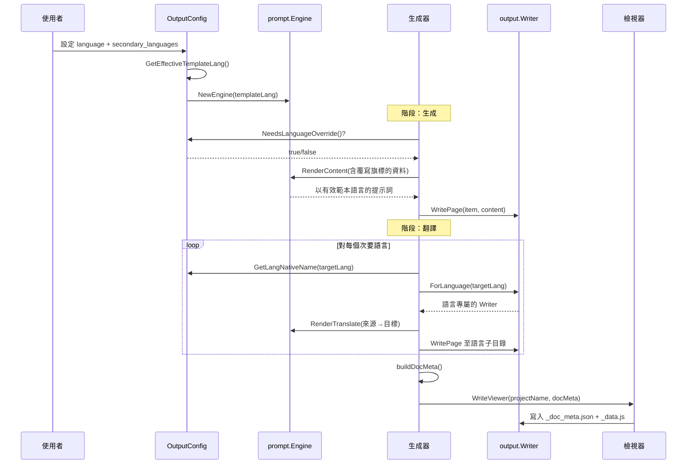

# 支援語言

selfmd 內建支援 11 種語言，透過雙層語言系統實現跨多種地區的文件生成與翻譯。

## 概述

selfmd 的語言支援系統圍繞兩個核心概念設計：

- **已知語言（Known Languages）** — 一組固定的語言代碼及其原生顯示名稱，用於 UI 呈現、翻譯工作流程及檢視器中繼資料。
- **支援的範本語言（Supported Template Languages）** — 已知語言的子集，擁有專屬的提示詞範本資料夾。不在此子集中的語言會退回使用英文範本，並附帶明確的語言覆寫指令傳送給 Claude。

這種雙層架構讓 selfmd 能以 11 種已知語言中的任何一種生成文件，同時只需維護兩種最常用語言（繁體中文和英文）的提示詞範本。其他語言則透過指示 Claude 以目標語言產出內容，同時使用英文範本結構來處理。

## 架構



## 已知語言

`KnownLanguages` 對應表定義了 selfmd 識別的所有語言代碼，每個代碼都配對其原生顯示名稱：

```go
var KnownLanguages = map[string]string{
	"zh-TW": "繁體中文",
	"zh-CN": "简体中文",
	"en-US": "English",
	"ja-JP": "日本語",
	"ko-KR": "한국어",
	"fr-FR": "Français",
	"de-DE": "Deutsch",
	"es-ES": "Español",
	"pt-BR": "Português",
	"th-TH": "ไทย",
	"vi-VN": "Tiếng Việt",
}
```

> Source: internal/config/config.go#L38-L51

完整的支援語言列表：

| 語言代碼 | 原生名稱 | 地區 |
|---|---|---|
| `zh-TW` | 繁體中文 | 台灣 |
| `zh-CN` | 简体中文 | 中國 |
| `en-US` | English | 美國 |
| `ja-JP` | 日本語 | 日本 |
| `ko-KR` | 한국어 | 南韓 |
| `fr-FR` | Français | 法國 |
| `de-DE` | Deutsch | 德國 |
| `es-ES` | Español | 西班牙 |
| `pt-BR` | Português | 巴西 |
| `th-TH` | ไทย | 泰國 |
| `vi-VN` | Tiếng Việt | 越南 |

`GetLangNativeName` 輔助函式將語言代碼解析為其原生顯示名稱，若遇到無法識別的值則退回傳回代碼本身：

```go
func GetLangNativeName(code string) string {
	if name, ok := KnownLanguages[code]; ok {
		return name
	}
	return code
}
```

> Source: internal/config/config.go#L73-L80

## 範本語言系統

只有兩種語言擁有專屬的提示詞範本資料夾：

```go
var SupportedTemplateLangs = []string{"zh-TW", "en-US"}
```

> Source: internal/config/config.go#L53-L54

這表示 `internal/prompt/templates/` 目錄包含：

```
templates/
├── zh-TW/          # 繁體中文範本
│   ├── catalog.tmpl
│   ├── content.tmpl
│   ├── updater.tmpl
│   ├── update_matched.tmpl
│   └── update_unmatched.tmpl
├── en-US/          # 英文範本
│   ├── catalog.tmpl
│   ├── content.tmpl
│   ├── updater.tmpl
│   ├── update_matched.tmpl
│   └── update_unmatched.tmpl
├── translate.tmpl        # 共用：頁面翻譯
└── translate_titles.tmpl # 共用：分類標題翻譯
```

### 有效範本解析

生成文件時，`GetEffectiveTemplateLang` 決定要載入哪個範本資料夾：

```go
func (o *OutputConfig) GetEffectiveTemplateLang() string {
	for _, lang := range SupportedTemplateLangs {
		if o.Language == lang {
			return o.Language
		}
	}
	return "en-US"
}
```

> Source: internal/config/config.go#L56-L65

如果設定的主要語言（例如 `ja-JP`）沒有專屬的範本資料夾，系統會退回使用 `en-US` 範本並啟動語言覆寫機制。

### 語言覆寫機制

`NeedsLanguageOverride` 偵測何時發生了退回：

```go
func (o *OutputConfig) NeedsLanguageOverride() bool {
	return o.GetEffectiveTemplateLang() != o.Language
}
```

> Source: internal/config/config.go#L67-L71

當需要覆寫時，`CatalogPromptData` 和 `ContentPromptData` 都會攜帶覆寫旗標，使提示詞指示 Claude 以目標語言產出內容：

```go
data := prompt.ContentPromptData{
	RepositoryName:       g.Config.Project.Name,
	Language:             g.Config.Output.Language,
	LanguageName:         langName,
	LanguageOverride:     g.Config.Output.NeedsLanguageOverride(),
	LanguageOverrideName: langName,
	// ...
}
```

> Source: internal/generator/content_phase.go#L91-L97



## 設定

語言透過 `selfmd.yaml` 的 `output` 區段進行設定：

```yaml
output:
    dir: docs
    language: en-US
    secondary_languages: ["zh-TW"]
    clean_before_generate: false
```

> Source: selfmd.yaml#L25-L29

`OutputConfig` 結構體中的相關欄位：

```go
type OutputConfig struct {
	Dir                 string   `yaml:"dir"`
	Language            string   `yaml:"language"`
	SecondaryLanguages  []string `yaml:"secondary_languages"`
	CleanBeforeGenerate bool     `yaml:"clean_before_generate"`
}
```

> Source: internal/config/config.go#L31-L36

- **`language`** — 文件生成的主要語言。所有內容最初以此語言產出。
- **`secondary_languages`** — 用於翻譯的額外語言列表。`selfmd translate` 指令會將主要語言的內容翻譯為這些語言。

預設設定將主要語言設為 `zh-TW`，不包含次要語言：

```go
Output: OutputConfig{
	Dir:                 ".doc-build",
	Language:            "zh-TW",
	SecondaryLanguages:  []string{},
	CleanBeforeGenerate: false,
},
```

> Source: internal/config/config.go#L110-L115

## UI 字串在地化

導覽頁面（索引、側邊欄、分類索引）使用在地化的 UI 字串。這些字串按語言定義在 `UIStrings` 對應表中：

```go
var UIStrings = map[string]map[string]string{
	"zh-TW": {
		"techDocs":        "技術文件",
		"catalog":         "目錄",
		"home":            "首頁",
		"sectionContains": "本章節包含以下內容：",
		"autoGenerated":   "本文件由 [selfmd](https://github.com/monkenwu/selfmd) 自動產生",
	},
	"en-US": {
		"techDocs":        "Technical Documentation",
		"catalog":         "Table of Contents",
		"home":            "Home",
		"sectionContains": "This section contains the following:",
		"autoGenerated":   "This documentation was automatically generated by [selfmd](https://github.com/monkenwu/selfmd)",
	},
}
```

> Source: internal/output/navigation.go#L12-L27

`getUIStrings` 函式為指定語言解析 UI 字串，若無對應定義則退回使用英文：

```go
func getUIStrings(lang string) map[string]string {
	if s, ok := UIStrings[lang]; ok {
		return s
	}
	return UIStrings["en-US"]
}
```

> Source: internal/output/navigation.go#L29-L35

目前只有 `zh-TW` 和 `en-US` 有專屬的 UI 字串。所有其他語言退回使用英文導覽標籤。

## 檢視器語言中繼資料

文件檢視器透過 `DocMeta` 和 `LangInfo` 結構體接收多語言中繼資料：

```go
type DocMeta struct {
	DefaultLanguage    string     `json:"default_language"`
	AvailableLanguages []LangInfo `json:"available_languages"`
}

type LangInfo struct {
	Code       string `json:"code"`
	NativeName string `json:"native_name"`
	IsDefault  bool   `json:"is_default"`
}
```

> Source: internal/output/writer.go#L13-L23

生成器中的 `buildDocMeta` 方法從設定組裝此中繼資料：

```go
func (g *Generator) buildDocMeta() *output.DocMeta {
	meta := &output.DocMeta{
		DefaultLanguage: g.Config.Output.Language,
		AvailableLanguages: []output.LangInfo{
			{
				Code:       g.Config.Output.Language,
				NativeName: config.GetLangNativeName(g.Config.Output.Language),
				IsDefault:  true,
			},
		},
	}
	for _, lang := range g.Config.Output.SecondaryLanguages {
		meta.AvailableLanguages = append(meta.AvailableLanguages, output.LangInfo{
			Code:       lang,
			NativeName: config.GetLangNativeName(lang),
			IsDefault:  false,
		})
	}
	return meta
}
```

> Source: internal/generator/pipeline.go#L189-L208

此中繼資料被寫入 `_doc_meta.json` 並打包到 `_data.js` 中，使靜態檢視器能在 UI 中顯示語言切換器。

## 核心流程

以下序列圖展示語言設定如何在生成與翻譯管線中流動：



## 輸出目錄結構

翻譯後的內容以語言專屬子目錄的形式組織在輸出目錄下：

```
.doc-build/
├── index.html              # 靜態檢視器
├── app.js                  # 檢視器應用程式
├── style.css               # 樣式
├── _data.js                # 打包的內容（所有語言）
├── _doc_meta.json          # 語言中繼資料
├── _catalog.json           # 主要語言目錄
├── index.md                # 主要語言索引
├── _sidebar.md             # 主要語言側邊欄
├── overview/
│   └── index.md            # 主要語言內容
├── zh-TW/                  # 次要語言子目錄
│   ├── _catalog.json       # 翻譯後的目錄
│   ├── index.md            # 翻譯後的索引
│   ├── _sidebar.md         # 翻譯後的側邊欄
│   └── overview/
│       └── index.md        # 翻譯後的內容
└── ja-JP/                  # 另一個次要語言
    └── ...
```

`Writer` 上的 `ForLanguage` 方法建立一個作用於語言子目錄的寫入器：

```go
func (w *Writer) ForLanguage(lang string) *Writer {
	return &Writer{
		BaseDir: filepath.Join(w.BaseDir, lang),
	}
}
```

> Source: internal/output/writer.go#L144-L149

## 使用範例

### 設定日文為主要語言並翻譯為英文

```yaml
output:
    language: ja-JP
    secondary_languages: ["en-US"]
```

由於 `ja-JP` 不在 `SupportedTemplateLangs` 中，系統將會：
1. 載入英文（`en-US`）提示詞範本
2. 在提示詞中設定 `LanguageOverride: true` 和 `LanguageOverrideName: "日本語"`
3. Claude 使用英文範本結構以日文生成內容
4. 執行 `selfmd translate` 將日文文件翻譯為英文

### 執行特定語言的翻譯

```bash
# 翻譯為所有次要語言
selfmd translate

# 僅翻譯為特定語言
selfmd translate --lang zh-TW

# 強制重新翻譯已存在的檔案
selfmd translate --force

# 控制並行數量
selfmd translate --concurrency 5
```

### 驗證目標語言

translate 指令會驗證請求的語言是否存在於 `secondary_languages` 設定中：

```go
for _, l := range translateLangs {
	if !validLangs[l] {
		return fmt.Errorf("language %s is not in secondary_languages list (available: %s)",
			l, strings.Join(cfg.Output.SecondaryLanguages, ", "))
	}
}
```

> Source: cmd/translate.go#L61-L64

## 相關連結

- [國際化](../index.md)
- [翻譯工作流程](../translation-workflow/index.md)
- [輸出語言](../../configuration/output-language/index.md)
- [translate 指令](../../cli/cmd-translate/index.md)
- [翻譯階段](../../core-modules/generator/translate-phase/index.md)
- [提示詞引擎](../../core-modules/prompt-engine/index.md)
- [靜態檢視器](../../core-modules/static-viewer/index.md)
- [設定總覽](../../configuration/config-overview/index.md)

## 參考檔案

| 檔案路徑 | 說明 |
|-----------|------|
| `internal/config/config.go` | KnownLanguages 對應表、SupportedTemplateLangs、OutputConfig 結構體、語言輔助函式 |
| `internal/output/navigation.go` | UIStrings 對應表及具語言感知能力的 UI 字串導覽生成 |
| `internal/output/writer.go` | DocMeta/LangInfo 結構體、ForLanguage 方法用於語言作用域的輸出 |
| `internal/output/viewer.go` | 檢視器生成及多語言資料打包至 _data.js |
| `internal/prompt/engine.go` | 提示詞範本引擎，支援語言專屬及共用範本載入 |
| `internal/prompt/templates/translate.tmpl` | 共用翻譯提示詞範本 |
| `internal/prompt/templates/translate_titles.tmpl` | 共用分類標題翻譯提示詞 |
| `internal/generator/pipeline.go` | buildDocMeta() 方法及生成管線協調 |
| `internal/generator/translate_phase.go` | 翻譯管線：translatePages、translateCategoryTitles |
| `internal/generator/content_phase.go` | 含語言覆寫資料注入的內容生成 |
| `internal/generator/catalog_phase.go` | 含語言覆寫資料注入的目錄生成 |
| `cmd/translate.go` | 翻譯指令實作及語言驗證 |
| `selfmd.yaml` | 含語言設定的專案設定範例 |