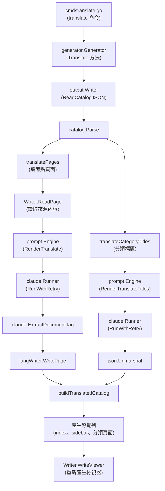
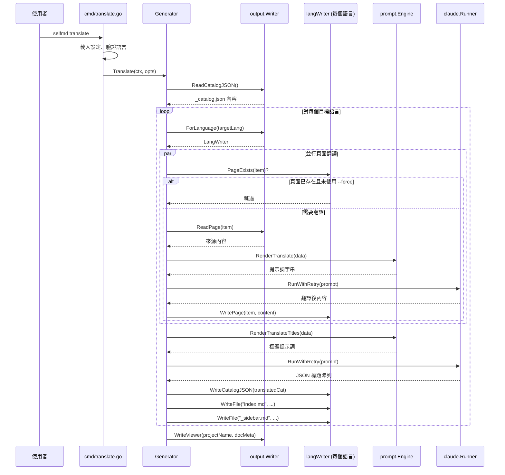

# 翻譯工作流程

selfmd 的翻譯工作流程使用 Claude AI 將已產生的文件從主要語言翻譯為一種或多種次要語言，產生完整本地化的文件網站，包含翻譯後的內容、導覽列與目錄結構。

## 概述

翻譯工作流程是一個後產生階段，將現有文件（由 `selfmd generate` 產生）翻譯為已設定的次要語言。它獨立於主要產生流程運作，允許按需執行翻譯或選擇性地重新執行。

核心概念：

- **主要語言** — 文件最初產生時所使用的語言，透過 `selfmd.yaml` 中的 `output.language` 設定
- **次要語言** — 翻譯的目標語言，透過 `output.secondary_languages` 設定
- **語言專屬 Writer** — 每個目標語言都有自己的 `output.Writer` 實例，寫入子目錄（例如 `.doc-build/en-US/`）
- **增量翻譯** — 已翻譯的頁面預設會被跳過，除非指定 `--force`
- **並行翻譯** — 多個頁面使用可設定的並行數同時翻譯

## 架構



## 翻譯流程

翻譯流程一次處理一個目標語言。對於每個語言，依序執行以下階段：

### 階段 1：讀取與解析主目錄

流程從讀取主要文件產生時建立的主目錄（`_catalog.json`）開始。此目錄定義了所有文件頁面的完整結構。

```go
catJSON, err := g.Writer.ReadCatalogJSON()
if err != nil {
    return fmt.Errorf("failed to read catalog (please run selfmd generate first): %w", err)
}

cat, err := catalog.Parse(catJSON)
if err != nil {
    return fmt.Errorf("failed to parse catalog: %w", err)
}

items := cat.Flatten()
sourceLang := g.Config.Output.Language
sourceLangName := config.GetLangNativeName(sourceLang)
```

> Source: internal/generator/translate_phase.go#L33-L46

### 階段 2：翻譯葉節點頁面

葉節點頁面（沒有子頁面的頁面）使用 errgroup 搭配信號量並行限制器進行並行翻譯。每個頁面經過以下處理：

1. **跳過檢查** — 如果頁面已存在且未設定 `--force`，則跳過該頁面
2. **讀取來源** — 從主要語言輸出讀取原始頁面內容
3. **渲染提示詞** — 使用 `translate.tmpl` 渲染翻譯提示詞
4. **呼叫 Claude** — 透過 `RunWithRetry` 將提示詞發送至 Claude CLI
5. **擷取內容** — 從 `<document>` 標籤中擷取翻譯後的 Markdown
6. **寫入輸出** — 將翻譯後的頁面寫入語言專屬子目錄

```go
eg, ctx := errgroup.WithContext(ctx)
sem := make(chan struct{}, opts.Concurrency)

for _, item := range leafItems {
    item := item
    eg.Go(func() error {
        // Skip if already translated and not forcing
        if !opts.Force && langWriter.PageExists(item) {
            skipped.Add(1)
            // Try to extract title from existing translation
            if content, err := langWriter.ReadPage(item); err == nil {
                if title := extractTitle(content); title != "" {
                    titlesMu.Lock()
                    translatedTitles[item.Path] = title
                    titlesMu.Unlock()
                }
            }
            fmt.Printf("      [Skip] %s (exists)\n", item.Title)
            return nil
        }

        sem <- struct{}{}
        defer func() { <-sem }()
```

> Source: internal/generator/translate_phase.go#L161-L183

### 階段 3：翻譯分類標題

分類標題（包含子頁面的章節標題）透過單次批次 API 呼叫進行翻譯以提高效率。系統收集所有未翻譯的分類標題，以列表形式發送，並接收 JSON 陣列的翻譯結果。

```go
rendered, err := g.Engine.RenderTranslateTitles(prompt.TranslateTitlesPromptData{
    SourceLanguage:     sourceLang,
    SourceLanguageName: sourceLangName,
    TargetLanguage:     targetLang,
    TargetLanguageName: targetLangName,
    Titles:             titles,
})
```

> Source: internal/generator/translate_phase.go#L329-L335

回應被解析為 JSON 陣列並驗證數量是否相符：

```go
var translated []string
if err := json.Unmarshal([]byte(content), &translated); err != nil {
    fmt.Printf(" Failed (parse response)\n")
    return nil, fmt.Errorf("parse response: %w", err)
}

if len(translated) != len(toTranslate) {
    fmt.Printf(" Failed (count mismatch: expected %d, got %d)\n", len(toTranslate), len(translated))
    return nil, fmt.Errorf("count mismatch: expected %d, got %d", len(toTranslate), len(translated))
}
```

> Source: internal/generator/translate_phase.go#L362-L371

### 階段 4：建構翻譯目錄與導覽列

所有頁面與標題翻譯完成後，系統建構翻譯目錄並為目標語言產生完整的導覽檔案：

```go
// Build translated catalog
translatedCat := buildTranslatedCatalog(cat, translatedTitles)
if err := langWriter.WriteCatalogJSON(translatedCat); err != nil {
    g.Logger.Warn("failed to save translated catalog", "lang", targetLang, "error", err)
}

// Generate translated index and sidebar
indexContent := output.GenerateIndex(
    g.Config.Project.Name,
    g.Config.Project.Description,
    translatedCat,
    targetLang,
)
```

> Source: internal/generator/translate_phase.go#L73-L84

同時為每個父項目產生分類索引頁面：

```go
for _, item := range translatedItems {
    if !item.HasChildren {
        continue
    }
    var children []catalog.FlatItem
    for _, child := range translatedItems {
        if child.ParentPath == item.Path && child.Path != item.Path {
            children = append(children, child)
        }
    }
    if len(children) > 0 {
        categoryContent := output.GenerateCategoryIndex(item, children, targetLang)
        if err := langWriter.WritePage(item, categoryContent); err != nil {
            g.Logger.Warn("failed to write translated category index", "path", item.Path, "error", err)
        }
    }
}
```

> Source: internal/generator/translate_phase.go#L95-L112

### 階段 5：重新產生文件檢視器

所有目標語言處理完成後，文件檢視器會以更新的語言元資料重新產生，在靜態檢視器中啟用語言切換功能：

```go
docMeta := g.buildDocMeta()
fmt.Println("Regenerating documentation viewer...")
if err := g.Writer.WriteViewer(g.Config.Project.Name, docMeta); err != nil {
    g.Logger.Warn("failed to generate viewer", "error", err)
}
```

> Source: internal/generator/translate_phase.go#L118-L124

## 核心流程



## 翻譯提示詞設計

selfmd 使用兩個共用的提示詞模板（與語言無關）進行翻譯：

### 頁面翻譯提示詞

`translate.tmpl` 模板指示 Claude 翻譯完整的文件頁面，同時保留 Markdown 格式、程式碼區塊、連結、Mermaid 圖表和來源標註。

提示詞強制執行的主要翻譯規則：
- 保留所有 Markdown 格式（標題、連結、程式碼區塊、表格、Mermaid 圖表）
- 不翻譯程式碼識別符、檔案路徑或程式碼區塊
- 使用自然的對應翻譯章節標題
- 保留相對連結（僅翻譯顯示文字，保持路徑不變）
- 保留來源標註的原始格式

```text
You are a professional technical documentation translator. Your task is to translate the following documentation page from {{.SourceLanguageName}} ({{.SourceLanguage}}) to {{.TargetLanguageName}} ({{.TargetLanguage}}).
```

> Source: internal/prompt/templates/translate.tmpl#L1

### 分類標題翻譯提示詞

`translate_titles.tmpl` 模板處理分類標題的批次翻譯。它回傳翻譯後標題的 JSON 陣列，保持技術術語和專有名詞不翻譯。

```text
You are a professional technical documentation translator. Translate the following category titles from {{.SourceLanguageName}} ({{.SourceLanguage}}) to {{.TargetLanguageName}} ({{.TargetLanguage}}).
```

> Source: internal/prompt/templates/translate_titles.tmpl#L1

## 輸出目錄結構

翻譯後的文件組織在輸出目錄下的語言專屬子目錄中：

```
.doc-build/
├── _catalog.json          # 主目錄（主要語言）
├── index.md               # 主要語言索引
├── _sidebar.md            # 主要語言側邊欄
├── overview/
│   └── index.md           # 主要語言頁面
├── en-US/                 # 翻譯語言子目錄
│   ├── _catalog.json      # 翻譯後目錄
│   ├── index.md           # 翻譯後索引
│   ├── _sidebar.md        # 翻譯後側邊欄
│   └── overview/
│       └── index.md       # 翻譯後頁面
└── zh-TW/                 # 另一個翻譯語言
    ├── _catalog.json
    ├── index.md
    └── ...
```

`output.Writer` 上的 `ForLanguage` 方法建立語言範圍的 writer：

```go
func (w *Writer) ForLanguage(lang string) *Writer {
    return &Writer{
        BaseDir: filepath.Join(w.BaseDir, lang),
    }
}
```

> Source: internal/output/writer.go#L145-L149

## 設定

翻譯在 `selfmd.yaml` 的 `output` 區段中設定：

```yaml
output:
    dir: docs
    language: en-US
    secondary_languages: ["zh-TW"]
```

> Source: selfmd.yaml#L25-L29

| 欄位 | 型別 | 說明 |
|------|------|------|
| `output.language` | `string` | 產生文件的主要語言代碼 |
| `output.secondary_languages` | `[]string` | 要翻譯的目標語言代碼列表 |

### 支援的語言

`KnownLanguages` 映射定義了所有可識別的語言代碼及其原生顯示名稱：

```go
var KnownLanguages = map[string]string{
    "zh-TW": "繁體中文",
    "zh-CN": "简体中文",
    "en-US": "English",
    "ja-JP": "日本語",
    "ko-KR": "한국어",
    "fr-FR": "Français",
    "de-DE": "Deutsch",
    "es-ES": "Español",
    "pt-BR": "Português",
    "th-TH": "ไทย",
    "vi-VN": "Tiếng Việt",
}
```

> Source: internal/config/config.go#L39-L51

## 使用範例

### 基本翻譯

為所有已設定的次要語言執行翻譯：

```bash
selfmd translate
```

### 翻譯特定語言

使用 `--lang` 旗標僅翻譯特定語言：

```bash
selfmd translate --lang zh-TW
selfmd translate --lang zh-TW,ja-JP
```

指定的語言會與已設定的 `secondary_languages` 列表進行驗證：

```go
for _, l := range translateLangs {
    if !validLangs[l] {
        return fmt.Errorf("language %s is not in secondary_languages list (available: %s)", l, strings.Join(cfg.Output.SecondaryLanguages, ", "))
    }
}
```

> Source: cmd/translate.go#L61-L64

### 強制重新翻譯

重新翻譯所有頁面，即使翻譯已存在：

```bash
selfmd translate --force
```

### 自訂並行數

覆寫已設定的 `max_concurrent` 設定值：

```bash
selfmd translate --concurrency 5
```

### CLI 旗標摘要

| 旗標 | 型別 | 預設值 | 說明 |
|------|------|--------|------|
| `--lang` | `[]string` | 所有次要語言 | 僅翻譯指定語言 |
| `--force` | `bool` | `false` | 強制重新翻譯已存在的檔案 |
| `--concurrency` | `int` | 來自設定 `claude.max_concurrent` | 覆寫並行等級 |

## 本地化導覽

翻譯工作流程產生完整本地化的導覽元素。`output.UIStrings` 映射為索引頁面、側邊欄和分類頁面提供語言專屬的 UI 文字：

```go
var UIStrings = map[string]map[string]string{
    "zh-TW": {
        "techDocs":        "技術文件",
        "catalog":         "目錄",
        "home":            "首頁",
        "sectionContains": "本章節包含以下內容：",
        "autoGenerated":   "本文件由 [selfmd](https://github.com/monkenwu/selfmd) 自動產生",
    },
    "en-US": {
        "techDocs":        "Technical Documentation",
        "catalog":         "Table of Contents",
        "home":            "Home",
        "sectionContains": "This section contains the following:",
        "autoGenerated":   "This documentation was automatically generated by [selfmd](https://github.com/monkenwu/selfmd)",
    },
}
```

> Source: internal/output/navigation.go#L12-L27

對於不在 `UIStrings` 中的語言，系統會回退至英文：

```go
func getUIStrings(lang string) map[string]string {
    if s, ok := UIStrings[lang]; ok {
        return s
    }
    return UIStrings["en-US"]
}
```

> Source: internal/output/navigation.go#L30-L35

## 多語言檢視器元資料

翻譯完成後，語言元資料會被建構並傳遞給靜態檢視器以支援語言切換：

```go
func (g *Generator) buildDocMeta() *output.DocMeta {
    meta := &output.DocMeta{
        DefaultLanguage: g.Config.Output.Language,
        AvailableLanguages: []output.LangInfo{
            {
                Code:       g.Config.Output.Language,
                NativeName: config.GetLangNativeName(g.Config.Output.Language),
                IsDefault:  true,
            },
        },
    }
    for _, lang := range g.Config.Output.SecondaryLanguages {
        meta.AvailableLanguages = append(meta.AvailableLanguages, output.LangInfo{
            Code:       lang,
            NativeName: config.GetLangNativeName(lang),
            IsDefault:  false,
        })
    }
    return meta
}
```

> Source: internal/generator/pipeline.go#L189-L208

## 相關連結

- [國際化](../index.md)
- [支援的語言](../supported-languages/index.md)
- [translate 命令](../../cli/cmd-translate/index.md)
- [設定概述](../../configuration/config-overview/index.md)
- [輸出語言](../../configuration/output-language/index.md)
- [Claude Runner](../../core-modules/claude-runner/index.md)
- [提示詞引擎](../../core-modules/prompt-engine/index.md)
- [翻譯階段](../../core-modules/generator/translate-phase/index.md)
- [輸出寫入器](../../core-modules/output-writer/index.md)
- [靜態檢視器](../../core-modules/static-viewer/index.md)

## 參考檔案

| 檔案路徑 | 說明 |
|----------|------|
| `internal/generator/translate_phase.go` | 核心翻譯流程實作 |
| `cmd/translate.go` | CLI translate 命令定義與旗標處理 |
| `internal/config/config.go` | 設定結構、語言映射與驗證 |
| `internal/generator/pipeline.go` | Generator 結構與多語言支援的 `buildDocMeta` |
| `internal/prompt/engine.go` | 提示詞模板引擎與翻譯渲染方法 |
| `internal/prompt/templates/translate.tmpl` | 頁面翻譯提示詞模板 |
| `internal/prompt/templates/translate_titles.tmpl` | 分類標題批次翻譯提示詞模板 |
| `internal/output/writer.go` | 輸出寫入器與 `ForLanguage` 語言範圍寫入器 |
| `internal/output/navigation.go` | 導覽列產生與本地化 UI 字串 |
| `internal/catalog/catalog.go` | 目錄資料結構與扁平化邏輯 |
| `internal/claude/runner.go` | Claude CLI 執行器與重試邏輯 |
| `internal/claude/parser.go` | 回應解析與 `ExtractDocumentTag` |
| `selfmd.yaml` | 包含次要語言範例的專案設定 |