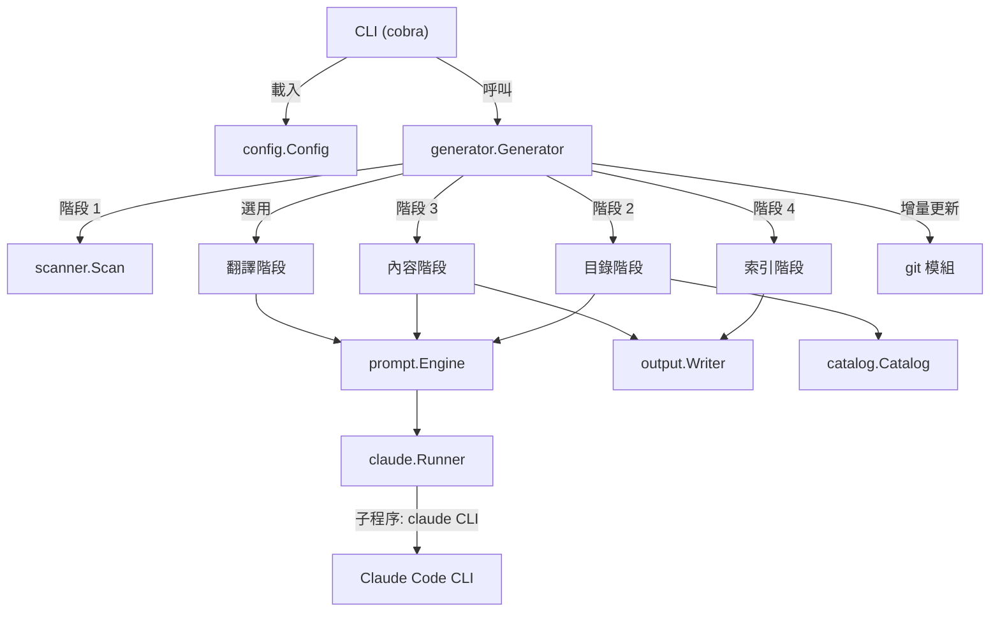
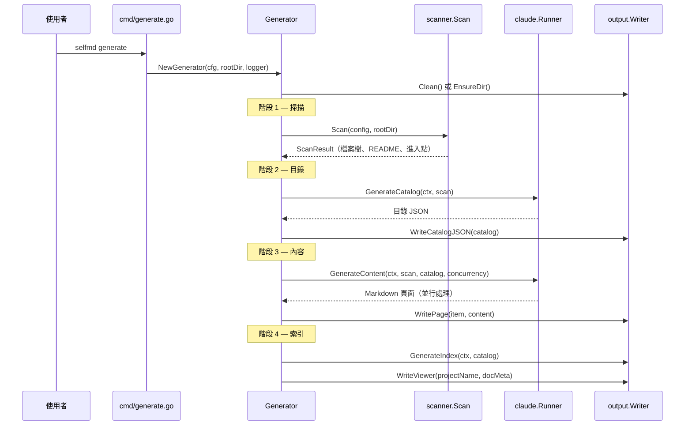

# 簡介

SelfMD 是一個 CLI 工具，能夠自動為任何程式碼庫生成結構化、高品質的技術文件——由 Claude Code CLI 驅動。

## 概述

SelfMD 分析專案的原始碼，建立文件目錄，並透過 Claude Code CLI 運用 Anthropic 的 Claude AI 來生成完整的 Markdown 文件頁面。它專為希望無需手動撰寫即可產出專業級專案 Wiki 的開發者而設計。

### 核心概念

- **自動化文件生成**：SelfMD 掃描您的專案結構，將結構化提示詞發送給 Claude，並撰寫完整的 Markdown 文件頁面，組織成可導覽的層級結構。
- **四階段流水線**：生成過程遵循嚴格的順序——掃描、目錄、內容和索引——每個階段都建立在前一階段的輸出之上。
- **增量更新**：在初次完整生成之後，SelfMD 利用 git 變更偵測來識別哪些文件頁面需要更新，避免耗費資源的完整重新生成。
- **多語言支援**：文件可以先以主要語言生成，然後翻譯為次要語言，內建多種語系的提示詞範本。
- **YAML 驅動的設定**：單一 `selfmd.yaml` 檔案控制生成的所有面向——專案目標、輸出設定、Claude 模型參數和 git 整合。

### 何時使用 SelfMD

SelfMD 適用於以下情境：

- 為現有程式碼庫快速建立完整的文件 Wiki
- 透過增量更新讓文件與持續演進的原始碼保持同步
- 從單一來源產出多語言文件
- 使用 AI 生成的目錄來標準化跨專案的文件結構

## 架構



SelfMD 是一個以 [Cobra](https://github.com/spf13/cobra) 建構的 Go CLI 應用程式。進入點委派給 `cmd` 套件，該套件定義了四個子命令：`init`、`generate`、`update` 和 `translate`。核心生成邏輯位於 `internal/generator` 套件中，負責協調掃描器、提示詞引擎、Claude 執行器、目錄管理器和輸出寫入器等模組。

## 核心命令

SelfMD 提供四個 CLI 命令，各自對應不同的工作流程：

| 命令 | 說明 |
|---------|-------------|
| `selfmd init` | 掃描當前目錄、偵測專案類型，並生成 `selfmd.yaml` 設定檔 |
| `selfmd generate` | 執行完整的四階段文件生成流水線 |
| `selfmd update` | 根據 git 變更執行增量文件更新 |
| `selfmd translate` | 將主要語言的文件翻譯為已設定的次要語言 |

### 命令層級

```go
var rootCmd = &cobra.Command{
	Use:   "selfmd",
	Short: "selfmd — Auto Documentation Generator for Claude Code CLI",
	Long: banner + `Automatically generate structured, high-quality technical documentation
for any codebase — powered by Claude Code CLI.`,
}
```

> Source: cmd/root.go#L25-L30

## 核心流程

### 完整生成流水線

`generate` 命令執行四階段流水線：



流水線實作於 `Generate` 方法中：

```go
func (g *Generator) Generate(ctx context.Context, opts GenerateOptions) error {
	start := time.Now()

	// Phase 0: Setup
	clean := opts.Clean || g.Config.Output.CleanBeforeGenerate
	if clean {
		fmt.Println("[0/4] Cleaning output directory...")
		if !opts.DryRun {
			if err := g.Writer.Clean(); err != nil {
				return err
			}
		}
	} else {
		if err := g.Writer.EnsureDir(); err != nil {
			return err
		}
	}

	// Phase 1: Scan
	fmt.Println("[1/4] Scanning project structure...")
	scan, err := scanner.Scan(g.Config, g.RootDir)
	if err != nil {
		return fmt.Errorf("failed to scan project: %w", err)
	}
```

> Source: internal/generator/pipeline.go#L68-L91

### 增量更新流程

`update` 命令使用 git diff 偵測已變更的原始檔案，將其與現有文件頁面進行比對，並僅重新生成受影響的頁面：

1. **解析變更檔案** — 讀取先前記錄的提交與 HEAD 之間的 git diff
2. **比對現有文件** — 在文件頁面內容中搜尋對已變更檔案路徑的引用
3. **判斷更新範圍** — 詢問 Claude 哪些比對到的頁面確實需要重新生成
4. **處理未比對的檔案** — 詢問 Claude 是否應為未被任何現有頁面引用的檔案建立新的文件頁面
5. **重新生成** — 對已識別的頁面重新執行內容生成

```go
func (g *Generator) Update(ctx context.Context, scan *scanner.ScanResult, previousCommit, currentCommit, changedFiles string) error {
	// Read existing catalog
	existingCatalogJSON, err := g.Writer.ReadCatalogJSON()
	if err != nil {
		return fmt.Errorf("failed to read existing catalog (please run selfmd generate first): %w", err)
	}
```

> Source: internal/generator/updater.go#L32-L37

## 設定

SelfMD 透過 `selfmd.yaml` 檔案進行設定，該檔案定義了五個設定區段：

```yaml
project:
    name: selfmd
    type: cli
    description: ""
targets:
    include:
        - src/**
        - pkg/**
        - cmd/**
        - internal/**
    exclude:
        - vendor/**
        - node_modules/**
        - .git/**
    entry_points:
        - main.go
        - cmd/root.go
output:
    dir: docs
    language: en-US
    secondary_languages: ["zh-TW"]
    clean_before_generate: false
claude:
    model: opus
    max_concurrent: 3
    timeout_seconds: 30000
    max_retries: 2
    allowed_tools:
        - Read
        - Glob
        - Grep
git:
    enabled: true
    base_branch: develop
```

> Source: selfmd.yaml#L1-L33

設定由 `config.Config` 結構體載入並驗證：

```go
type Config struct {
	Project ProjectConfig `yaml:"project"`
	Targets TargetsConfig `yaml:"targets"`
	Output  OutputConfig  `yaml:"output"`
	Claude  ClaudeConfig  `yaml:"claude"`
	Git     GitConfig     `yaml:"git"`
}
```

> Source: internal/config/config.go#L11-L17

## 關鍵設計決策

- **以 Claude Code CLI 作為 AI 後端**：SelfMD 並非直接呼叫 Anthropic API，而是將 `claude` CLI 作為子程序來執行。這樣可以利用 Claude Code 內建的工具權限（Read、Glob、Grep），讓 AI 在生成文件的同時能主動探索程式碼庫。
- **並行內容生成**：內容頁面以並行方式生成（由 `max_concurrent` 控制），以減少大型專案的實際執行時間。
- **目錄優先策略**：目錄會先以結構化 JSON 樹的形式生成，然後每個內容頁面再獨立生成。這確保在撰寫任何頁面內容之前，文件層級結構已經是連貫一致的。
- **基於 Git 的增量更新**：透過在每次生成後記錄提交雜湊值，後續的 `update` 執行只需處理自上次執行以來變更的檔案，大幅降低成本與時間。

## 使用範例

### 初始化專案

`init` 命令會自動偵測專案類型和進入點：

```go
func runInit(cmd *cobra.Command, args []string) error {
	if _, err := os.Stat(cfgFile); err == nil && !forceInit {
		return fmt.Errorf("config file %s already exists, use --force to overwrite", cfgFile)
	}

	cfg := config.DefaultConfig()

	projectType, entryPoints := detectProject()
	cfg.Project.Type = projectType
	cfg.Project.Name = filepath.Base(mustCwd())
	cfg.Targets.EntryPoints = entryPoints

	if err := cfg.Save(cfgFile); err != nil {
		return fmt.Errorf("failed to write config file: %w", err)
	}
```

> Source: cmd/init.go#L27-L41

### 執行完整生成

```go
opts := generator.GenerateOptions{
	Clean:       clean,
	DryRun:      dryRun,
	Concurrency: concurrencyNum,
}

return gen.Generate(ctx, opts)
```

> Source: cmd/generate.go#L89-L95

### Claude CLI 呼叫

`claude.Runner` 以結構化的參數執行 Claude Code CLI，包括模型選擇、工具權限和 JSON 輸出格式：

```go
func (r *Runner) Run(ctx context.Context, opts RunOptions) (*RunResult, error) {
	args := []string{
		"-p",
		"--output-format", "json",
	}

	model := opts.Model
	if model == "" {
		model = r.config.Model
	}
	if model != "" {
		args = append(args, "--model", model)
	}

	tools := opts.AllowedTools
	if len(tools) == 0 {
		tools = r.config.AllowedTools
	}
	if len(tools) > 0 {
		for _, t := range tools {
			args = append(args, "--allowedTools", t)
		}
	}

	// Explicitly block Write/Edit to prevent content from being lost in denied tool calls
	args = append(args, "--disallowedTools", "Write", "--disallowedTools", "Edit")
```

> Source: internal/claude/runner.go#L30-L56

## 相關連結

- [輸出結構](../output-structure/index.md)
- [技術堆疊](../tech-stack/index.md)
- [安裝](../../getting-started/installation/index.md)
- [首次執行](../../getting-started/first-run/index.md)
- [設定概覽](../../configuration/config-overview/index.md)
- [生成流水線](../../architecture/pipeline/index.md)
- [模組依賴](../../architecture/module-dependencies/index.md)

## 參考檔案

| 檔案路徑 | 說明 |
|-----------|-------------|
| `main.go` | 應用程式進入點 |
| `go.mod` | Go 模組定義與相依套件 |
| `selfmd.yaml` | 專案設定檔 |
| `cmd/root.go` | 根 CLI 命令定義與全域旗標 |
| `cmd/generate.go` | `generate` 命令實作 |
| `cmd/init.go` | `init` 命令與專案類型偵測 |
| `cmd/update.go` | `update` 命令，用於增量文件更新 |
| `cmd/translate.go` | `translate` 命令，用於多語言支援 |
| `internal/config/config.go` | 設定結構體定義、載入與驗證 |
| `internal/generator/pipeline.go` | Generator 結構體與四階段流水線協調 |
| `internal/generator/updater.go` | 增量更新邏輯與檔案對文件比對 |
| `internal/scanner/scanner.go` | 專案目錄掃描與檔案過濾 |
| `internal/scanner/filetree.go` | 檔案樹資料結構與渲染 |
| `internal/claude/runner.go` | Claude Code CLI 子程序呼叫與重試邏輯 |
| `internal/prompt/engine.go` | 提示詞範本引擎與多語言支援 |
| `internal/output/writer.go` | 輸出檔案寫入、目錄持久化與頁面管理 |
| `internal/catalog/catalog.go` | 目錄資料模型、解析、扁平化與序列化 |
| `internal/git/git.go` | Git 操作，用於變更偵測與提交追蹤 |