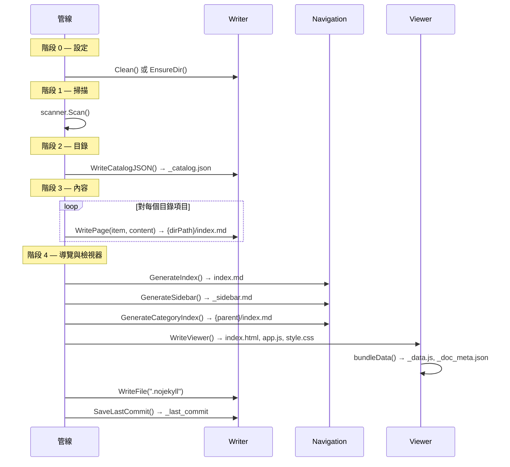

# 輸出結構

selfmd 從您的原始碼生成一個自包含的文件網站，產出一個包含 Markdown 檔案、中繼資料和靜態檢視器的目錄，可直接在瀏覽器中開啟。

## 總覽

當 selfmd 執行 `generate` 命令時，會將所有輸出寫入單一可設定的目錄（預設為 `.doc-build`）。輸出包含：

- **Markdown 內容頁面**，以階層式目錄結構組織，對應文件目錄結構
- **中繼資料檔案**，用於增量更新和導覽
- **靜態 HTML/JS/CSS 檢視器**，將所有內容打包，支援離線、無伺服器瀏覽
- **多語言目錄**，在設定次要語言時產生

輸出目錄設計為可作為靜態網站提供服務（例如透過 GitHub Pages），或直接在本機開啟 `index.html` 瀏覽。

## 架構

```mermaid
flowchart TD
    Pipeline["產生器管線"]

    subgraph Output_Dir["輸出目錄 (.doc-build/)"]
        direction TB
        IndexMD["index.md"]
        Sidebar["_sidebar.md"]
        CatalogJSON["_catalog.json"]
        LastCommit["_last_commit"]
        NoJekyll[".nojekyll"]
        DocMeta["_doc_meta.json"]
        DataJS["_data.js"]
        IndexHTML["index.html"]
        AppJS["app.js"]
        StyleCSS["style.css"]

        subgraph Content_Pages["內容頁面"]
            direction TB
            OverviewDir["overview/index.md"]
            CliDir["cli/cmd-generate/index.md"]
            MorePages["...其他頁面..."]
        end

        subgraph Lang_Dir["次要語言 (例如 zh-TW/)"]
            direction TB
            LangCatalog["_catalog.json"]
            LangSidebar["_sidebar.md"]
            LangPages["overview/index.md, ..."]
        end
    end

    Pipeline --> Output_Dir
    Writer["output.Writer"] --> IndexMD
    Writer --> Sidebar
    Writer --> CatalogJSON
    Writer --> LastCommit
    Navigation["output.Navigation"] --> IndexMD
    Navigation --> Sidebar
    Viewer["output.WriteViewer"] --> IndexHTML
    Viewer --> AppJS
    Viewer --> StyleCSS
    Viewer --> DocMeta
    Viewer --> DataJS
```



## 目錄配置

完整的 selfmd 輸出目錄如下所示：

```
.doc-build/                          # 輸出根目錄（可透過 output.dir 設定）
├── index.html                       # 靜態檢視器 HTML 外殼
├── app.js                           # 客戶端渲染應用程式
├── style.css                        # 檢視器樣式表
├── _data.js                         # 打包內容，供離線檢視
├── _catalog.json                    # 目錄結構（用於增量更新）
├── _doc_meta.json                   # 語言中繼資料
├── _sidebar.md                      # 導覽側邊欄
├── _last_commit                     # Git commit 雜湊值（用於變更偵測）
├── .nojekyll                        # 防止 GitHub Pages 忽略 _ 開頭的檔案
├── index.md                         # 主要首頁
├── overview/
│   ├── index.md                     # 分類索引（自動產生）
│   ├── introduction/
│   │   └── index.md                 # 內容頁面
│   ├── output-structure/
│   │   └── index.md                 # 內容頁面
│   └── tech-stack/
│       └── index.md                 # 內容頁面
├── cli/
│   ├── index.md                     # 分類索引
│   ├── cmd-generate/
│   │   └── index.md
│   └── ...
└── zh-TW/                           # 次要語言目錄
    ├── _catalog.json                # 翻譯後的目錄
    ├── _sidebar.md                  # 翻譯後的側邊欄
    ├── index.md                     # 翻譯後的首頁
    ├── overview/
    │   ├── index.md
    │   ├── introduction/
    │   │   └── index.md             # 翻譯後的內容
    │   └── ...
    └── ...
```

## 內容頁面結構

每個文件頁面都存儲為目錄路徑中的 `index.md` 檔案，路徑衍生自目錄結構。`Writer.WritePage` 方法將目錄項目的 `DirPath` 對應到檔案系統：

```go
func (w *Writer) WritePage(item catalog.FlatItem, content string) error {
	dir := filepath.Join(w.BaseDir, item.DirPath)
	if err := os.MkdirAll(dir, 0755); err != nil {
		return fmt.Errorf("failed to create directory %s: %w", dir, err)
	}

	path := filepath.Join(dir, "index.md")
	if err := os.WriteFile(path, []byte(content), 0644); err != nil {
		return fmt.Errorf("failed to write %s: %w", path, err)
	}
	return nil
}
```

> Source: internal/output/writer.go#L48-L60

### 路徑轉換

目錄系統使用兩種路徑表示法來對應檔案系統：

| 表示法 | 範例 | 用途 |
|---|---|---|
| 點記法（`Path`） | `core-modules.generator.content-phase` | 內部目錄參照 |
| 目錄路徑（`DirPath`） | `core-modules/generator/content-phase` | 檔案系統對應 |
| 檔案路徑 | `{BaseDir}/core-modules/generator/content-phase/index.md` | 實際輸出檔案 |

目錄模組中的 `flattenItem` 函式負責處理此轉換：

```go
func flattenItem(items *[]FlatItem, item CatalogItem, parentPath string, depth int) {
	path := item.Path
	dirPath := strings.ReplaceAll(path, ".", "/")

	if parentPath != "" {
		parentDir := strings.ReplaceAll(parentPath, ".", "/")
		if !strings.HasPrefix(dirPath, parentDir+"/") {
			path = parentPath + "." + item.Path
			dirPath = strings.ReplaceAll(path, ".", "/")
		} else {
			path = strings.ReplaceAll(dirPath, "/", ".")
		}
	}

	*items = append(*items, FlatItem{
		Title:       item.Title,
		Path:        path,
		DirPath:     dirPath,
		Depth:       depth,
		ParentPath:  parentPath,
		HasChildren: len(item.Children) > 0,
	})

	for _, child := range item.Children {
		flattenItem(items, child, path, depth+1)
	}
}
```

> Source: internal/catalog/catalog.go#L56-L88

## 中繼資料檔案

### _catalog.json

以 JSON 格式儲存目錄樹結構。用於增量更新——當重新執行產生但未使用 `clean` 時，會重新載入現有目錄而非重新產生。

```go
func (w *Writer) WriteCatalogJSON(cat *catalog.Catalog) error {
	data, err := cat.ToJSON()
	if err != nil {
		return err
	}
	return w.WriteFile("_catalog.json", data)
}
```

> Source: internal/output/writer.go#L76-L83

目錄 JSON 遵循以下結構：

```go
type Catalog struct {
	Items []CatalogItem `json:"items"`
}

type CatalogItem struct {
	Title    string        `json:"title"`
	Path     string        `json:"path"`
	Order    int           `json:"order"`
	Children []CatalogItem `json:"children"`
}
```

> Source: internal/catalog/catalog.go#L10-L21

### _last_commit

純文字檔案，包含產生時的 Git commit 雜湊值。增量更新引擎會將此值與目前 commit 進行比較以偵測變更的檔案。

```go
func (w *Writer) SaveLastCommit(commit string) error {
	return w.WriteFile("_last_commit", commit)
}
```

> Source: internal/output/writer.go#L129-L132

### _doc_meta.json

以 JSON 序列化的語言中繼資料。包含預設語言及所有可用語言與其原生顯示名稱。

```go
type DocMeta struct {
	DefaultLanguage    string     `json:"default_language"`
	AvailableLanguages []LangInfo `json:"available_languages"`
}

type LangInfo struct {
	Code       string `json:"code"`
	NativeName string `json:"native_name"`
	IsDefault  bool   `json:"is_default"`
}
```

> Source: internal/output/writer.go#L12-L23

### _sidebar.md

包含階層式導覽結構的 Markdown 檔案。由 `GenerateSidebar` 產生：

```go
func GenerateSidebar(projectName string, cat *catalog.Catalog, lang string) string {
	ui := getUIStrings(lang)
	var sb strings.Builder

	sb.WriteString(fmt.Sprintf("# %s\n\n", projectName))
	sb.WriteString(fmt.Sprintf("- [%s](./index.md)\n", ui["home"]))

	for _, item := range cat.Items {
		writeSidebarItem(&sb, item, "", 0)
	}

	return sb.String()
}
```

> Source: internal/output/navigation.go#L73-L86

## 導覽檔案

### 主要索引頁面 (index.md)

根目錄的 `index.md` 作為首頁。列出專案名稱、描述，以及包含所有目錄項目連結的完整目錄：

```go
func GenerateIndex(projectName, projectDesc string, cat *catalog.Catalog, lang string) string {
	ui := getUIStrings(lang)
	var sb strings.Builder

	sb.WriteString(fmt.Sprintf("# %s %s\n\n", projectName, ui["techDocs"]))

	if projectDesc != "" {
		sb.WriteString(projectDesc + "\n\n")
	}

	sb.WriteString("---\n\n")
	sb.WriteString(fmt.Sprintf("## %s\n\n", ui["catalog"]))

	for _, item := range cat.Items {
		writeIndexItem(&sb, item, "", 0)
	}

	sb.WriteString("\n---\n\n")
	sb.WriteString(fmt.Sprintf("*%s*\n", ui["autoGenerated"]))

	return sb.String()
}
```

> Source: internal/output/navigation.go#L37-L59

### 分類索引頁面

對於具有子項目的目錄項目（例如「核心模組」），會自動產生分類索引頁面，列出子頁面：

```go
func GenerateCategoryIndex(item catalog.FlatItem, children []catalog.FlatItem, lang string) string {
	ui := getUIStrings(lang)
	var sb strings.Builder

	sb.WriteString(fmt.Sprintf("# %s\n\n", item.Title))
	sb.WriteString(ui["sectionContains"] + "\n\n")

	for _, child := range children {
		relPath := computeRelativePath(item.DirPath, child.DirPath)
		sb.WriteString(fmt.Sprintf("- [%s](%s/index.md)\n", child.Title, relPath))
	}

	return sb.String()
}
```

> Source: internal/output/navigation.go#L100-L114

## 靜態檢視器

靜態檢視器是一個自包含的 HTML/JS/CSS 應用程式，在客戶端渲染文件。所有資源透過 `//go:embed` 指令嵌入到 Go 二進位檔中：

```go
//go:embed viewer/index.html
var viewerHTML string

//go:embed viewer/app.js
var viewerJS string

//go:embed viewer/style.css
var viewerCSS string
```

> Source: internal/output/viewer.go#L13-L20

### _data.js 打包檔

離線檢視的關鍵是 `_data.js`，它將所有 Markdown 內容、目錄結構和語言資料打包成一個 JavaScript 檔案，指派給 `window.DOC_DATA`：

```go
// Build data object
data := map[string]interface{}{
	"catalog": catalogObj,
	"pages":   pages,
}

// Add language metadata and secondary language data
if docMeta != nil {
	data["meta"] = docMeta

	languages := make(map[string]interface{})
	for _, lang := range docMeta.AvailableLanguages {
		if lang.IsDefault {
			continue
		}
		// ... collect language-specific catalog and pages
		languages[lang.Code] = langEntry
	}

	if len(languages) > 0 {
		data["languages"] = languages
	}
}

jsonBytes, err := json.Marshal(data)
// ...
content := "window.DOC_DATA = " + string(jsonBytes) + ";\n"
return w.WriteFile("_data.js", content)
```

> Source: internal/output/viewer.go#L126-L194

產生的 JavaScript 物件具有以下結構：

```javascript
window.DOC_DATA = {
  "catalog": { "items": [/* 目錄樹 */] },
  "pages": {
    "index.md": "# Landing page content...",
    "overview/introduction/index.md": "# Introduction...",
    // ... 所有主要語言頁面
  },
  "meta": {
    "default_language": "en-US",
    "available_languages": [
      { "code": "en-US", "native_name": "English", "is_default": true },
      { "code": "zh-TW", "native_name": "繁體中文", "is_default": false }
    ]
  },
  "languages": {
    "zh-TW": {
      "catalog": { "items": [/* 翻譯後的目錄 */] },
      "pages": {
        "index.md": "# 翻譯後的內容...",
        // ... 翻譯後的頁面
      }
    }
  }
};
```

打包過程會遍歷輸出目錄，收集所有 `.md` 檔案，並跳過以 `_` 開頭的檔案以及次要語言子目錄中的檔案（這些會分別收集到 `languages` 鍵下）。

## 核心流程

### 產生管線輸出順序



## 多語言輸出

當設定了 `secondary_languages` 時，selfmd 會為每種次要語言建立子目錄。`Writer.ForLanguage` 方法會回傳一個作用範圍限定在該子目錄的新 writer：

```go
func (w *Writer) ForLanguage(lang string) *Writer {
	return &Writer{
		BaseDir: filepath.Join(w.BaseDir, lang),
	}
}
```

> Source: internal/output/writer.go#L144-L149

主要（預設）語言的內容直接位於輸出根目錄。每種次要語言會有自己的目錄，包含：
- 翻譯後的 `_catalog.json`，帶有本地化標題
- 翻譯後的 `_sidebar.md`
- 翻譯後的 `index.md`（首頁）
- 翻譯後的分類索引頁面
- 翻譯後的內容頁面，與主要語言保持相同的目錄階層

## 連結修正

產生的內容可能包含損壞或不一致的內部連結。`LinkFixer` 在頁面寫入前驗證並修正相對連結。它從目錄建立多策略索引，用於模糊比對：

```go
func NewLinkFixer(cat *catalog.Catalog) *LinkFixer {
	items := cat.Flatten()
	dirPaths := make(map[string]bool)
	pathIndex := make(map[string]string)

	for _, item := range items {
		dirPaths[item.DirPath] = true

		// index by multiple keys for fuzzy matching
		pathIndex[item.DirPath] = item.DirPath
		pathIndex[item.Path] = item.DirPath                          // dot-notation
		pathIndex[strings.ReplaceAll(item.Path, ".", "/")] = item.DirPath

		// index by last segment (e.g., "scanner" → "core-modules/scanner")
		parts := strings.Split(item.DirPath, "/")
		lastSeg := parts[len(parts)-1]
		if _, exists := pathIndex[lastSeg]; !exists {
			pathIndex[lastSeg] = item.DirPath
		}

		// index by slug-like variations
		pathIndex[strings.ToLower(item.DirPath)] = item.DirPath
	}

	return &LinkFixer{
		allItems:  items,
		dirPaths:  dirPaths,
		pathIndex: pathIndex,
	}
}
```

> Source: internal/output/linkfixer.go#L18-L48

## 設定

輸出目錄和語言設定透過 `selfmd.yaml` 控制：

```go
type OutputConfig struct {
	Dir                 string   `yaml:"dir"`
	Language            string   `yaml:"language"`
	SecondaryLanguages  []string `yaml:"secondary_languages"`
	CleanBeforeGenerate bool     `yaml:"clean_before_generate"`
}
```

> Source: internal/config/config.go#L31-L36

| 設定項 | 預設值 | 說明 |
|---|---|---|
| `dir` | `.doc-build` | 輸出目錄路徑 |
| `language` | `zh-TW` | 主要文件語言 |
| `secondary_languages` | `[]` | 要翻譯的額外語言 |
| `clean_before_generate` | `false` | 是否在產生前清除輸出目錄 |

### GitHub Pages 相容性

selfmd 會在輸出根目錄寫入 `.nojekyll` 檔案，告知 GitHub Pages 不要透過 Jekyll 處理檔案。這是必要的，因為多個中繼資料檔案（例如 `_catalog.json`、`_sidebar.md`）以底線開頭，Jekyll 預設會忽略這些檔案。

```go
// Write .nojekyll to prevent GitHub Pages from ignoring files starting with _
if err := g.Writer.WriteFile(".nojekyll", ""); err != nil {
	g.Logger.Warn("failed to write .nojekyll", "error", err)
}
```

> Source: internal/generator/pipeline.go#L157-L160

## 相關連結

- [簡介](../introduction/index.md)
- [技術堆疊](../tech-stack/index.md)
- [產生管線](../../architecture/pipeline/index.md)
- [輸出寫入器](../../core-modules/output-writer/index.md)
- [靜態檢視器](../../core-modules/static-viewer/index.md)
- [目錄管理器](../../core-modules/catalog/index.md)
- [設定總覽](../../configuration/config-overview/index.md)
- [翻譯工作流程](../../i18n/translation-workflow/index.md)

## 參考檔案

| 檔案路徑 | 說明 |
|-----------|------|
| `internal/output/writer.go` | 輸出寫入器——檔案/頁面寫入、目錄持久化、語言作用範圍 |
| `internal/output/navigation.go` | 導覽產生——索引、側邊欄和分類索引頁面 |
| `internal/output/viewer.go` | 靜態檢視器產生與內容打包至 `_data.js` |
| `internal/output/linkfixer.go` | 連結驗證與內部 Markdown 連結的模糊比對修正 |
| `internal/catalog/catalog.go` | 目錄資料結構、JSON 解析與路徑展平 |
| `internal/config/config.go` | 設定結構，包含 `OutputConfig` 和語言定義 |
| `internal/generator/pipeline.go` | 四階段產生管線，協調所有輸出作業 |
| `selfmd.yaml` | 專案設定檔，展示實際的輸出設定 |