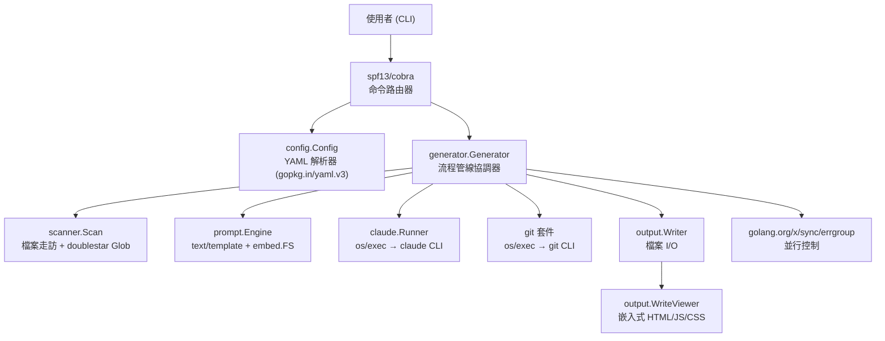

# 技術堆疊

SelfMD 完全以 Go 語言建構，並依賴 Claude Code CLI 作為其 AI 核心。本頁詳細介紹組成本專案的程式語言、框架、函式庫及外部工具。

## 概覽

SelfMD 是一個以 **Go (Golang)** 編寫的命令列工具，能為任何程式碼庫自動產生結構化的技術文件。它將 Claude Code CLI 作為子程序進行調度，向其傳送渲染後的提示詞模板並解析 JSON 回應。輸出結果為一組 Markdown 檔案，加上一個可直接在瀏覽器中開啟或部署至 GitHub Pages 的獨立靜態 HTML/JS/CSS 檢視器。

主要技術選擇：

- **Go** — 靜態編譯，所有主要平台皆可使用單一二進位檔發佈
- **Claude Code CLI** — AI 驅動的程式碼分析與文件產生
- **YAML** — 人類友善的專案設定格式
- **Go `embed`** — 提示詞模板與檢視器資源在編譯時嵌入二進位檔
- **Go `text/template`** — 具備語言感知模板集的提示詞渲染

## 架構



## 程式語言

SelfMD 使用 **Go 1.25.7**，如其模組檔案中所宣告。專案會編譯為六個平台目標的原生二進位檔：Linux (amd64、arm64)、macOS (amd64、arm64) 及 Windows (amd64、arm64)。

```go
module github.com/monkenwu/selfmd

go 1.25.7
```

> Source: go.mod#L1-L3

## 依賴項目

### 直接依賴

| 函式庫 | 版本 | 用途 |
|---------|---------|---------|
| `github.com/spf13/cobra` | v1.10.2 | CLI 命令框架 — 定義 `generate`、`init`、`update`、`translate` 子命令 |
| `gopkg.in/yaml.v3` | v3.0.1 | `selfmd.yaml` 設定檔的 YAML 解析與序列化 |
| `github.com/bmatcuk/doublestar/v4` | v4.10.0 | Globstar (`**`) 模式匹配，用於檔案包含/排除篩選 |
| `golang.org/x/sync` | v0.19.0 | `errgroup`，用於有限制的並行頁面產生與翻譯 |

### 間接依賴

| 函式庫 | 版本 | 用途 |
|---------|---------|---------|
| `github.com/inconshreveable/mousetrap` | v1.1.0 | Windows shell 偵測（Cobra 所需） |
| `github.com/spf13/pflag` | v1.0.9 | POSIX 相容的旗標解析（Cobra 所需） |

```go
require (
	github.com/bmatcuk/doublestar/v4 v4.10.0
	github.com/spf13/cobra v1.10.2
	golang.org/x/sync v0.19.0
	gopkg.in/yaml.v3 v3.0.1
)
```

> Source: go.mod#L5-L10

## 標準函式庫使用

SelfMD 大量使用 Go 的標準函式庫，在內建套件足夠使用時避免引入第三方依賴：

| 套件 | 使用位置 | 用途 |
|---------|---------|---------|
| `embed` | `prompt.Engine`、`output.WriteViewer` | 在編譯時嵌入提示詞模板與檢視器資源 |
| `text/template` | `prompt.Engine` | 以上下文資料渲染提示詞模板 |
| `encoding/json` | `claude.Parser`、`catalog.Catalog` | 解析 Claude CLI JSON 輸出及目錄序列化 |
| `os/exec` | `claude.Runner`、`git` 套件 | 生成 `claude` 與 `git` 子程序 |
| `log/slog` | 所有模組 | 整個流程管線的結構化日誌記錄 |
| `context` | `generator.Generator`、`claude.Runner` | 逾時管理與基於訊號的取消機制 |
| `sync/atomic` | `content_phase`、`translate_phase` | 用於並行產生的無鎖進度計數器 |
| `regexp` | `claude.Parser`、`translate_phase` | 從 Claude 回應中擷取 JSON 區塊、Markdown 圍欄及標題 |
| `path/filepath` | `scanner`、`output`、`catalog` | 跨平台路徑操作 |

### 嵌入指令

提示詞模板與檢視器資源透過 Go 的 `//go:embed` 指令嵌入二進位檔中：

```go
//go:embed templates/*/*.tmpl templates/*.tmpl
var templateFS embed.FS
```

> Source: internal/prompt/engine.go#L10-L11

```go
//go:embed viewer/index.html
var viewerHTML string

//go:embed viewer/app.js
var viewerJS string

//go:embed viewer/style.css
var viewerCSS string
```

> Source: internal/output/viewer.go#L13-L20

## 外部 CLI 工具

SelfMD 依賴兩個可在 `$PATH` 中找到的外部 CLI 工具：

### Claude Code CLI

Claude Code CLI (`claude`) 是核心 AI 引擎。SelfMD 以 JSON 輸出模式將其作為子程序調用，並透過 stdin 傳送提示詞：

```go
args := []string{
	"-p",
	"--output-format", "json",
}
// ...
cmd := exec.CommandContext(ctx, "claude", args...)
cmd.Stdin = strings.NewReader(opts.Prompt)
```

> Source: internal/claude/runner.go#L32-L75

Runner 支援模型選擇、工具限制（`--allowedTools`、`--disallowedTools`）、可設定的逾時，以及帶線性退避的自動重試：

```go
func (r *Runner) RunWithRetry(ctx context.Context, opts RunOptions) (*RunResult, error) {
	maxRetries := r.config.MaxRetries
	var lastErr error

	for attempt := 0; attempt <= maxRetries; attempt++ {
		if attempt > 0 {
			backoff := time.Duration(attempt) * 5 * time.Second
			// ...
		}
		result, err := r.Run(ctx, opts)
		if err == nil && !result.IsError {
			return result, nil
		}
		// ...
	}
	return nil, fmt.Errorf("all %d attempts failed: %w", maxRetries+1, lastErr)
}
```

> Source: internal/claude/runner.go#L113-L143

### Git CLI

`git` CLI 用於增量更新中的變更偵測。所有互動皆透過 `internal/git` 套件進行：

```go
func GetChangedFilesSince(dir, sinceCommit string) (string, error) {
	return runGit(dir, "diff", "--relative", "--name-status", sinceCommit+"..HEAD")
}
```

> Source: internal/git/git.go#L38-L40

## 並行模型

內容產生與翻譯使用 `golang.org/x/sync/errgroup` 搭配信號量 channel，將並行數限制在設定的 `max_concurrent` 值：

```go
eg, ctx := errgroup.WithContext(ctx)
sem := make(chan struct{}, concurrency)

for _, item := range items {
	item := item
	eg.Go(func() error {
		sem <- struct{}{}
		defer func() { <-sem }()
		// ... generate page ...
		return nil
	})
}

if err := eg.Wait(); err != nil {
	return err
}
```

> Source: internal/generator/content_phase.go#L36-L76

進度計數器（`done`、`failed`、`skipped`）使用 `sync/atomic.Int32` 實現跨 goroutine 的無鎖更新。

## 設定格式

專案設定儲存於 `selfmd.yaml`，並使用 `gopkg.in/yaml.v3` 進行解析。`Config` 結構體直接對應 YAML 結構：

```go
type Config struct {
	Project ProjectConfig `yaml:"project"`
	Targets TargetsConfig `yaml:"targets"`
	Output  OutputConfig  `yaml:"output"`
	Claude  ClaudeConfig  `yaml:"claude"`
	Git     GitConfig     `yaml:"git"`
}
```

> Source: internal/config/config.go#L11-L17

## 提示詞模板系統

提示詞以 Go `text/template` 檔案的形式組織在語言特定的目錄中，並在編譯時嵌入：

```
templates/
├── zh-TW/
│   ├── catalog.tmpl
│   ├── content.tmpl
│   ├── update_matched.tmpl
│   ├── update_unmatched.tmpl
│   └── updater.tmpl
├── en-US/
│   ├── catalog.tmpl
│   ├── content.tmpl
│   ├── update_matched.tmpl
│   ├── update_unmatched.tmpl
│   └── updater.tmpl
├── translate.tmpl
└── translate_titles.tmpl
```

引擎在初始化時載入語言特定的模板，並在不支援的語言時回退至 `en-US`：

```go
func (o *OutputConfig) GetEffectiveTemplateLang() string {
	for _, lang := range SupportedTemplateLangs {
		if o.Language == lang {
			return o.Language
		}
	}
	return "en-US"
}
```

> Source: internal/config/config.go#L58-L65

## 靜態檢視器

輸出包含一個以純 HTML、JavaScript 和 CSS 建構的獨立文件檢視器（無框架依賴）。檢視器資源嵌入於 Go 二進位檔中，並在產生過程中寫入輸出目錄：

- `index.html` — SPA 外殼，注入專案名稱與語言
- `app.js` — 客戶端 Markdown 渲染與導覽
- `style.css` — 文件主題
- `_data.js` — 包含所有目錄資料與 Markdown 頁面內容的打包 JSON

此打包方式實現了完全離線/無伺服器的文件瀏覽 — 只需在瀏覽器中開啟 `index.html` 即可。

## 建置與發佈

SelfMD 編譯為獨立的二進位檔，無需執行階段依賴（除了 `claude` 和 `git` CLI）。提供六個平台的預建二進位檔：

| 平台 | 二進位檔 |
|----------|--------|
| Linux amd64 | `bin/selfmd-linux-amd64` |
| Linux arm64 | `bin/selfmd-linux-arm64` |
| macOS amd64 | `bin/selfmd-macos-amd64` |
| macOS arm64 | `bin/selfmd-macos-arm64` |
| Windows amd64 | `bin/selfmd-windows-amd64.exe` |
| Windows arm64 | `bin/selfmd-windows-arm64.exe` |

## 相關連結

- [簡介](../introduction/index.md)
- [輸出結構](../output-structure/index.md)
- [設定概覽](../../configuration/config-overview/index.md)
- [Claude 設定](../../configuration/claude-config/index.md)
- [系統架構](../../architecture/index.md)
- [Claude Runner](../../core-modules/claude-runner/index.md)
- [提示詞引擎](../../core-modules/prompt-engine/index.md)

## 參考檔案

| 檔案路徑 | 說明 |
|-----------|-------------|
| `go.mod` | Go 模組定義與依賴宣告 |
| `go.sum` | 依賴校驗碼 |
| `main.go` | 應用程式進入點 |
| `cmd/root.go` | 根 Cobra 命令與全域旗標 |
| `cmd/generate.go` | Generate 命令實作，含訊號處理 |
| `internal/config/config.go` | 設定結構體、YAML 載入、驗證與預設值 |
| `internal/claude/runner.go` | Claude CLI 子程序調用與重試邏輯 |
| `internal/claude/types.go` | RunOptions、RunResult 與 CLIResponse 型別定義 |
| `internal/claude/parser.go` | JSON/Markdown 回應解析與擷取工具 |
| `internal/generator/pipeline.go` | 四階段產生流程管線協調器 |
| `internal/generator/catalog_phase.go` | 透過 Claude 產生目錄 |
| `internal/generator/content_phase.go` | 使用 errgroup 的並行內容頁面產生 |
| `internal/generator/index_phase.go` | 索引與側邊欄導覽產生 |
| `internal/generator/translate_phase.go` | 翻譯流程管線與並行頁面翻譯 |
| `internal/generator/updater.go` | 增量更新引擎與 git 變更匹配 |
| `internal/scanner/scanner.go` | 專案目錄掃描器，含 glob 篩選 |
| `internal/scanner/filetree.go` | 檔案樹資料結構與渲染 |
| `internal/git/git.go` | Git CLI 包裝器，用於變更偵測 |
| `internal/prompt/engine.go` | 提示詞模板引擎，含嵌入式 FS |
| `internal/output/writer.go` | 文件檔案寫入器與目錄持久化 |
| `internal/output/viewer.go` | 靜態檢視器產生，含嵌入式 HTML/JS/CSS |
| `internal/output/navigation.go` | 索引、側邊欄與分類頁面產生 |
| `internal/output/linkfixer.go` | 相對連結驗證與修正 |
| `internal/catalog/catalog.go` | 目錄資料模型、JSON 解析與樹狀結構展平 |
| `selfmd.yaml` | 專案設定檔 |